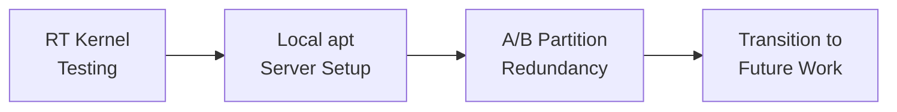

# Current Work in Progress

---

## Active Tasks

### 1. Testing Real-Time Capabilities of the Kernel

!!! note "Status: In Progress"
    Latency benchmarks and cyclictest validation are underway.

**Outline:**

- <!-- TODO: Test methodology -->
- <!-- TODO: Target latency thresholds -->
- <!-- TODO: Test results and observations -->

---

### 2. Adapting apt Support via Local Update Servers

!!! note "Status: In Progress"
    Setting up offline package management for field updates.

**Outline:**

- <!-- TODO: Why apt support is needed -->
- <!-- TODO: Local repository server setup -->
- <!-- TODO: Yocto package feed configuration -->
- <!-- TODO: Testing offline updates -->

---

### 3. Enabling A/B Partition Redundancy

!!! note "Status: In Progress"
    Implementing graceful boot fallback on partition corruption.

**Outline:**

- <!-- TODO: A/B partition scheme design -->
- <!-- TODO: Bootloader integration -->
- <!-- TODO: Failover testing methodology -->
- <!-- TODO: Recovery procedure -->

---

## Current Work Flow

---

[← Phase 3](../phase3/index.md){ .md-button }
[Future Work →](../future-work/index.md){ .md-button .md-button--primary }
