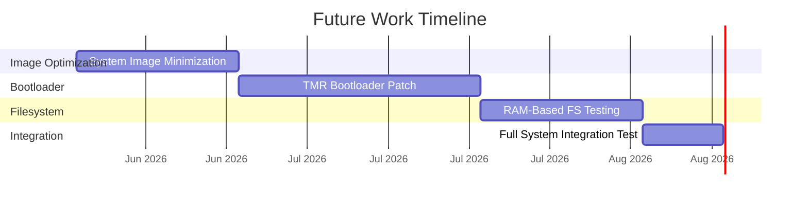

# Future Work

---

## Planned Tasks

### 1. Minimizing the System Image

!!! info "Status: Planned"
    Further reducing the system image footprint beyond the current < 5 GB target.

**Outline:**

- <!-- TODO: Package audit and removal strategy -->
- <!-- TODO: Strip unused kernel modules -->
- <!-- TODO: Optimize rootfs layout -->
- <!-- TODO: Target image size -->

---

### 2. Patching the Bootloader for Triple Modular Redundancy (TMR)

!!! info "Status: Planned"
    Implementing TMR at the bootloader level for fault-tolerant boot.

**Outline:**

- <!-- TODO: TMR concept applied to bootloader -->
- <!-- TODO: Voting mechanism implementation -->
- <!-- TODO: Bootloader modification approach -->
- <!-- TODO: Testing under simulated faults -->

---

### 3. Testing RAM-Based Filesystem

!!! info "Status: Planned"
    Evaluating tmpfs/initramfs for radiation-safe runtime operation.

**Outline:**

- <!-- TODO: tmpfs vs initramfs evaluation -->
- <!-- TODO: Overlay filesystem with read-only root -->
- <!-- TODO: Persistence strategy (selective writeback) -->
- <!-- TODO: Memory budget on TX2i (8 GB) -->
- <!-- TODO: Performance benchmarks -->

---

## Future Roadmap

---

[← Current Work](../current-work/index.md){ .md-button }
[Back to Home →](../index.md){ .md-button .md-button--primary }
