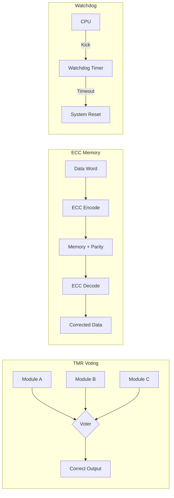

# Hardware Redundancy Concepts

Phase 0 · Research

!!! info "Outline Page"
    This page is an outline only. Content will be populated with concepts, diagrams, and images.

---

## Outline

### ECC (Error-Correcting Code) Memory

- <!-- TODO: What is ECC and why it matters in space -->
- <!-- TODO: TX2i ECC support details -->

### Watchdog Timers

- <!-- TODO: Hardware watchdog concepts -->
- <!-- TODO: Role in boot recovery -->

### Triple Modular Redundancy (TMR)

- <!-- TODO: TMR architecture overview -->
- <!-- TODO: Voting mechanisms -->
- <!-- TODO: Application at bootloader level -->

### Radiation-Hardened vs Radiation-Tolerant Components

- <!-- TODO: TX2i's position on this spectrum -->
- <!-- TODO: COTS vs rad-hard tradeoffs -->

---

## Hardware Redundancy Architecture

---

[← Research Papers](papers.md){ .md-button }
[Software Redundancy →](software-redundancy.md){ .md-button .md-button--primary }
