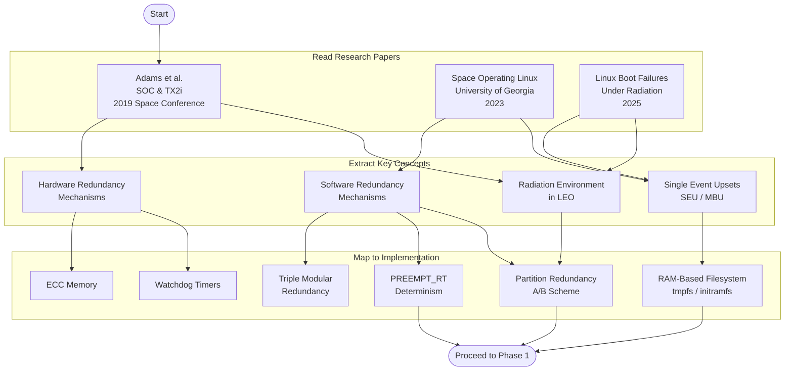

# Phase 0 — Literature & Redundancy Concepts

Research · Week 1–2

!!! warning "Continuous Learning Process"
    This is a continuous process and is still not 100% understood. The content presented here is adapted to the best of the author's ability based on the referenced research papers. This section will be updated as understanding deepens through ongoing testing and validation.

---

## Phase Overview

---

## Research Papers

### Paper 1 — Adams et al. · SOC & TX2i (2019)

!!! note "Citation"
    <!-- TODO: Add full IEEE citation and DOI link -->
    Adams, J. et al., *[Paper Title — SOC and TX2i for Space Applications]*, IEEE Aerospace Conference, 2019.

**Key Takeaways:**

- <!-- TODO: Add key takeaways -->

---

### Paper 2 — Space Operating Linux (University of Georgia, 2023)

!!! note "Citation"
    <!-- TODO: Add full IEEE citation and DOI link -->
    *Space Operating Linux*, University of Georgia, 2023.

**Key Takeaways:**

- <!-- TODO: Add key takeaways -->

---

### Paper 3 — Linux Boot Failures Under Radiation (2025)

!!! note "Citation"
    <!-- TODO: Add full IEEE citation and DOI link -->
    *Linux Boot Failures Under Radiation*, 2025.

**Key Takeaways:**

- <!-- TODO: Add key takeaways -->

---

## Subpages

| Page | Description |
|---|---|
| [Research Papers Overview](papers.md) | Detailed breakdown of each paper's contributions |
| [Hardware Redundancy Concepts](hardware-redundancy.md) | ECC, watchdog timers, TMR hardware |
| [Software Redundancy Concepts](software-redundancy.md) | A/B partitioning, RAM filesystems, checksums |
| [Radiation Effects & Mitigation](radiation-mitigation.md) | SEU, MBU, TID, and countermeasures |

---

[← Back to Roadmap](../roadmap.md){ .md-button }
[Next: Phase 1 →](../phase1/index.md){ .md-button .md-button--primary }
