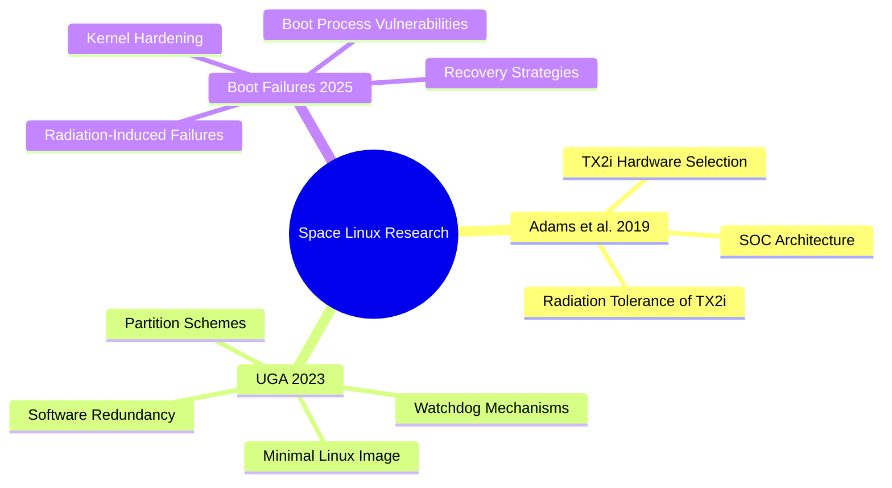

# Research Papers Overview

Phase 0 · Literature Review

!!! info "Outline Page"
    This page is an outline only. Detailed content, summaries, and analysis will be added as the documentation matures.

---

## Paper 1 — Adams et al. · SOC & TX2i (2019 Space Conference)

<!-- TODO: Add IEEE DOI link -->

### Outline

- **Context & Motivation**
    - <!-- TODO -->
- **Key Contributions**
    - <!-- TODO -->
- **Hardware Platform Discussion**
    - <!-- TODO -->
- **Relevance to This Project**
    - <!-- TODO -->

---

## Paper 2 — Space Operating Linux (University of Georgia, 2023)

<!-- TODO: Add IEEE DOI link -->

### Outline

- **Context & Motivation**
    - <!-- TODO -->
- **System Architecture Proposed**
    - <!-- TODO -->
- **Redundancy Mechanisms Discussed**
    - <!-- TODO -->
- **Key Results**
    - <!-- TODO -->
- **Relevance to This Project**
    - <!-- TODO -->

---

## Paper 3 — Linux Boot Failures Under Radiation (2025)

<!-- TODO: Add IEEE DOI link -->

### Outline

- **Context & Motivation**
    - <!-- TODO -->
- **Failure Modes Identified**
    - <!-- TODO -->
- **Experimental Setup**
    - <!-- TODO -->
- **Key Findings**
    - <!-- TODO -->
- **Mitigation Strategies Proposed**
    - <!-- TODO -->
- **Relevance to This Project**
    - <!-- TODO -->

---

## Cross-Paper Concept Map

---

[← Phase 0 Overview](index.md){ .md-button }
[Hardware Redundancy →](hardware-redundancy.md){ .md-button .md-button--primary }
