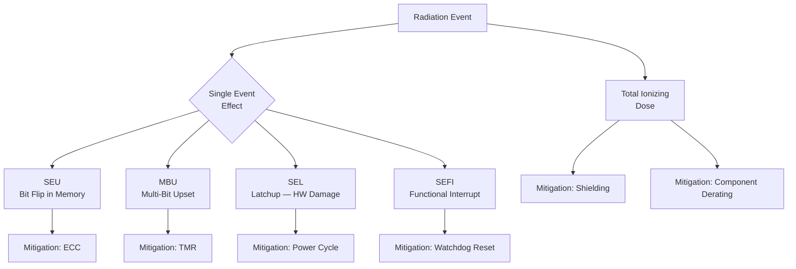

# Radiation Effects & Mitigation

Phase 0 · Research

!!! info "Outline Page"
    This page is an outline only. Content will be populated with concepts, diagrams, and images.

---

## Outline

### The LEO Radiation Environment

- <!-- TODO: Types of radiation in LEO -->
- <!-- TODO: South Atlantic Anomaly -->
- <!-- TODO: Solar particle events -->

### Single Event Effects (SEE)

- <!-- TODO: Single Event Upset (SEU) -->
- <!-- TODO: Multi-Bit Upset (MBU) -->
- <!-- TODO: Single Event Latchup (SEL) -->
- <!-- TODO: Single Event Functional Interrupt (SEFI) -->

### Total Ionizing Dose (TID)

- <!-- TODO: Cumulative radiation damage -->
- <!-- TODO: TX2i TID tolerance -->

### Mitigation Strategies Summary

- <!-- TODO: Hardware mitigations (ECC, TMR, watchdog) -->
- <!-- TODO: Software mitigations (A/B partition, RAM FS, checksums) -->
- <!-- TODO: System-level mitigations (power cycling, safe mode) -->

---

## Radiation Effect Classification

---

[← Software Redundancy](software-redundancy.md){ .md-button }
[Phase 1 — Minimal Build →](../phase1/index.md){ .md-button .md-button--primary }
