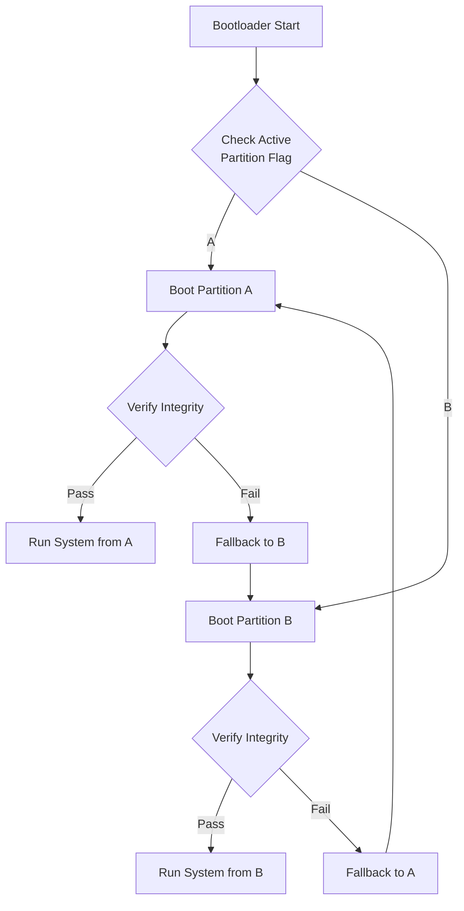
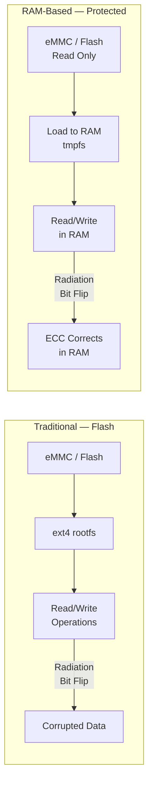

# Software Redundancy Concepts

Phase 0 · Research

!!! info "Outline Page"
    This page is an outline only. Content will be populated with concepts, diagrams, and images.

---

## Outline

### A/B Partition Redundancy

- <!-- TODO: Concept explanation -->
- <!-- TODO: How boot fallback works -->
- <!-- TODO: Implementation in embedded Linux -->

### RAM-Based Filesystem (tmpfs / initramfs)

- <!-- TODO: Why RAM filesystems protect against flash corruption -->
- <!-- TODO: tmpfs vs initramfs tradeoffs -->
- <!-- TODO: Overlay filesystem strategies -->

### Filesystem Integrity & Checksums

- <!-- TODO: dm-verity, fs checksums -->
- <!-- TODO: Read-only root filesystem patterns -->

### Software Watchdog & Health Monitoring

- <!-- TODO: systemd watchdog integration -->
- <!-- TODO: Custom health check services -->

---

## A/B Partition Redundancy Flow

---

## RAM-Based Filesystem Architecture

---

[← Hardware Redundancy](hardware-redundancy.md){ .md-button }
[Radiation Mitigation →](radiation-mitigation.md){ .md-button .md-button--primary }
