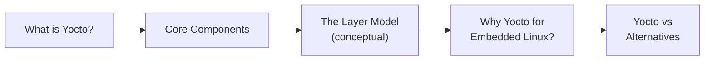
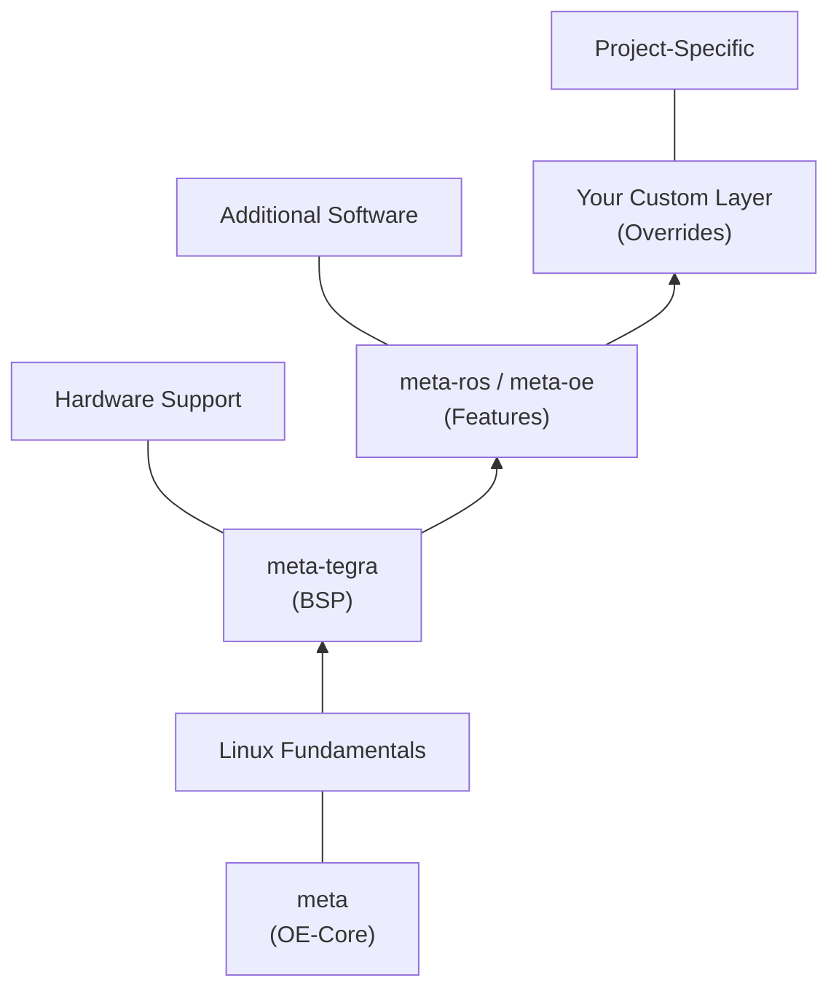

# What Is the Yocto Project?

Phase 1 · Page 1 of 11

!!! abstract "Page Goal"
    By the end of this page you should understand what the Yocto Project is, what its core components are, and why we chose it to build a custom Linux image for the Jetson TX2i.

---

## Page Process Overview

---

## What Is Yocto?

<!-- CONTENT: 
- Yocto is NOT a Linux distribution — it's an open-source collaboration project and framework
- It provides templates, tools, and methods to create custom Linux-based systems for embedded/IoT
- The output of Yocto is a complete Linux image: bootloader, kernel, rootfs, packages — all built from source
- Hosted by the Linux Foundation
- Used in automotive, aerospace, industrial, consumer electronics
-->

---

## Core Components

<!-- CONTENT:
Explain each component briefly — 2-3 sentences each. A table works well here.

| Component | What It Is |
|-----------|-----------|
| **Poky** | The reference distribution and build system. Contains BitBake + OpenEmbedded-Core + meta-poky + meta-yocto-bsp. This is what you `git clone` to start. |
| **BitBake** | The task executor / build engine. Parses recipes, resolves dependencies, and runs build tasks. Think of it as "make on steroids" for cross-compilation. |
| **OpenEmbedded-Core (OE-Core)** | The core metadata layer (`meta`). Contains the fundamental recipes for the base Linux system — glibc, busybox, systemd, gcc, etc. |
| **Metadata** | The collective term for recipes (`.bb`), configuration (`.conf`), classes (`.bbclass`), and append files (`.bbappend`) that describe *what* to build and *how*. |
| **Recipes (`.bb` files)** | Instructions for building a single piece of software — where to fetch it, how to configure, compile, install, and package it. |
| **Images** | Special recipes that define a complete root filesystem by aggregating packages. e.g., `core-image-minimal`. |
| **Machine Configuration** | A `.conf` file that describes target hardware — CPU architecture, kernel, bootloader, flash layout. |
-->

---

## The Layer Model (Conceptual)

<!-- CONTENT:
- Yocto organizes everything into "layers" — directories of metadata following a specific structure
- Layers are modular: you stack them to compose your final image
- Base layer: `meta` (OE-Core) — provides the Linux fundamentals
- BSP layer: `meta-tegra` — adds hardware-specific support for NVIDIA Tegra SoCs
- Feature layers: `meta-ros`, `meta-openembedded` sub-layers — add specific functionality
- Your own layer: custom recipes and configuration
- Layers have priorities — higher-priority layers can override lower ones
- This is covered hands-on in Page 6
-->

---

## Recipes, Images, and Machines

<!-- CONTENT:
### Recipes
- A recipe = one `.bb` file = one software package
- Example: `linux-tegra_5.10.bb` is the recipe for the NVIDIA-patched Linux kernel
- Recipes define: SRC_URI (source location), do_compile (build steps), do_install (install steps)

### Images
- An image recipe = a recipe that assembles a root filesystem from packages
- `core-image-minimal` — the smallest bootable image
- `demo-image-full-cmdline` — a more complete image with utilities
- IMAGE_INSTALL variable controls what packages go into the image

### Machines
- A machine configuration defines the target hardware
- Located in a BSP layer: `meta-tegra/conf/machine/`
- Example: `jetson-tx2i.conf`
- Sets CPU architecture, kernel provider, bootloader, flash layout
-->

---

## Why Yocto for This Project?

<!-- CONTENT:
- **Minimal footprint** — we need < 5 GB images; Yocto builds only what we include
- **Reproducibility** — every build is deterministic; critical for flight-certified systems
- **BSP integration** — meta-tegra provides first-class NVIDIA Jetson support
- **Customizability** — we can patch the kernel (PREEMPT_RT), select exact packages, control the boot chain
- **Cross-compilation** — builds ARM64 images on an x86_64 host
- **Long-term support** — Kirkstone is an LTS release (April 2022, supported until April 2026)
-->

---

## Yocto vs Alternatives

<!-- CONTENT:
Brief comparison — not exhaustive, just enough context.

| Criteria | Yocto | Buildroot | Manual Cross-Compile |
|----------|-------|-----------|---------------------|
| **Output** | Full distro (packages, package manager) | Minimal rootfs (no package manager) | Whatever you build |
| **Complexity** | High learning curve | Lower learning curve | Highest (DIY everything) |
| **Customizability** | Excellent — layer model | Good — menuconfig | Total, but manual |
| **BSP Support** | Extensive (meta-tegra, meta-freescale, etc.) | Limited | None |
| **Package Management** | deb / rpm / ipk | None by default | None |
| **Reproducibility** | Excellent (sstate, hash equivalence) | Good | Poor |
| **Why not for us?** | — | No meta-tegra equivalent; no package management for field updates | Not scalable for a full OS |
-->

---

[Next: Prerequisite Reading →](02-prerequisite-reading.md){ .md-button .md-button--primary }
