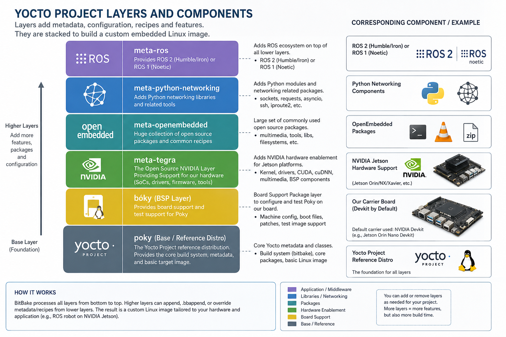

# What Is the Yocto Project?

Phase 1 · Page 1 of 10

!!! abstract "Page Goal"
    By the end of this page you should understand what the Yocto Project is, what its core components are, and why we chose it to build a custom Linux image for the Jetson TX2i.

---

## Page Process Overview

---

## What Is Yocto?

- Yocto Project is an open source framework that helps developers create custom Linux-based systems regardless of the hardware architecture.
- The project provides a flexible set of tools and a space where embedded developers worldwide can share technologies, software stacks, configurations, and best practices that can be used to create tailored Linux images for embedded and IOT devices, or anywhere a customized Linux OS is needed.
- It is the de facto industry tool-kit used for custom Linux development, widely used in System-on-chip(SoC) development, Automotive Applications and so on.

## Core Components and Terms of Yocto 

| Component | What It Is |
|-----------|-----------|
| **Configuration Files** | Files which hold global definitions of variables, user defined variables and hardware configuration information. They tell the build system what to build and put into the image to support a particular platform. |
| **Metadata** | A key element of the Yocto Project is the meta-data which is used to construct a Linux distribution, contained in the files that the build system parses when building an image. In general, Metadata includes recipes, configuration files and other information referring to the build instructions themselves, as well as the data used to control what things get built and to affect how they are built. The meta-data also includes commands and data used to indicate what versions of software are used, and where they are obtained from, as well as changes or additions to the software itself (patches or auxiliary files) which are used to fix bugs or customize the software for use in a particular situation. OpenEmbedded Core is an important set of validated metadata. |
| **Recipe** | The most common form of metadata. A recipe will contain a list of settings and tasks (instructions) for building packages which are then used to build the binary image. A recipe describes where you get source code and which patches to apply. Recipes describe dependencies for libraries or for other recipes, as well as configuration and compilation options. They are stored in layers. |
| **Layer** | A collection of related recipes. Layers allow you to consolidate related metadata to customize your build, and isolate information for multiple architecture builds. Layers are hierarchical in their ability to override previous specifications. You can include any number of available layers from the Yocto Project and customize the build by adding your layers after them. The Layer Index is searchable for layers within Yocto Project. |          
| **OpenEmbedded-Core**| OE-core is meta-data composed of foundation recipes, classes and associated files that are meant to be common among many different OpenEmbedded-derived systems, including the Yocto Project. It is a curated subset of an original repository developed by the OpenEmbedded community which has been pared down into a smaller, core set of continuously validated recipes resulting in a tightly controlled and a quality-assured core set of recipes. |
| **Poky** |A reference embedded distribution and a reference test configuration created to 1) provide a base level functional distro which can be used to illustrate how to customize a distribution, 2) to test the Yocto Project components, Poky is used to validate Yocto Project, and 3) as a vehicle for users to download Yocto Project. Poky is not a product level distro, but a good starting point for customization. Poky is an integration layer on top of oe-core.|
| **Build System – “Bitbake”** | a scheduler and execution engine which parses instructions (recipes) and configuration data. It then creates a dependency tree to order the compilation, schedules the compilation of the included code, and finally, executes the building of the specified, custom Linux image (distribution). BitBake is a make-like build tool. BitBake recipes specify how a particular package is built. They include all the package dependencies, source code locations, configuration, compilation, build, install and remove instructions. Recipes also store the metadata for the package in standard variables. Related recipes are consolidated into a layer. During the build process dependencies are tracked and native or cross-compilation of the package is performed. As a first step in a cross-build setup, the framework will attempt to create a cross-compiler toolchain (Extensible SDK) suited for the target platform.|
| **Packages** | The output of the build system used to create your final image.|

---

## The Layer Model (Conceptual)

- Yocto Project has a development model for embedded Linux creation which distinguishes it from other simple build systems. It is called the Layer Model.

- The Layer Model is designed to support both collaboration and customization at the same time. Layers are repositories containing related sets of instructions which tell the build system what to do. Users can collaborate, share, and reuse layers. Layers can contain changes to previous instructions or settings at any time.
 
- This powerful override capability is what allows you to customize previous collaborative or community supplied layers to suit your product requirements.

- Use different layers to logically separate information in your build. As an example, you could have a BSP layer, a GUI layer, a distro configuration, middleware, or an application. Putting your entire build into one layer limits and complicates future customization and reuse. Isolating information into layers, on the other hand, helps simplify future customizations and reuse. Use BSP layers from silicon vendors when possible.

- Familiarize yourself with the curated (tested) [YOCTO PROJECT COMPATIBLE LAYER INDEX](https://www.yoctoproject.org/software-overview/layers/){:target="_blank"}. There is also the [OpenEmbedded Layer Index](https://layers.openembedded.org/){:target="_blank"} which contains more layers but the content is less universally validated.

The Layer Model for this Phase is as follows:

[Next: Important Links →](02-prerequisite-reading.md){ .md-button .md-button--primary }
