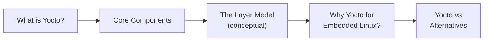

# What Is the Yocto Project?

Phase 1 · Page 1 of 9

!!! abstract "Page Goal"
    By the end of this page you should understand what the Yocto Project is, what its core components are, and why we chose it to build a custom Linux image for the Jetson TX2i.

---

## Page Process Overview

---

## What Is Yocto?

- The Yocto Project is a free, open-source toolkit that lets you build your own custom Linux operating system for any hardware — from a small sensor board to a powerful industrial computer.
- Think of it like a recipe book for operating systems: instead of installing a pre-made OS like Ubuntu or Windows, Yocto lets you choose exactly what goes into your OS, piece by piece — nothing more, nothing less.
- It is the industry standard for building custom Linux systems. Companies in automotive, aerospace, robotics, and IoT (Internet of Things) all use Yocto when they need full control over what software runs on their hardware.


## Core Components and Terms of Yocto 

!!! tip "In Simple Terms"
    If you think of building an OS like cooking a meal: **Recipes** are the cooking instructions, **Layers** are cookbooks that group related recipes, **Configuration Files** are your preferences (e.g. oven temperature), **BitBake** is the chef that reads everything and does the actual cooking, and **Poky** is the starter kit that comes with basic recipes to get you going.

| Component | What It Is |
|-----------|-----------|
| **Configuration Files** | Settings files that tell the build system what hardware you are targeting and what software to include. Think of them as a checklist of preferences for your custom OS. |
| **Metadata** | All the information the build system needs to construct your OS — this includes recipes, configuration files, version numbers, download locations, and any patches (small fixes) applied to the software. OpenEmbedded Core (OE-Core) is an important, well-tested collection of this metadata. |
| **Recipe** | A set of instructions for building one piece of software. Each recipe says: where to download the source code, what dependencies it needs, how to compile it, and how to package it for your OS image. Recipes are the most common type of metadata. |
| **Layer** | A folder of related recipes grouped together. For example, one layer might contain all the recipes for NVIDIA hardware support, while another contains networking tools. You stack layers on top of each other, and later layers can override earlier ones — this is how you customize without modifying the originals. |
| **OpenEmbedded-Core (OE-Core)** | The foundation layer — a carefully tested and maintained set of core recipes that most Yocto builds start with. Think of it as the standard library that provides essential OS components like the C compiler, basic utilities, and the Linux kernel recipe. |
| **Poky** | The official Yocto starter kit. It bundles OE-Core with BitBake and a reference configuration so you can start building immediately. Poky is not meant to be shipped as a final product — it is a starting point that you customize for your own hardware and needs. |
| **Build System — BitBake** | The engine that actually builds your OS. BitBake reads all your recipes and configuration files, figures out the correct order to build everything (resolving dependencies automatically), downloads source code, compiles it, and assembles the final OS image. It works similarly to `make` in C/C++ projects, but is designed for building entire operating systems. |
| **Packages** | The individual compiled software outputs that BitBake produces. These packages are then combined together to create your final OS image file. |l image.|

---

## The Layer Model (Conceptual)

!!! tip "In Simple Terms"
    Think of layers like transparent sheets stacked on top of each other. The bottom sheet has the basics. Each sheet you add on top can add new features or change what is underneath — without erasing the original. This makes it easy to share, reuse, and customize.

- Yocto uses a "Layer Model" that sets it apart from simpler build systems. Layers are folders (usually Git repositories) that contain related recipes and configuration.

- Multiple people and organizations can contribute different layers, and you simply stack them together. If you need to change something from a community layer, you add your own layer on top that overrides just the parts you need — you never have to modify the original.

- It is good practice to keep different concerns in separate layers. For example:
    - A **BSP layer** (Board Support Package — the hardware-specific software from the chip manufacturer) for your specific board
    - A **GUI layer** for graphical interface packages
    - An **application layer** for your own custom software

- The official [Yocto Compatible Layer Index](https://www.yoctoproject.org/software-overview/layers/){:target="_blank"} lists tested, community-approved layers. The [OpenEmbedded Layer Index](https://layers.openembedded.org/){:target="_blank"} has even more layers, though they may not all be as thoroughly tested.

The Layer Model for this Phase is as follows:

## Why Yocto for This Project?

- **We need a tiny OS.** Our goal is to create the smallest possible operating system that still does everything we need. Yocto lets us pick exactly which software packages go in — nothing extra, nothing wasted. A standard Linux distribution like Ubuntu includes thousands of packages you would never use on a space computer.

- **We need full control.** Yocto builds everything from source code, including the Linux kernel (the core of the OS) and the bootloader (the small program that starts the OS). This means we can modify any part of the system to add safety features like redundancy (backup copies that take over if something fails).

- **We need to add custom safety layers.** Because Yocto gives us control over every component, we can add features like A/B partition switching (keeping a backup copy of the OS), Triple Modular Redundancy (having three copies vote on the correct answer), and other protections needed for hardware operating in space.

[Next: Important Links →](02-prerequisite-reading.md){ .md-button .md-button--primary }
