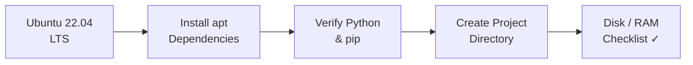

# Host Environment Setup

<span class="phase-label">Phase 1 · Page 3 of 11</span>

!!! abstract "Page Goal"
    Go from a bare Ubuntu installation to a fully prepared host machine ready to build Yocto images.

---

## Page Process Overview



---

## Supported Host OS

<!-- CONTENT:
- Ubuntu 22.04 LTS (strongly recommended for Kirkstone)
- Ubuntu 20.04 LTS also works
- Other distros (Fedora, Debian, openSUSE) are possible but not tested in this project
- Must be a native Linux install or a properly configured VM (NOT WSL — see warning below)
-->

!!! warning "WSL Is Not Supported"
    The Yocto build system does not officially support Windows Subsystem for Linux (WSL). Use a native Ubuntu installation or a full VM.

---

## Hardware Requirements

<!-- CONTENT:
| Resource | Minimum | Recommended |
|----------|---------|-------------|
| **Disk Space** | 100 GB free | 250 GB+ free (builds generate ~100 GB of intermediate files) |
| **RAM** | 8 GB | 16 GB+ |
| **CPU** | 4 cores | 8+ cores (significantly reduces build time) |
| **Internet** | Required | Required for first build (fetching sources) |
-->

---

## Installing Build Dependencies

<!-- CONTENT:
The full one-liner apt command. Then break it down — explain what each group of packages does.

```bash
sudo apt update
sudo apt install -y gawk wget git diffstat unzip texinfo gcc build-essential \
    chrpath socat cpio python3 python3-pip python3-pexpect xz-utils debianutils \
    iputils-ping python3-git python3-jinja2 python3-subunit zstd liblz4-tool \
    file locales libacl1 lz4
```

### What do these packages do?
- `gawk`, `diffstat`, `unzip`, `texinfo` — text processing and build tools used by BitBake
- `gcc`, `build-essential` — native C compiler and build essentials
- `chrpath` — modifies rpath in binaries (critical for Yocto)
- `python3`, `python3-pip`, `python3-pexpect`, `python3-git`, `python3-jinja2` — Python stack used by BitBake
- `socat` — network relay (used by QEMU networking)
- `cpio`, `xz-utils`, `zstd`, `liblz4-tool`, `lz4` — archive and compression tools
- `locales` — locale generation (common source of build errors if missing)
- `file` — file type detection
-->

---

## Python & pip Requirements

<!-- CONTENT:
- Verify Python 3 version: `python3 --version` (3.8+ required)
- Kirkstone uses Python 3 exclusively — Python 2 is not supported
- pip is needed for some build-time dependencies
-->

---

## Setting the Locale

<!-- CONTENT:
Yocto requires a UTF-8 locale. If it's not set, builds will fail with cryptic errors.

```bash
sudo locale-gen en_US.UTF-8
export LANG=en_US.UTF-8
export LC_ALL=en_US.UTF-8
```

Add to `~/.bashrc` for persistence.
-->

---

## Directory Structure

<!-- CONTENT:
Recommended project layout:

```
~/yocto/
├── poky/                  ← Yocto reference distribution (cloned)
│   ├── meta/              ← OE-Core
│   ├── meta-poky/         ← Poky distro config
│   ├── meta-yocto-bsp/    ← Reference BSP
│   ├── build/             ← Created by oe-init-build-env
│   │   ├── conf/
│   │   │   ├── local.conf
│   │   │   └── bblayers.conf
│   │   └── tmp/           ← Build output (huge)
│   └── ...
├── meta-tegra/            ← NVIDIA Tegra BSP layer (cloned)
├── meta-openembedded/     ← Community layers (cloned)
│   ├── meta-oe/
│   ├── meta-python/
│   ├── meta-networking/
│   └── meta-xfce/
└── meta-ros/              ← ROS recipes (cloned)
```
-->

---

## Verify Setup

<!-- CONTENT:
Quick verification commands:

```bash
# Check Ubuntu version
lsb_release -a

# Check disk space
df -h ~

# Check GCC
gcc --version

# Check Python
python3 --version

# Check Git
git --version

# Check locale
locale
```

All good? Move on to the Quick Build.
-->

---

[← Prerequisite Reading](02-prerequisite-reading.md){ .md-button }
[Next: Quick Build →](04-quick-build.md){ .md-button .md-button--primary }
