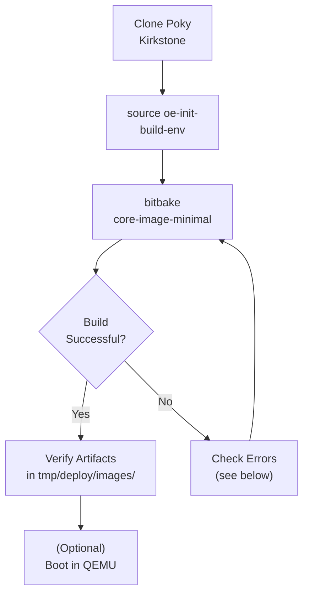

# Yocto Quick Build 

<span class="phase-label">Phase 1 · Page 4 of 9</span>

!!! abstract "Page Goal"
    - Before building for our actual hardware (the Jetson TX2i), we first do a "test run" to make sure everything on your computer is set up correctly. This test build creates a tiny Linux image that runs inside a virtual machine (QEMU) on your computer.
    - This page also walks through the key files and folders that Yocto creates, so you understand the project layout before moving on.
---

## Page Process Overview



---

## Why Do a Quick Build First?

- **Validates your setup** — catches missing packages, locale issues, or disk space problems before you invest hours in a full hardware build.
- **Teaches the workflow** — you will use the same `source oe-init-build-env` → `bitbake` steps for every build going forward.
- **No hardware needed** — the default target is QEMU (a virtual machine that runs on your computer), so you can verify everything works without connecting a Jetson board.


---

## Clone Poky & Checkout Kirkstone

!!! note "Prerequisite"

    - You should be comfortable with basic Git commands (like `git clone`, `git checkout`, `git pull`). Git is used throughout Yocto to download and manage code.

    - All Yocto layers must be on the **same release branch** (e.g., `kirkstone`). Mixing branches causes build errors.
---

Now download a copy of Poky (the Yocto starter kit) onto your build machine:

```bash
$ git clone https://git.yoctoproject.org/poky
Cloning into 'poky'...
remote: Counting
objects: 432160, done. remote: Compressing objects: 100%
(102056/102056), done. remote: Total 432160 (delta 323116), reused
432037 (delta 323000) Receiving objects: 100% (432160/432160), 153.81 MiB | 8.54 MiB/s, done.
Resolving deltas: 100% (323116/323116), done.
Checking connectivity... done.


Then move to the poky directory and take a look at existing branches:

$ cd poky
$ git branch -a
.
.
.
remotes/origin/HEAD -> origin/master
remotes/origin/dunfell
remotes/origin/dunfell-next
.
.
.
remotes/origin/gatesgarth
remotes/origin/gatesgarth-next
.
.
.
remotes/origin/master
remotes/origin/master-next
.
.
.
For this example, check out the kirkstone branch based on the Kirkstone release:

$ git checkout -t origin/kirkstone -b my-kirkstone
Branch 'my-kirkstone' set up to track remote branch 'kirkstone' from 'origin'.
Switched to a new branch 'my-kirkstone'
The previous Git checkout command creates a local branch named my-kirkstone. The files available to you in that branch exactly match the repository’s files in the kirkstone release branch.

Note that you can regularly type the following command in the same directory to keep your local files in sync with the release branch:

$ git pull
```


## Source the Build Environment

```bash
source oe-init-build-env
```

What this does:
- Creates the `build/` directory if it does not exist yet
- Generates two default configuration files: `build/conf/local.conf` and `build/conf/bblayers.conf`
- Adds the `bitbake` command to your terminal so you can use it
- Moves you into the `build/` directory automatically

You must run this command **every time you open a new terminal** before using `bitbake`.

---

## Build `core-image-minimal`

- This step builds a complete (but tiny) Linux operating system from source code. The process takes several hours on the first run.
- First, make sure you are in the `poky` directory and have sourced the environment:

```bash
$cd poky
$ source oe-init-build-env

This sources the binary and places you into the build directory

You had no conf/local.conf file. This configuration file has therefore been
created for you with some default values. You may wish to edit it to, for
example, select a different MACHINE (target hardware). See conf/local.conf
for more information as common configuration options are commented.

You had no conf/bblayers.conf file. This configuration file has therefore
been created for you with some default values. To add additional metadata
layers into your configuration please add entries to conf/bblayers.conf.

The Yocto Project has extensive documentation about OE including a reference
manual which can be found at:
    https://docs.yoctoproject.org

For more information about OpenEmbedded see their website:
    https://www.openembedded.org/

### Shell environment set up for builds. ###

You can now run 'bitbake <target>'

Common targets are:
    core-image-minimal
    core-image-full-cmdline
    core-image-sato
    core-image-weston
    meta-toolchain
    meta-ide-support

You can also run generated QEMU images with a command like 'runqemu qemux86-64'

Other commonly useful commands are:
 - 'devtool' and 'recipetool' handle common recipe tasks
 - 'bitbake-layers' handles common layer tasks
 - 'oe-pkgdata-util' handles common target package tasks
```

## Available Image Types
- Yocto comes with several pre-defined image targets. Here are the most common ones (the ones marked with a bullet were actually built and tested in this project):

```bash

build-appliance-image: An example virtual machine that contains all the pieces required to run builds using the build system as well as the build system itself. You can boot and run the image using either the VMware Player or VMware Workstation. For more information on this image, see the Build Appliance page on the Yocto Project website.

core-image-base: A console-only image that fully supports the target device hardware.

- core-image-full-cmdline: A console-only image with more full-featured Linux system functionality installed.

core-image-minimal: A small image just capable of allowing a device to boot.

core-image-minimal-dev: A core-image-minimal image suitable for development work using the host. The image includes headers and libraries you can use in a host development environment.

core-image-minimal-initramfs: A core-image-minimal image that has the Minimal RAM-based Initial Root Filesystem (Initramfs) as part of the kernel, which allows the system to find the first “init” program more efficiently. See the PACKAGE_INSTALL variable for additional information helpful when working with Initramfs images.

core-image-minimal-mtdutils: A core-image-minimal image that has support for the Minimal MTD Utilities, which let the user interact with the MTD subsystem in the kernel to perform operations on flash devices.

core-image-rt: A core-image-minimal image plus a real-time test suite and tools appropriate for real-time use.

core-image-rt-sdk: A core-image-rt image that includes everything in the cross-toolchain. The image also includes development headers and libraries to form a complete stand-alone SDK and is suitable for development using the target.

- core-image-sato: An image with Sato support, a mobile environment and visual style that works well with mobile devices. The image supports X11 with a Sato theme and applications such as a terminal, editor, file manager, media player, and so forth.

- core-image-sato-dev: A core-image-sato image suitable for development using the host. The image includes libraries needed to build applications on the device itself, testing and profiling tools, and debug symbols. This image was formerly core-image-sdk.

- core-image-sato-sdk: A core-image-sato image that includes everything in the cross-toolchain. The image also includes development headers and libraries to form a complete standalone SDK and is suitable for development using the target.

core-image-testmaster: A “controller” image designed to be used for automated runtime testing. Provides a “known good” image that is deployed to a separate partition so that you can boot into it and use it to deploy a second image to be tested. You can find more information about runtime testing in the “Performing Automated Runtime Testing” section in the Yocto Project Test Environment Manual.

core-image-testmaster-initramfs: A RAM-based Initial Root Filesystem (Initramfs) image tailored for use with the core-image-testmaster image.

- core-image-weston: A very basic Wayland image with a terminal. This image provides the Wayland protocol libraries and the reference Weston compositor. For more information, see the “Using Wayland and Weston” section in the Yocto Project Development Tasks Manual.

- core-image-x11: A very basic X11 image with a terminal.
```

## Poky Directory Structure

Here is what the `poky/` folder looks like after cloning. Understanding this layout helps you find recipes, configurations, and build outputs:

```
poky/
├── bitbake/                    # BitBake build engine
├── build/                      # Created by oe-init-build-env
│   ├── conf/
│   │   ├── bblayers.conf       # Declares active layers
│   │   ├── local.conf          # Machine, distro & build settings
│   │   └── templateconf.cfg
│   └── tmp/                    # Build output (generated after first build)
│       ├── deploy/
│       │   └── images/         # Final images land here
│       ├── sstate-control/
│       ├── work/
│       └── ...
├── documentation/              # Yocto Project documentation source
├── meta/                       # OpenEmbedded-Core (OE-Core) layer
│   ├── classes/
│   ├── conf/
│   ├── files/
│   ├── lib/
│   └── recipes-*/              # Core recipes (gcc, glibc, busybox …)
├── meta-poky/                  # Poky distro configuration layer
│   ├── conf/
│   │   └── distro/
│   │       └── poky.conf
│   └── recipes-*/
├── meta-selftest/              # Layer used for automated testing
├── meta-skeleton/              # Example / template recipes
├── meta-yocto-bsp/             # Reference BSP layer (beaglebone, genericx86-64 …)
│   ├── conf/
│   │   └── machine/
│   └── recipes-*/
├── oe-init-build-env           # Build environment setup script
├── scripts/                    # Helper scripts (runqemu, devtool …)
└── LICENSE*                    # License files
```

---

## Understanding `bblayers.conf`

This is the initial `bblayers.conf` file. It is a simple list that tells BitBake which layers to use. By default, only the three core Poky layers are listed:

```bash
# POKY_BBLAYERS_CONF_VERSION is increased each time build/conf/bblayers.conf
# changes incompatibly
POKY_BBLAYERS_CONF_VERSION = "2"

BBPATH = "${TOPDIR}"
BBFILES ?= ""

BBLAYERS ?= " \
  /home/yocto/recreate/poky/meta \
  /home/yocto/recreate/poky/meta-poky \
  /home/yocto/recreate/poky/meta-yocto-bsp \
  "
```

### How to add layers

There are two ways to add a new layer to your build:

**1. Manually editing `bblayers.conf`**

You can open `build/conf/bblayers.conf` and add the absolute path of the layer directly:

```bash
BBLAYERS ?= " \
  /home/yocto/recreate/poky/meta \
  /home/yocto/recreate/poky/meta-poky \
  /home/yocto/recreate/poky/meta-yocto-bsp \
  /home/yocto/recreate/meta-tegra \
  "
```

**2. Using `bitbake-layers add-layer` command**

You can also use the `bitbake-layers` utility to add layers. The path can be absolute or **relative to the build directory**.

For example, if your directory structure looks like this:

```
yocto/                          # Common parent folder
├── poky/                       # Cloned first
│   └── build/                  # You are here after sourcing
├── meta-tegra/                 # Cloned alongside poky
├── meta-openembedded/          # Cloned alongside poky
└── meta-ros/                   # Cloned alongside poky
```

After cloning all layers into the `yocto/` folder, you would:

```bash
cd poky
source oe-init-build-env        # Places you inside poky/build/
```

Then add layers using relative paths from `build/` — since `build/` is two levels deep from the `yocto/` folder:

```bash
bitbake-layers add-layer ../../meta-tegra
bitbake-layers add-layer ../../meta-openembedded/meta-oe
```

!!! tip "Verify your layers"
    You can check which layers are currently active by running:
    ```bash
    bitbake-layers show-layers
    ```

---

## Understanding `local.conf`

The `local.conf` file is where you control what to build and how to build it. Below is the full default file that Yocto generates, followed by a section-by-section explanation.

---

### The full default `local.conf`

```bash
#
# This file is your local configuration file and is where all local user settings
# are placed. The comments in this file give some guide to the options a new user
# to the system might want to change but pretty much any configuration option can
# be set in this file. More adventurous users can look at
# local.conf.sample.extended which contains other examples of configuration which
# can be placed in this file but new users likely won't need any of them
# initially.
#
# Lines starting with the '#' character are commented out and in some cases the
# default values are provided as comments to show people example syntax. Enabling
# the option is a question of removing the # character and making any change to the
# variable as required.

#
# Machine Selection
#
# You need to select a specific machine to target the build with. There are a selection
# of emulated machines available which can boot and run in the QEMU emulator:
#
#MACHINE ?= "qemuarm"
#MACHINE ?= "qemuarm64"
#MACHINE ?= "qemumips"
#MACHINE ?= "qemumips64"
#MACHINE ?= "qemuppc"
#MACHINE ?= "qemux86"
#MACHINE ?= "qemux86-64"
#
# There are also the following hardware board target machines included for 
# demonstration purposes:
#
#MACHINE ?= "beaglebone-yocto"
#MACHINE ?= "genericx86"
#MACHINE ?= "genericx86-64"
#MACHINE ?= "edgerouter"
#
# This sets the default machine to be qemux86-64 if no other machine is selected:
MACHINE ??= "qemux86-64"

#
# Where to place downloads
#
# During a first build the system will download many different source code tarballs
# from various upstream projects. This can take a while, particularly if your network
# connection is slow. These are all stored in DL_DIR. When wiping and rebuilding you
# can preserve this directory to speed up this part of subsequent builds. This directory
# is safe to share between multiple builds on the same machine too.
#
# The default is a downloads directory under TOPDIR which is the build directory.
#
#DL_DIR ?= "${TOPDIR}/downloads"

#
# Where to place shared-state files
#
# BitBake has the capability to accelerate builds based on previously built output.
# This is done using "shared state" files which can be thought of as cache objects
# and this option determines where those files are placed.
#
# You can wipe out TMPDIR leaving this directory intact and the build would regenerate
# from these files if no changes were made to the configuration. If changes were made
# to the configuration, only shared state files where the state was still valid would
# be used (done using checksums).
#
# The default is a sstate-cache directory under TOPDIR.
#
#SSTATE_DIR ?= "${TOPDIR}/sstate-cache"

#
# Where to place the build output
#
# This option specifies where the bulk of the building work should be done and
# where BitBake should place its temporary files and output. Keep in mind that
# this includes the extraction and compilation of many applications and the toolchain
# which can use Gigabytes of hard disk space.
#
# The default is a tmp directory under TOPDIR.
#
#TMPDIR = "${TOPDIR}/tmp"

#
# Default policy config
#
# The distribution setting controls which policy settings are used as defaults.
# The default value is fine for general Yocto project use, at least initially.
# Ultimately when creating custom policy, people will likely end up subclassing 
# these defaults.
#
DISTRO ?= "poky"
# As an example of a subclass there is a "bleeding" edge policy configuration
# where many versions are set to the absolute latest code from the upstream 
# source control systems. This is just mentioned here as an example, its not
# useful to most new users.
# DISTRO ?= "poky-bleeding"

#
# Package Management configuration
#
# This variable lists which packaging formats to enable. Multiple package backends
# can be enabled at once and the first item listed in the variable will be used
# to generate the root filesystems.
# Options are:
#  - 'package_deb' for debian style deb files
#  - 'package_ipk' for ipk files are used by opkg (a debian style embedded package manager)
#  - 'package_rpm' for rpm style packages
# E.g.: PACKAGE_CLASSES ?= "package_rpm package_deb package_ipk"
# We default to rpm:
PACKAGE_CLASSES ?= "package_deb"

#
# SDK target architecture
#
# This variable specifies the architecture to build SDK items for and means
# you can build the SDK packages for architectures other than the machine you are
# running the build on (i.e. building i686 packages on an x86_64 host).
# Supported values are i686, x86_64, aarch64
#SDKMACHINE ?= "i686"

#
# Extra image configuration defaults
#
# The EXTRA_IMAGE_FEATURES variable allows extra packages to be added to the generated
# images. Some of these options are added to certain image types automatically. The
# variable can contain the following options:
#  "dbg-pkgs"       - add -dbg packages for all installed packages
#                     (adds symbol information for debugging/profiling)
#  "src-pkgs"       - add -src packages for all installed packages
#                     (adds source code for debugging)
#  "dev-pkgs"       - add -dev packages for all installed packages
#                     (useful if you want to develop against libs in the image)
#  "ptest-pkgs"     - add -ptest packages for all ptest-enabled packages
#                     (useful if you want to run the package test suites)
#  "tools-sdk"      - add development tools (gcc, make, pkgconfig etc.)
#  "tools-debug"    - add debugging tools (gdb, strace)
#  "eclipse-debug"  - add Eclipse remote debugging support
#  "tools-profile"  - add profiling tools (oprofile, lttng, valgrind)
#  "tools-testapps" - add useful testing tools (ts_print, aplay, arecord etc.)
#  "debug-tweaks"   - make an image suitable for development
#                     e.g. ssh root access has a blank password
# There are other application targets that can be used here too, see
# meta/classes/image.bbclass and meta/classes/core-image.bbclass for more details.
# We default to enabling the debugging tweaks.
EXTRA_IMAGE_FEATURES ?= "debug-tweaks"

#
# Additional image features
#
# The following is a list of additional classes to use when building images which
# enable extra features. Some available options which can be included in this variable
# are:
#   - 'buildstats' collect build statistics
USER_CLASSES ?= "buildstats"

#
# Runtime testing of images
#
# The build system can test booting virtual machine images under qemu (an emulator)
# after any root filesystems are created and run tests against those images. It can also
# run tests against any SDK that are built. To enable this uncomment these lines.
# See classes/test{image,sdk}.bbclass for further details.
#IMAGE_CLASSES += "testimage testsdk"
#TESTIMAGE_AUTO:qemuall = "1"

#
# Interactive shell configuration
#
# Under certain circumstances the system may need input from you and to do this it
# can launch an interactive shell. It needs to do this since the build is
# multithreaded and needs to be able to handle the case where more than one parallel
# process may require the user's attention. The default is iterate over the available
# terminal types to find one that works.
#
# Examples of the occasions this may happen are when resolving patches which cannot
# be applied, to use the devshell or the kernel menuconfig
#
# Supported values are auto, gnome, xfce, rxvt, screen, konsole (KDE 3.x only), none
# Note: currently, Konsole support only works for KDE 3.x due to the way
# newer Konsole versions behave
#OE_TERMINAL = "auto"
# By default disable interactive patch resolution (tasks will just fail instead):
PATCHRESOLVE = "noop"

#
# Disk Space Monitoring during the build
#
# Monitor the disk space during the build. If there is less that 1GB of space or less
# than 100K inodes in any key build location (TMPDIR, DL_DIR, SSTATE_DIR), gracefully
# shutdown the build. If there is less than 100MB or 1K inodes, perform a hard halt
# of the build. The reason for this is that running completely out of space can corrupt
# files and damages the build in ways which may not be easily recoverable.
# It's necessary to monitor /tmp, if there is no space left the build will fail
# with very exotic errors.
BB_DISKMON_DIRS ??= "\
    STOPTASKS,${TMPDIR},1G,100K \
    STOPTASKS,${DL_DIR},1G,100K \
    STOPTASKS,${SSTATE_DIR},1G,100K \
    STOPTASKS,/tmp,100M,100K \
    HALT,${TMPDIR},100M,1K \
    HALT,${DL_DIR},100M,1K \
    HALT,${SSTATE_DIR},100M,1K \
    HALT,/tmp,10M,1K"

#
# Shared-state files from other locations
#
# As mentioned above, shared state files are prebuilt cache data objects which can be
# used to accelerate build time. This variable can be used to configure the system
# to search other mirror locations for these objects before it builds the data itself.
#
# This can be a filesystem directory, or a remote url such as https or ftp. These
# would contain the sstate-cache results from previous builds (possibly from other
# machines). This variable works like fetcher MIRRORS/PREMIRRORS and points to the
# cache locations to check for the shared objects.
# NOTE: if the mirror uses the same structure as SSTATE_DIR, you need to add PATH
# at the end as shown in the examples below. This will be substituted with the
# correct path within the directory structure.
#SSTATE_MIRRORS ?= "\
#file://.* https://someserver.tld/share/sstate/PATH;downloadfilename=PATH \
#file://.* file:///some/local/dir/sstate/PATH"

#
# Yocto Project SState Mirror
#
# The Yocto Project has prebuilt artefacts available for its releases, you can enable
# use of these by uncommenting the following lines. This will mean the build uses
# the network to check for artefacts at the start of builds, which does slow it down
# equally, it will also speed up the builds by not having to build things if they are
# present in the cache. It assumes you can download something faster than you can build it
# which will depend on your network.
# Note: For this to work you also need hash-equivalence passthrough to the matching server
#
#BB_HASHSERVE_UPSTREAM = "hashserv.yoctoproject.org:8686"
#SSTATE_MIRRORS ?= "file://.* http://sstate.yoctoproject.org/all/PATH;downloadfilename=PATH"

#
# Qemu configuration
#
# By default native qemu will build with a builtin VNC server where graphical output can be
# seen. The line below enables the SDL UI frontend too.
PACKAGECONFIG:append:pn-qemu-system-native = " sdl"
# By default libsdl2-native will be built, if you want to use your host's libSDL instead of 
# the minimal libsdl built by libsdl2-native then uncomment the ASSUME_PROVIDED line below.
#ASSUME_PROVIDED += "libsdl2-native"

# You can also enable the Gtk UI frontend, which takes somewhat longer to build, but adds
# a handy set of menus for controlling the emulator.
#PACKAGECONFIG:append:pn-qemu-system-native = " gtk+"

#
# Hash Equivalence
#
# Enable support for automatically running a local hash equivalence server and
# instruct bitbake to use a hash equivalence aware signature generator. Hash
# equivalence improves reuse of sstate by detecting when a given sstate
# artifact can be reused as equivalent, even if the current task hash doesn't
# match the one that generated the artifact.
#
# A shared hash equivalent server can be set with "<HOSTNAME>:<PORT>" format
#
#BB_HASHSERVE = "auto"
#BB_SIGNATURE_HANDLER = "OEEquivHash"

#
# Memory Resident Bitbake
#
# Bitbake's server component can stay in memory after the UI for the current command
# has completed. This means subsequent commands can run faster since there is no need
# for bitbake to reload cache files and so on. Number is in seconds, after which the
# server will shut down.
#
#BB_SERVER_TIMEOUT = "60"

# CONF_VERSION is increased each time build/conf/ changes incompatibly and is used to
# track the version of this file when it was generated. This can safely be ignored if
# this doesn't mean anything to you.
CONF_VERSION = "2"
```

---

### Section-by-section explanation

#### 1. Machine Selection (`MACHINE`)

- This is the **most important variable** — it tells BitBake which hardware target to build for.
- The default is `qemux86-64`, which builds an image for a 64-bit x86 virtual machine (QEMU).
- The `??=` operator means "set only if no other configuration has already set this variable" — it is the weakest form of assignment.
- QEMU machine options (`qemuarm`, `qemuarm64`, `qemumips`, etc.) let you test builds without physical hardware.
- Hardware board targets like `beaglebone-yocto`, `genericx86-64`, and `edgerouter` are included for demonstration.
- In later pages, we will change this to the Jetson TX2i machine name provided by the `meta-tegra` layer.

#### 2. Download Directory (`DL_DIR`)

- Controls where BitBake stores downloaded source tarballs, patches, and files.
- Defaults to `${TOPDIR}/downloads` (i.e. `build/downloads/`).
- This directory can be **shared across multiple builds** and **preserved between clean rebuilds** to avoid re-downloading sources.

#### 3. Shared State Directory (`SSTATE_DIR`)

- BitBake caches the output of each build task as "shared state" (sstate) objects.
- If you clean `tmp/` but keep `sstate-cache/` intact, BitBake can **skip rebuilding unchanged components**, drastically speeding up rebuilds.
- Defaults to `${TOPDIR}/sstate-cache`.

#### 4. Build Output Directory (`TMPDIR`)

- Where all the heavy lifting happens — source extraction, compilation, packaging, and final image assembly.
- Defaults to `${TOPDIR}/tmp`.
- This directory can grow to **tens of gigabytes** during a full build.

#### 5. Distribution Policy (`DISTRO`)

- Selects which distribution configuration to use.
- `poky` is the default reference distribution.
- The distro configuration controls default package selections, init system (systemd vs sysvinit), and other system-wide policies.

#### 6. Package Management (`PACKAGE_CLASSES`)

- Determines the packaging format for built packages.
- Options: `package_deb` (Debian .deb), `package_ipk` (lightweight, used by opkg), `package_rpm` (Red Hat .rpm).
- The **first listed format** is used to generate the root filesystem.

#### 7. SDK Target Architecture (`SDKMACHINE`)

- If you build an SDK (Software Development Kit), this controls which host architecture the SDK targets.
- Commented out by default — the SDK will match your build host architecture.

#### 8. Extra Image Features (`EXTRA_IMAGE_FEATURES`)

- Adds additional functionality to the generated image.
- `debug-tweaks` is enabled by default — this allows root login with an empty password over SSH, making development easier.

!!! warning "Remove `debug-tweaks` in production"
    The `debug-tweaks` feature must be removed for any production or deployment image, as it disables password authentication for root.

- Other useful options include `tools-debug` (gdb, strace), `tools-sdk` (gcc, make on-target), and `dev-pkgs` (development headers).

#### 9. User Classes (`USER_CLASSES`)

- Additional classes applied during the build.
- `buildstats` collects build performance statistics (time per task, CPU usage, etc.).

#### 10. Runtime Testing (`IMAGE_CLASSES`, `TESTIMAGE_AUTO`)

- Yocto can automatically boot QEMU images after building and run test suites against them.
- Commented out by default — uncomment to enable automated testing.

#### 11. Interactive Shell (`OE_TERMINAL`, `PATCHRESOLVE`)

- When BitBake encounters situations requiring user input (e.g., unresolvable patches, `devshell`, kernel `menuconfig`), it can open an interactive terminal.
- `PATCHRESOLVE = "noop"` means patches that fail to apply will cause the task to **fail immediately** rather than prompting for manual resolution.

#### 12. Disk Space Monitoring (`BB_DISKMON_DIRS`)

- Monitors free disk space and inodes in critical directories during the build.
- `STOPTASKS` — gracefully stops new tasks when space drops below the threshold (1 GB / 100K inodes).
- `HALT` — hard-stops the entire build when space is critically low (100 MB / 1K inodes).
- Also monitors `/tmp` — running out of space there causes cryptic, hard-to-debug failures.

#### 13. Shared State Mirrors (`SSTATE_MIRRORS`)

- Allows BitBake to fetch pre-built sstate objects from remote servers or local directories before building from source.
- The Yocto Project provides official sstate mirrors for its releases, which can significantly speed up builds if your network is fast.

#### 14. QEMU Configuration (`PACKAGECONFIG`)

- Configures QEMU's UI frontend.
- By default, SDL support is enabled for graphical output.
- GTK+ frontend is available but takes longer to build.

#### 15. Hash Equivalence (`BB_HASHSERVE`, `BB_SIGNATURE_HANDLER`)

- An advanced caching mechanism that detects when a build artifact can be reused even if the task hash has changed slightly.
- Improves sstate hit rates and reduces unnecessary rebuilds.

#### 16. Memory Resident BitBake (`BB_SERVER_TIMEOUT`)

- Keeps BitBake's server process in memory between commands, so subsequent `bitbake` invocations start faster (no need to re-parse all recipes).
- Commented out by default.

#### 17. Configuration Version (`CONF_VERSION`)

- Tracks the version of the `local.conf` format.
- Incremented when the build system makes incompatible changes to the configuration structure.


## Starting the Build

Run this command from inside the `build/` directory to start the build:

```bash
$ bitbake core-image-minimal
```

This will build a minimal bootable Linux image for the machine set in `local.conf` (default: `qemux86-64`).

You can also build other image targets, for example `core-image-sato` which includes a graphical desktop environment:

```bash
$ bitbake core-image-sato
```

For more details on BitBake commands, see the [BitBake section in the Yocto Overview](https://docs.yoctoproject.org/kirkstone/overview-manual/concepts.html#bitbake){:target="_blank"} or the [BitBake User Manual](https://docs.yoctoproject.org/bitbake/2.0/bitbake-user-manual/bitbake-user-manual-intro.html#the-bitbake-command){:target="_blank"}.

!!! warning "Common Error: Linux Inotify Watches"

    On Linux, the kernel limits how many file changes a user can monitor simultaneously using `inotify`. BitBake tracks a large number of files during the build, and the default limit is often too low, causing the build to fail with an error like:

    ```text
    Traceback (most recent call last):
      File "/home/raigyocto/yocto/poky/bitbake/bin/bitbake", line 36, in <module>
        sys.exit(bitbake_main(BitBakeConfigParameters(sys.argv),
      File "/home/raigyocto/yocto/poky/bitbake/lib/bb/main.py", line 378, in bitbake_main
        return ui_module.main(server_connection.connection, server_connection.events,
      File "/home/raigyocto/yocto/poky/bitbake/lib/bb/ui/knotty.py", line 415, in main
        params.updateToServer(server, os.environ.copy())
      File "/home/raigyocto/yocto/poky/bitbake/lib/bb/cookerdata.py", line 75, in updateToServer
        raise Exception("Unable to update the server configuration with local parameters: %s" % error)
    Exception: Unable to update the server configuration with local parameters: Traceback (most recent call last):
      File "/home/raigyocto/yocto/poky/bitbake/lib/bb/command.py", line 90, in runCommand
        result = command_method(self, commandline)
      File "/home/raigyocto/yocto/poky/bitbake/lib/bb/command.py", line 286, in updateConfig
        command.cooker.updateConfigOpts(options, environment, cmdline)
      File "/home/raigyocto/yocto/poky/bitbake/lib/bb/cooker.py", line 535, in updateConfigOpts
        self.reset()
      File "/home/raigyocto/yocto/poky/bitbake/lib/bb/cooker.py", line 1774, in reset
        self.initConfigurationData()
      File "/home/raigyocto/yocto/poky/bitbake/lib/bb/cooker.py", line 404, in initConfigurationData
        self.add_filewatch(mc.getVar("__base_depends", False), self.configwatcher)
      File "/home/raigyocto/yocto/poky/bitbake/lib/bb/cooker.py", line 313, in add_filewatch
        watcher.add_watch(f, self.watchmask, quiet=False)
      File "/home/raigyocto/yocto/poky/bitbake/lib/pyinotify.py", line 1888, in add_watch
        raise WatchManagerError(err, ret_)
    pyinotify.WatchManagerError: add_watch: cannot watch /home/raigyocto/yocto/poky/build/conf WD=-1, Errno=No space left on device (ENOSPC)
    ```

    **Fix — increase the watch limit temporarily:**

    ```bash
    sudo sysctl fs.inotify.max_user_watches=500000
    ```

    **Fix — make it permanent (survives reboot):**

    ```bash
    echo "fs.inotify.max_user_watches=5000000" | sudo tee -a /etc/sysctl.conf
    sudo sysctl -p
    ```

---

## (Optional) Test Your Image in QEMU

After the build finishes, you can boot the image inside a virtual machine on your computer to verify it works:

```bash
$ runqemu qemux86-64
```

- This will boot the image in a virtual machine window.
- Login as `root` (no password required — `debug-tweaks` is enabled by default).
- Explore the system, then close the QEMU window to exit.

This step is optional — the primary goal of the Quick Build is to validate that your host setup and build toolchain are working correctly, since we will be building an image for a custom hardware.


[← Build Computer Setup](03-host-setup.md){ .md-button }
[Next: Cloning & Branching →](05-cloning-and-branching.md){ .md-button .md-button--primary }
