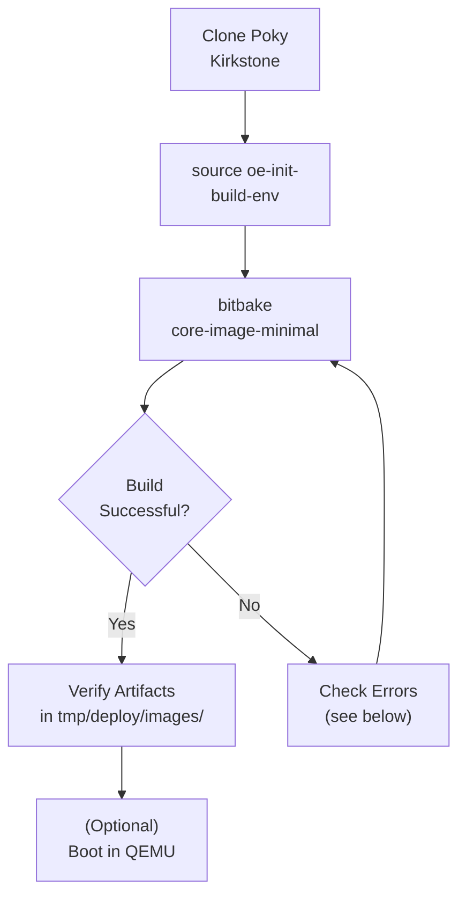

# Yocto Quick Build (Sanity Check)

<span class="phase-label">Phase 1 · Page 4 of 11</span>

!!! abstract "Page Goal"
    Build the stock `core-image-minimal` for to prove your host toolchain works. This follows the [official Yocto Quick Build guide](https://docs.yoctoproject.org/kirkstone/brief-yoctoprojectqs/index.html) and catches host issues before they become Tegra issues.

---

## Page Process Overview



---

## Why Do a Quick Build First?

<!-- CONTENT:
- Validates that all host dependencies are correctly installed
- Catches locale, disk space, and permission issues early
- Familiarizes you with the oe-init-build-env → bitbake workflow
- The Quick Build targets QEMU (a virtual machine) so you don't need any hardware
- Takes ~1-2 hours on a modern machine (first build)
- Once this works, you know your host is solid
-->

---

## Clone Poky & Checkout Kirkstone

<!-- CONTENT:
```bash
cd ~/yocto
git clone git://git.yoctoproject.org/poky
cd poky
git checkout -t origin/kirkstone -b my-kirkstone
```

Verify you're on the right branch:
```bash
git branch
# Should show: * my-kirkstone
```
-->

---

## Source the Build Environment

<!-- CONTENT:
```bash
source oe-init-build-env
```

What this does:
- Creates the `build/` directory (if it doesn't exist)
- Generates `build/conf/local.conf` and `build/conf/bblayers.conf` with defaults
- Sets up environment variables and adds `bitbake` to your PATH
- Changes your working directory to `build/`

You must run this in **every new terminal session** before running bitbake.
-->

---

## Build `core-image-minimal`

<!-- CONTENT:
```bash
bitbake core-image-minimal
```

What to expect:
- First build downloads ~5-10 GB of source code
- Build time: 1-3 hours depending on CPU/RAM/disk speed
- You'll see task progress: `NOTE: Running task X of Y`
- The build is successful when you see: `NOTE: Tasks Summary: ... do_build`
-->

---

## Verify Build Artifacts

<!-- CONTENT:
```bash
ls tmp/deploy/images/qemux86-64/
```

Expected files:
- `core-image-minimal-qemux86-64.rootfs.ext4` — root filesystem
- `bzImage` — Linux kernel
- `core-image-minimal-qemux86-64.rootfs.manifest` — package list

If these files exist, your host setup is confirmed working.
-->

---

## (Optional) Boot in QEMU

<!-- CONTENT:
```bash
runqemu qemux86-64
```

This will launch a QEMU virtual machine running your freshly built image.
- Login as `root` (no password)
- Explore, then close the window to exit

This step is optional — the goal was just to validate the build.
-->

---

[← Host Setup](03-host-setup.md){ .md-button }
[Next: Cloning & Branching →](05-cloning-and-branching.md){ .md-button .md-button--primary }
