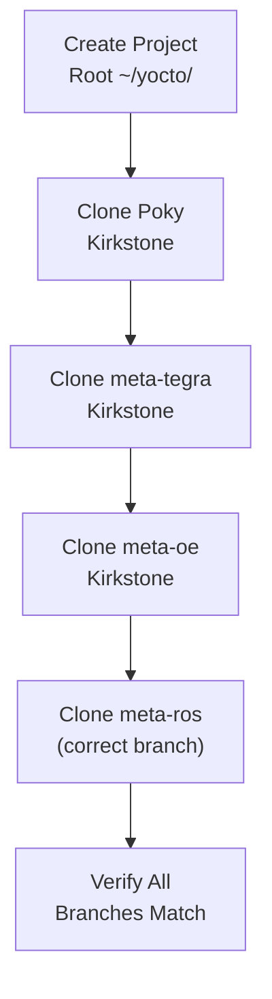

# Cloning Poky & Branch Strategy

<span class="phase-label">Phase 1 · Page 5 of 11</span>

!!! abstract "Page Goal"
    Clone Poky and all required layer repositories into your workspace, ensuring every repo is checked out to a compatible Kirkstone branch.

---

## Page Process Overview



---

## Project Workspace Layout

<!-- CONTENT:
Before cloning, establish a clean workspace. All repos live side by side:

```bash
mkdir -p ~/yocto && cd ~/yocto
```

After cloning, your directory should look like:

```
~/yocto/
├── poky/                  ← Reference distribution
├── meta-tegra/            ← NVIDIA BSP
├── meta-openembedded/     ← Community layers
└── meta-ros/              ← ROS recipes
```
-->

---

## Cloning Each Repository

<!-- CONTENT:
### Poky (Reference Distribution)
```bash
git clone -b kirkstone git://git.yoctoproject.org/poky
```

### meta-tegra (NVIDIA Tegra BSP)
```bash
git clone -b kirkstone https://github.com/OE4T/meta-tegra.git
```

### meta-openembedded
```bash
git clone -b kirkstone https://git.openembedded.org/meta-openembedded
```

### meta-ros
```bash
git clone -b <branch> https://github.com/ros/meta-ros.git
```
Note: meta-ros branch naming may differ — verify compatibility with Kirkstone.
-->

---

## Branch Alignment

!!! warning "Critical: All Layers Must Be on the Same Release"
    Mixing branches (e.g., Kirkstone Poky with Dunfell meta-tegra) will cause **build failures**. Every layer must target the same Yocto release.

<!-- CONTENT:
Why branch alignment matters:
- Each Yocto release changes API, variable names, and class behavior
- Recipes in one branch may depend on features that don't exist in another
- meta-tegra Kirkstone expects OE-Core Kirkstone APIs

How to verify:
```bash
cd ~/yocto/poky && git branch
cd ~/yocto/meta-tegra && git branch
cd ~/yocto/meta-openembedded && git branch
cd ~/yocto/meta-ros && git branch
```

All should show `kirkstone` (or a branch tracking `origin/kirkstone`).
-->

---

## Directory Listing After Cloning

<!-- CONTENT:
Verify your workspace:

```bash
ls ~/yocto/
# poky  meta-tegra  meta-openembedded  meta-ros
```

```bash
for dir in poky meta-tegra meta-openembedded meta-ros; do
    echo "$dir: $(cd ~/yocto/$dir && git rev-parse --abbrev-ref HEAD)"
done
```

Expected output:
```
poky: kirkstone
meta-tegra: kirkstone
meta-openembedded: kirkstone
meta-ros: kirkstone
```
-->

---

[← Quick Build](04-quick-build.md){ .md-button }
[Next: Adding Layers →](06-adding-layers.md){ .md-button .md-button--primary }
