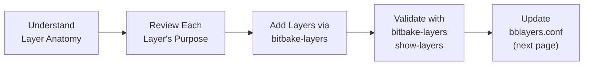
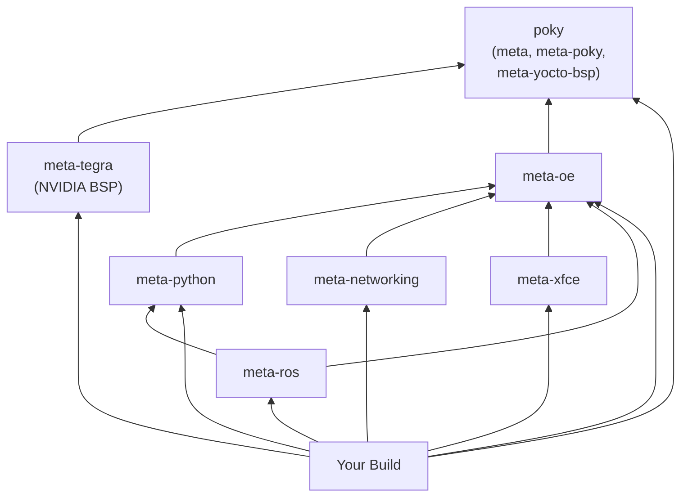

# Adding Layers & Configuring `bblayers.conf`

<span class="phase-label">Phase 1 · Page 6 of 10</span>

!!! abstract "Page Goal"
    Understand what each layer provides, add them to your build one by one, validate the layer stack, and configure `bblayers.conf` for the Jetson TX2i build.

---

## Page Process Overview



---

## What Is a Yocto Layer?

<!-- CONTENT:
A layer is a directory containing:
```
meta-example/
├── conf/
│   └── layer.conf          ← Layer configuration (name, priority, compatibility)
├── recipes-core/           ← Recipe directories organized by category
│   └── example/
│       └── example_1.0.bb  ← A recipe
├── recipes-kernel/
│   └── linux/
│       └── linux-example.bbappend  ← Modifies an existing recipe
├── classes/                ← Shared build logic (.bbclass files)
└── README                  ← Layer documentation
```

Key concepts:
- Every layer has a `conf/layer.conf` that declares its name and compatibility
- Layers can depend on other layers
- Layers have a priority (`BBFILE_PRIORITY`) — higher priority wins on conflicts
- Layers are modular — add only what you need
-->

---

## Layer Table — What We Use

<!-- CONTENT:
| Layer | Repository | Sub-Layers to Include | What It Provides | Dependencies |
|-------|-----------|----------------------|------------------|-------------|
| **meta** (OE-Core) | Included in Poky | — | Core Linux recipes (glibc, busybox, systemd, gcc) | None |
| **meta-poky** | Included in Poky | — | Poky distro configuration | meta |
| **meta-yocto-bsp** | Included in Poky | — | Reference BSP for QEMU and BeagleBone | meta |
| **meta-tegra** | OE4T/meta-tegra | — | NVIDIA Tegra BSP: kernel, bootloader, flash tools, CUDA | meta |
| **meta-oe** | meta-openembedded | `meta-oe` | Extra recipes not in OE-Core (utilities, libs) | meta |
| **meta-python** | meta-openembedded | `meta-python` | Python packages and runtime | meta, meta-oe |
| **meta-networking** | meta-openembedded | `meta-networking` | Network utilities and daemons | meta, meta-oe |
| **meta-xfce** | meta-openembedded | `meta-xfce` | Xfce desktop environment | meta, meta-oe |
| **meta-ros** | ros/meta-ros | *(check sub-layers)* | ROS Melodic/Noetic recipes | meta, meta-oe, meta-python |
-->

---

## Step-by-Step: Adding Layers

<!-- CONTENT:
First, source the build environment:
```bash
cd ~/yocto/poky
source oe-init-build-env
```

Then add layers one at a time. Order matters — add dependencies first.

### Step 1: Add meta-tegra
```bash
bitbake-layers add-layer ../../meta-tegra
```

### Step 2: Add meta-openembedded sub-layers
```bash
bitbake-layers add-layer ../../meta-openembedded/meta-oe
bitbake-layers add-layer ../../meta-openembedded/meta-python
bitbake-layers add-layer ../../meta-openembedded/meta-networking
bitbake-layers add-layer ../../meta-openembedded/meta-xfce
```

### Step 3: Add meta-ros
```bash
bitbake-layers add-layer ../../meta-ros/meta-ros-common
bitbake-layers add-layer ../../meta-ros/meta-ros2  # or meta-ros1 depending on your target
```

Each `add-layer` command checks dependencies automatically and will error if a required layer is missing.
-->

---

## Layer Priority

<!-- CONTENT:
- `BBFILE_PRIORITY` is set in each layer's `layer.conf`
- Higher number = higher priority
- When two layers provide the same recipe, the higher-priority layer wins
- Default priority is 6; BSP layers are typically higher (e.g., meta-tegra = 8)
- You rarely need to change this — just be aware of it when debugging
-->

---

## Layer Dependency Diagram



---

## Validating Layers

<!-- CONTENT:
After adding all layers, verify:

```bash
bitbake-layers show-layers
```

Expected output:
```
layer                 path                                      priority
==========================================================================
meta                  /home/user/yocto/poky/meta                5
meta-poky             /home/user/yocto/poky/meta-poky           5
meta-yocto-bsp        /home/user/yocto/poky/meta-yocto-bsp      5
meta-tegra            /home/user/yocto/meta-tegra               8
meta-oe               /home/user/yocto/meta-openembedded/meta-oe 6
meta-python           ...                                        7
meta-networking       ...                                        5
meta-xfce             ...                                        7
meta-ros-common       ...                                        ...
```

If a layer is missing, add it. If there are dependency errors, check branch alignment (Page 5).
-->

---

## Configuring `bblayers.conf`

<!-- CONTENT:
- Location: `build/conf/bblayers.conf`
- Created automatically by `source oe-init-build-env`
- Declares which layers are active in your build via the `BBLAYERS` variable
- BitBake reads this file first — if a layer isn't listed here, it doesn't exist to the build system
- Edited automatically by `bitbake-layers add-layer` or manually
-->

---

### Full Annotated `bblayers.conf`

<!-- CONTENT:
```bash
# bblayers.conf — Layer configuration for Jetson TX2i Yocto Build
# Location: ~/yocto/poky/build/conf/bblayers.conf
# 
# This file tells BitBake which layers to include in the build.
# Paths are absolute. Adjust YOCTO_ROOT to match your workspace.

# Convenience variable — not a BitBake standard, just for readability
YOCTO_ROOT := "${TOPDIR}/../.."

BBLAYERS ?= " \
  ${YOCTO_ROOT}/poky/meta                              \
  ${YOCTO_ROOT}/poky/meta-poky                         \
  ${YOCTO_ROOT}/poky/meta-yocto-bsp                    \
  \
  ${YOCTO_ROOT}/meta-tegra                             \
  \
  ${YOCTO_ROOT}/meta-openembedded/meta-oe              \
  ${YOCTO_ROOT}/meta-openembedded/meta-python           \
  ${YOCTO_ROOT}/meta-openembedded/meta-networking       \
  ${YOCTO_ROOT}/meta-openembedded/meta-xfce             \
  \
  ${YOCTO_ROOT}/meta-ros/meta-ros-common                \
  ${YOCTO_ROOT}/meta-ros/meta-ros2                      \
  "
```

### Line-by-Line Breakdown

| Line(s) | Layer | Why It's Here |
|---------|-------|---------------|
| `poky/meta` | OE-Core | Core Linux recipes — this is always required |
| `poky/meta-poky` | Poky distro | Default distro configuration |
| `poky/meta-yocto-bsp` | Reference BSP | Provides QEMU machines (used in quick build) |
| `meta-tegra` | NVIDIA BSP | Machine configs, kernel, bootloader, flash tools for Jetson |
| `meta-oe` | OpenEmbedded extras | Additional utilities and libraries |
| `meta-python` | Python packages | Python runtime and packages (dependency of meta-ros) |
| `meta-networking` | Network stack | Networking daemons and tools |
| `meta-xfce` | Desktop | Xfce desktop environment components |
| `meta-ros-common` | ROS shared | Common ROS infrastructure |
| `meta-ros2` | ROS 2 recipes | ROS 2 packages |
-->

---

### Layer Ordering — Does It Matter?

<!-- CONTENT:
- The order in `BBLAYERS` does NOT determine priority — that's controlled by `BBFILE_PRIORITY` in each layer's `layer.conf`
- However, convention is to list base layers first, BSP second, and feature layers after
- This makes the file more readable and easier to debug
-->

---

### Verifying the Configuration

<!-- CONTENT:
```bash
bitbake-layers show-layers
```

Check:
1. All expected layers appear in the output
2. No `ERROR: Layer` dependency warnings
3. Priorities look reasonable (meta-tegra should be higher than meta)
-->

---

### Common Mistakes

<!-- CONTENT:
| Mistake | Symptom | Fix |
|---------|---------|-----|
| Missing sub-layer (e.g., `meta-python` not listed) | `ERROR: Nothing PROVIDES 'python3-...'` | Add the missing layer |
| Wrong path (typo) | `ERROR: Layer directory '...' does not exist` | Check path in bblayers.conf |
| Relative vs absolute paths | Works on one machine, fails on another | Use `${TOPDIR}` or absolute paths |
| Forgot to add meta-oe but added meta-python | Dependency error on parse | meta-python depends on meta-oe — add meta-oe first |
-->

---

[← Cloning & Branching](05-cloning-and-branching.md){ .md-button }
[Next: Deep Dive — local.conf →](07-local-conf.md){ .md-button .md-button--primary }
