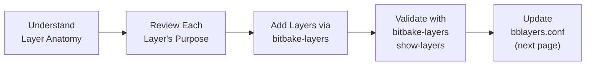

# Adding Layers & Configuring `bblayers.conf`

<span class="phase-label">Phase 1 · Page 6 of 9</span>

!!! abstract "Page Goal"
    - The main files to be edited are the local.conf and bblayers.conf which are located in the conf folder inside the build directory.
    - Here we understand what each layer provides, add them to your build one by one, validate the layer stack, and configure `bblayers.conf` for the Jetson TX2i build.

---

## Page Process Overview



---
## What Is a Yocto Layer?

A Yocto layer is a directory structured to store metadata configuration files, classes, and recipes. The generic directory layout of a layer looks like this:

```text
meta-example/
├── conf/
│   └── layer.conf          ← Layer configuration (name, priority, compatibility)
├── recipes-core/           ← Recipe directories organized by category
│   └── example/
│       └── example_1.0.bb  ← A recipe
├── recipes-kernel/
│   └── linux/
│       └── linux-example.bbappend  ← Modifies an existing recipe
├── classes/                ← Shared build logic (.bbclass files)
└── README                  ← Layer documentation
```

### Key Layer Concepts:
- **`layer.conf`**: Located in `conf/`, it declares the layer's name, priority, and compatibility.
- **Layer Dependencies**: A layer can declare dependencies on other layers; BitBake will parse and verify these dependencies during initialization.
- **Layer Priority (`BBFILE_PRIORITY`)**: Controls which recipe takes precedence if multiple layers define the same recipe.

---

## Sourcing the Build Environment

Before you can query or modify layers, you must source the Yocto Project initialization script from the terminal. 

```bash
cd ~/yocto
source poky/oe-init-build-env poky/build
```

!!! note "The Build Directory Location"
    By passing `poky/build` to the initialization script, the build folder is created inside the `poky` directory. Sourcing the script automatically changes your working directory to `~/yocto/poky/build/`.

---

## Sourcing & Initial `bblayers.conf`

Sourcing the environment script generates a baseline configuration directory (`conf/`) containing the `bblayers.conf` file. This configuration tells BitBake which layers are active.

By default, the initial generated `build/conf/bblayers.conf` file includes only the core Poky distribution metadata:

```bash
# POKY_BBLAYERS_CONF_VERSION is increased each time build/conf/bblayers.conf
# changes incompatibly
POKY_BBLAYERS_CONF_VERSION = "2"

BBPATH = "${TOPDIR}"
BBFILES ?= ""

BBLAYERS ?= " \
  /home/yocto/recreate/poky/meta \
  /home/yocto/recreate/poky/meta-poky \
  /home/yocto/recreate/poky/meta-yocto-bsp \
  "
```

---

## How to Add Layers

There are two primary methods to add a new layer to your build environment:

### Method 1: Using the `bitbake-layers` CLI (Recommended)
You can use the `bitbake-layers add-layer` utility to automatically register layers in your config. The path can be absolute, or **relative to your build directory** (`~/yocto/poky/build`).

Since the build directory is nested two levels deep inside `poky/build`, a layer located at `~/yocto/meta-tegra` is represented relatively as `../../meta-tegra`.

```bash
bitbake-layers add-layer ../../meta-tegra
```

Using relative paths makes your build directory portable across host environments (e.g., if you share your build configuration with another developer whose home directory path differs).

### Method 2: Manually Editing `bblayers.conf`
You can open `build/conf/bblayers.conf` in a text editor and add the absolute or relative path directly to the `BBLAYERS` list:

```bash
BBLAYERS ?= " \
  /home/yocto/recreate/poky/meta \
  /home/yocto/recreate/poky/meta-poky \
  /home/yocto/recreate/poky/meta-yocto-bsp \
  /home/yocto/recreate/meta-tegra \
  "
```

---

## Cloning the optional `meta-qt5` Layer

To extend package options in our build configuration and support graphical utilities, we can clone the `meta-qt5` layer. This is useful if you plan to compile custom Qt5-based user interfaces or run GUI-based data plotting applications directly on target hardware.

!!! info "Status Note"
    Although `meta-qt5` packages are available in the recipe configuration, GUI components and real-time GUI plots are not actively tested in the core flight build image. 

Run the following command from the workspace parent directory (`~/yocto`) to clone `meta-qt5`:

```bash
git clone -b kirkstone https://github.com/meta-qt5/meta-qt5.git
```

---

## Detailed Build Layer Summary

| Layer | Repository Path | What It Provides |
|---|---|---|
| **meta** | `poky/meta` | Core OS components, systemd, compiler tools. |
| **meta-poky** | `poky/meta-poky` | Reference distribution configurations. |
| **meta-yocto-bsp** | `poky/meta-yocto-bsp` | Reference board support package configs. |
| **meta-tegra** | `meta-tegra` | NVIDIA Tegra L4T kernel, bootloader, and flashing scripts. |
| **meta-oe** | `meta-openembedded/meta-oe` | General utility packages (dependency for other sub-layers). |
| **meta-python** | `meta-openembedded/meta-python` | Python modules and utilities. |
| **meta-networking** | `meta-openembedded/meta-networking` | Network protocol utilities, SSH, and firewalls. |
| **meta-multimedia** | `meta-openembedded/meta-multimedia` | Audio/video processing tools. |
| **meta-gnome** | `meta-openembedded/meta-gnome` | GNOME desktop and library components. |
| **meta-xfce** | `meta-openembedded/meta-xfce` | Lightweight XFCE Desktop recipes. |
| **meta-ros-common** | `meta-ros/meta-ros-common` | Core ROS utilities and common build helpers. |
| **meta-ros2** | `meta-ros/meta-ros2` | Generic ROS 2 metadata recipes. |
| **meta-ros2-humble** | `meta-ros/meta-ros2-humble` | Specific ROS 2 Humble packages. |
| **meta-qt5** | `meta-qt5` | Qt5 applications, modules, and platform support. |

---

## Step-by-Step CLI Commands to Add All Layers

Run these relative-path commands sequentially from the build directory (`~/yocto/poky/build`) to add the required layers in the correct dependency order:

```bash
# 1. Add NVIDIA BSP Layer
bitbake-layers add-layer ../../meta-tegra

# 2. Add OpenEmbedded Sub-Layers
bitbake-layers add-layer ../../meta-openembedded/meta-oe
bitbake-layers add-layer ../../meta-openembedded/meta-python
bitbake-layers add-layer ../../meta-openembedded/meta-networking
bitbake-layers add-layer ../../meta-openembedded/meta-multimedia
bitbake-layers add-layer ../../meta-openembedded/meta-gnome
bitbake-layers add-layer ../../meta-openembedded/meta-xfce

# 3. Add ROS and ROS 2 Layers
bitbake-layers add-layer ../../meta-ros/meta-ros-common
bitbake-layers add-layer ../../meta-ros/meta-ros2
bitbake-layers add-layer ../../meta-ros/meta-ros2-humble

# 4. Add Qt5 Layer (optional GUI libraries)
bitbake-layers add-layer ../../meta-qt5
```

---

## Final Output: `bblayers.conf`

Once all layers are added, the final contents of `poky/build/conf/bblayers.conf` will look like this:

### Option A: Using Absolute Workspace Paths
This configuration maps to a static folder layout on the target build machine (using `/home/raigyocto` as an example):

```bash
# POKY_BBLAYERS_CONF_VERSION is increased each time build/conf/bblayers.conf
# changes incompatibly
POKY_BBLAYERS_CONF_VERSION = "2"

BBPATH = "${TOPDIR}"
BBFILES ?= ""

BBLAYERS ?= " \
  /home/yocto/poky/meta \
  /home/yocto/poky/meta-poky \
  /home/yocto/poky/meta-yocto-bsp \
  /home/yocto/meta-openembedded/meta-oe \
  /home/yocto/meta-openembedded/meta-python \
  /home/yocto/meta-openembedded/meta-networking \
  /home/yocto/meta-openembedded/meta-multimedia \
  /home/yocto/meta-openembedded/meta-gnome \
  /home/yocto/meta-openembedded/meta-xfce \
  /home/yocto/meta-ros/meta-ros-common \
  /home/yocto/meta-ros/meta-ros2 \
  /home/yocto/meta-ros/meta-ros2-humble \
  /home/yocto/meta-qt5 \
  /home/yocto/meta-tegra \
  "
```

### Option B: Using Relative Workspace Paths
This layout utilizes `../` and `../../` relative paths from the build environment context. It is the preferred method for sharing build directories:

```bash
# POKY_BBLAYERS_CONF_VERSION is increased each time build/conf/bblayers.conf
# changes incompatibly
POKY_BBLAYERS_CONF_VERSION = "2"


BBFILES ?= ""

BBLAYERS ?= " \
  /../meta \
  /../meta-poky \
  /../meta-yocto-bsp \
  /../../meta-openembedded/meta-oe \
  /../../meta-openembedded/meta-python \
  /../../meta-openembedded/meta-networking \
  /../../meta-openembedded/meta-multimedia \
  /../../meta-openembedded/meta-gnome \
  /../../meta-openembedded/meta-xfce \
  /../../meta-ros/meta-ros-common \
  /../../meta-ros/meta-ros2 \
  /../../meta-ros/meta-ros2-humble \
  /../../meta-qt5 \
  /../../meta-tegra \
  "
```

---

## Validating Layers

After adding all layers, verify the layer stack configuration by running the following command from your build directory:

```bash
bitbake-layers show-layers
```

### Expected Output
The command prints out each registered layer, its location path, and its parsing priority:

```text
layer                 path                                                 priority
====================================================================================
meta                  /home/raigyocto/yocto/poky/meta                      5
meta-poky             /home/raigyocto/yocto/poky/meta-poky                 5
meta-yocto-bsp        /home/raigyocto/yocto/poky/meta-yocto-bsp             5
meta-oe               /home/raigyocto/yocto/meta-openembedded/meta-oe      6
meta-python           /home/raigyocto/yocto/meta-openembedded/meta-python  7
meta-networking       /home/raigyocto/yocto/meta-openembedded/meta-net...  5
meta-multimedia       /home/raigyocto/yocto/meta-openembedded/meta-mul...  5
meta-gnome            /home/raigyocto/yocto/meta-openembedded/meta-gnome   5
meta-xfce             /home/raigyocto/yocto/meta-openembedded/meta-xfce    7
meta-ros-common       /home/raigyocto/yocto/meta-ros/meta-ros-common       10
meta-ros2             /home/raigyocto/yocto/meta-ros/meta-ros2            11
meta-ros2-humble      /home/raigyocto/yocto/meta-ros/meta-ros2-humble      12
meta-qt5              /home/raigyocto/yocto/meta-qt5                       7
meta-tegra            /home/raigyocto/yocto/meta-tegra                     5
```

---

[← Cloning & Branching](05-cloning-and-branching.md){ .md-button }
[Next: Deep Dive — local.conf →](07-local-conf.md){ .md-button .md-button--primary }
