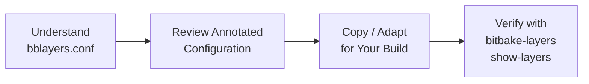

# Configuring `bblayers.conf`

<span class="phase-label">Phase 1 · Page 7 of 11</span>

!!! abstract "Page Goal"
    Understand `bblayers.conf`, review a complete annotated version for this project, and verify it. After this page, your layer stack is locked in.

---

## Page Process Overview



---

## What Is `bblayers.conf`?

<!-- CONTENT:
- Location: `build/conf/bblayers.conf`
- Created automatically by `source oe-init-build-env`
- Declares which layers are active in your build via the `BBLAYERS` variable
- BitBake reads this file first — if a layer isn't listed here, it doesn't exist to the build system
- Edited automatically by `bitbake-layers add-layer` or manually
-->

---

## Full Annotated `bblayers.conf`

<!-- CONTENT:
```bash
# bblayers.conf — Layer configuration for Jetson TX2i Yocto Build
# Location: ~/yocto/poky/build/conf/bblayers.conf
# 
# This file tells BitBake which layers to include in the build.
# Paths are absolute. Adjust YOCTO_ROOT to match your workspace.

# Convenience variable — not a BitBake standard, just for readability
YOCTO_ROOT := "${TOPDIR}/../.."

BBLAYERS ?= " \
  ${YOCTO_ROOT}/poky/meta                              \
  ${YOCTO_ROOT}/poky/meta-poky                         \
  ${YOCTO_ROOT}/poky/meta-yocto-bsp                    \
  \
  ${YOCTO_ROOT}/meta-tegra                             \
  \
  ${YOCTO_ROOT}/meta-openembedded/meta-oe              \
  ${YOCTO_ROOT}/meta-openembedded/meta-python           \
  ${YOCTO_ROOT}/meta-openembedded/meta-networking       \
  ${YOCTO_ROOT}/meta-openembedded/meta-xfce             \
  \
  ${YOCTO_ROOT}/meta-ros/meta-ros-common                \
  ${YOCTO_ROOT}/meta-ros/meta-ros2                      \
  "
```

### Line-by-Line Breakdown

| Line(s) | Layer | Why It's Here |
|---------|-------|---------------|
| `poky/meta` | OE-Core | Core Linux recipes — this is always required |
| `poky/meta-poky` | Poky distro | Default distro configuration |
| `poky/meta-yocto-bsp` | Reference BSP | Provides QEMU machines (used in quick build) |
| `meta-tegra` | NVIDIA BSP | Machine configs, kernel, bootloader, flash tools for Jetson |
| `meta-oe` | OpenEmbedded extras | Additional utilities and libraries |
| `meta-python` | Python packages | Python runtime and packages (dependency of meta-ros) |
| `meta-networking` | Network stack | Networking daemons and tools |
| `meta-xfce` | Desktop | Xfce desktop environment components |
| `meta-ros-common` | ROS shared | Common ROS infrastructure |
| `meta-ros2` | ROS 2 recipes | ROS 2 packages |
-->

---

## Layer Ordering — Does It Matter?

<!-- CONTENT:
- The order in `BBLAYERS` does NOT determine priority — that's controlled by `BBFILE_PRIORITY` in each layer's `layer.conf`
- However, convention is to list base layers first, BSP second, and feature layers after
- This makes the file more readable and easier to debug
-->

---

## Verifying the Configuration

<!-- CONTENT:
```bash
bitbake-layers show-layers
```

Check:
1. All expected layers appear in the output
2. No `ERROR: Layer` dependency warnings
3. Priorities look reasonable (meta-tegra should be higher than meta)
-->

---

## Common Mistakes

<!-- CONTENT:
| Mistake | Symptom | Fix |
|---------|---------|-----|
| Missing sub-layer (e.g., `meta-python` not listed) | `ERROR: Nothing PROVIDES 'python3-...'` | Add the missing layer |
| Wrong path (typo) | `ERROR: Layer directory '...' does not exist` | Check path in bblayers.conf |
| Relative vs absolute paths | Works on one machine, fails on another | Use `${TOPDIR}` or absolute paths |
| Forgot to add meta-oe but added meta-python | Dependency error on parse | meta-python depends on meta-oe — add meta-oe first |
-->

---

[← Adding Layers](06-adding-layers.md){ .md-button }
[Next: Deep Dive — local.conf →](08-local-conf.md){ .md-button .md-button--primary }
