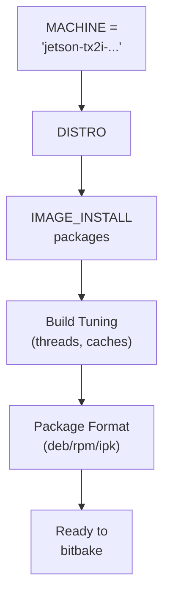

# Deep Dive: `local.conf`

<span class="phase-label">Phase 1 · Page 7 of 10</span>

!!! abstract "Page Goal"
    Understand every important variable in `local.conf`, why each setting was chosen for this project, and have a complete copy-pasteable configuration.

---

## Page Process Overview



---

## Where Is `local.conf`?

<!-- CONTENT:
- Path: `build/conf/local.conf`
- Auto-generated by `source oe-init-build-env` on first run
- This is your *per-build* configuration — it's NOT committed to version control
- Changes here override defaults from layers and distro configs
-->

---

## `MACHINE` — Choosing Your Target Hardware

<!-- CONTENT:
The MACHINE variable tells BitBake which hardware you're building for.

### Finding Valid Machine Names

Valid machine names live in BSP layer conf files:
```bash
ls ~/yocto/meta-tegra/conf/machine/
```

Example output:
```
jetson-tx2-devkit.conf
jetson-tx2i.conf
jetson-nano-devkit.conf
jetson-xavier-nx-devkit.conf
...
```

### Setting MACHINE
```bash
MACHINE = "jetson-tx2i"
```

### jetson-tx2i vs jetson-tx2

| Attribute | jetson-tx2 | jetson-tx2i |
|-----------|-----------|-------------|
| Variant | Consumer | Industrial |
| Temp range | 0–80°C | −40–85°C |
| ECC memory | No | Yes |
| Machine conf | jetson-tx2-devkit.conf | jetson-tx2i.conf |

For this project we use `jetson-tx2i` — the industrial variant for space applications.
-->

---

## `DISTRO` — Distribution Configuration

<!-- CONTENT:
```bash
DISTRO = "poky"
```

- The default Poky distro is sufficient for our purposes
- You can create a custom distro layer later if needed
- DISTRO controls default package manager, init system (systemd vs sysvinit), and other policies
-->

---

## `IMAGE_INSTALL` — Defining Your Packages

<!-- CONTENT:
IMAGE_INSTALL controls which packages are included in your root filesystem image.

```bash
IMAGE_INSTALL:append = " \
    packagegroup-core-boot \
    package-name-1 \
    package-name-2 \
    ..."
```

### Package List for This Project

| Package | Category | Why |
|---------|----------|-----|
| `openssh` | Networking | Remote access to the device |
| `nano` | Utilities | Simple text editor for on-device config |
| `i2c-tools` | Hardware | I2C debugging for peripherals |
| `python3` | Runtime | Required by ROS and custom scripts |
| *...ROS packages...* | Application | Core robot operating system |
| *...GUI packages...* | Desktop | Minimal Xfce for display output |

### `+=` vs `:append`
- `+=` adds with a space — but can be overridden by later assignments
- `:append` (Kirkstone syntax) appends and cannot be overridden — safer for additive lists
- In Kirkstone, the old `_append` syntax is replaced by `:append`
-->

---

## Build Tuning

<!-- CONTENT:
### Parallelism
```bash
BB_NUMBER_THREADS = "8"      # Number of BitBake tasks to run in parallel
PARALLEL_MAKE = "-j 8"       # Number of make jobs per recipe
```

Rule of thumb: set both to the number of CPU cores on your host machine.

### Download Directory
```bash
DL_DIR = "/home/user/yocto/downloads"
```
Stores fetched source tarballs. Share across builds to avoid re-downloading.

### Shared State Cache
```bash
SSTATE_DIR = "/home/user/yocto/sstate-cache"
```
Stores pre-built build artifacts. Dramatically speeds up rebuilds and clean builds.

### Temporary Directory
```bash
TMPDIR = "${TOPDIR}/tmp"
```
Default is fine. This is where all build output goes (~50-100 GB).
-->

---

## Package Format

<!-- CONTENT:
```bash
PACKAGE_CLASSES = "package_deb"
```

| Format | Pros | Cons |
|--------|------|------|
| **deb** | Familiar (Debian/Ubuntu), good tooling, apt support | Slightly more overhead |
| rpm | Standard in Fedora/Red Hat ecosystems | Less common in embedded |
| ipk | Lightweight, opkg package manager | Limited tooling |

We chose **deb** because:
1. We plan to add apt support for on-device package updates (Phase 4)
2. Familiar tooling for debugging
3. Good metadata support
-->

---

## Full Annotated `local.conf`

<!-- CONTENT:
```bash
# local.conf — Build configuration for Jetson TX2i Yocto Build
# Location: ~/yocto/poky/build/conf/local.conf
#
# This file is NOT version-controlled. Each developer maintains their own copy.

# --- Target Hardware ---
MACHINE = "jetson-tx2i"

# --- Distribution ---
DISTRO = "poky"

# --- Package Format ---
PACKAGE_CLASSES = "package_deb"

# --- Image Packages ---
IMAGE_INSTALL:append = " \
    packagegroup-core-boot \
    openssh \
    nano \
    python3 \
    i2c-tools \
    "
# Add ROS packages, GUI packages, etc. as needed

# --- Build Parallelism ---
BB_NUMBER_THREADS = "8"
PARALLEL_MAKE = "-j 8"

# --- Shared Directories ---
DL_DIR = "${TOPDIR}/../../downloads"
SSTATE_DIR = "${TOPDIR}/../../sstate-cache"

# --- Extra Settings ---
EXTRA_IMAGE_FEATURES += "debug-tweaks"  # Allows root login without password (dev only!)
```
-->

---

## MACHINE Naming Gotchas

!!! warning "Common MACHINE Pitfalls"
    <!-- CONTENT:
    - The MACHINE name must **exactly match** a `.conf` filename in `meta-tegra/conf/machine/` (minus the `.conf` extension)
    - `jetson-tx2i` ≠ `jetson-tx2-i` ≠ `jetsontx2i` — hyphens matter
    - If you see `ERROR: Nothing PROVIDES 'virtual/kernel'`, your MACHINE is probably wrong
    - Always check: `ls meta-tegra/conf/machine/*.conf`
    -->

---

[← Adding Layers & bblayers.conf](06-adding-layers.md){ .md-button }
[Next: Kick Off the Build →](08-kickoff-build.md){ .md-button .md-button--primary }
