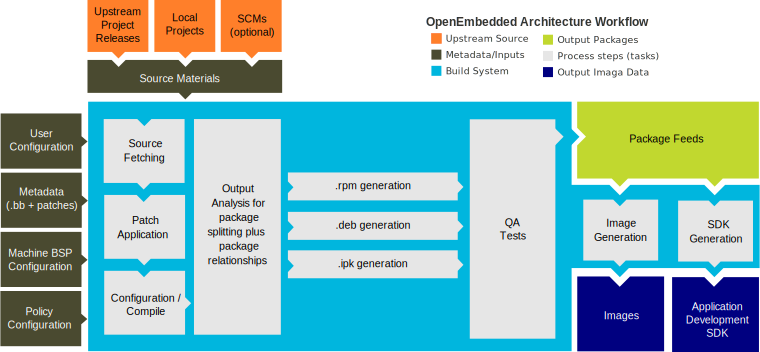

# The Build Process Explained

<span class="phase-label">Phase 1 · Page 8 of 9</span>

!!! abstract "Page Goal"
    Run the actual build, understand what BitBake does under the hood, and know how to debug when things go wrong.

---


!!! note "Starting the build"
   
   ```bash
    Remember the Max File watches error from page 4 of phase 1, max sure to increase max file watches

    To Check our build in the commandline -  run the commands as below in the build directory.

    verify layers again using bitbake-layers show-layers

    bitbake core-image-sato or bitbake core-image-full-cmdline


   ```

---

### Terminal Output
You'll see lines like:
```
NOTE: Preparing RunQueue
NOTE: Executing Tasks
Currently 3 running tasks (245 of 4521)  5% |##                    |
0: linux-tegra-5.10.104+gitAUTOINC+...-r0 do_fetch (from OE4T/...)
1: glibc-2.35-r0 do_compile
2: busybox-1.35.0-r0 do_configure

This is representative, a screenshot will be attached here again for reference.
```
---

## Rebuilds Are Fast
- After your first build, subsequent builds are **much faster**. Yocto caches (stores all the completed work in a directory for quick access) for every task (this is called the "sstate cache"), so only changed recipes need to be rebuilt.

## Watching the Build
- BitBake shows live progress in your terminal — you can see which tasks are running and how many are left.
- To check how much disk space the build is using, open a second terminal and run: `du -sh ~/yocto/poky/build/tmp`
- If a task fails, BitBake tells you exactly which recipe and task failed, and where the log file is.

---

## Build Complete — What Success Looks Like

A successful build ends with:
```
NOTE: Tasks Summary: Attempted X tasks of which Y didn't need to be rerun and all succeeded.
```

No `ERROR:` lines. You're done!

## The BitBake Task Pipeline

The diagram below shows the high-level workflow of the Yocto Project build process, showing how configuration inputs and source materials flow through the system to produce package feeds, target images, and SDKs:




### What Each Task Does

Every recipe goes through these steps in order:

| Task | What It Does | Example |
|------|-------------|---------|
| `do_fetch` | Downloads source code from `SRC_URI` (git, http, local files) | Clones the Linux kernel from NVIDIA's git repo |
| `do_unpack` | Extracts downloaded archives into a working directory | Unpacks a `.tar.gz` into `tmp/work/.../<recipe>/` |
| `do_patch` | Applies patch files listed in `SRC_URI` | Applies PREEMPT_RT patch to the kernel |
| `do_configure` | Runs configuration (autoconf, cmake, kernel menuconfig) | `./configure --host=aarch64-...` |
| `do_compile` | Compiles the source code (cross-compilation) | `make -j8` with cross-compiler |
| `do_install` | Installs compiled files to a staging directory (`${D}`) | `make install DESTDIR=${D}` |
| `do_package` | Splits installed files into packages (deb/rpm/ipk) | Creates `linux-tegra_5.10.deb` |
| `do_package_write_deb` | Writes the actual `.deb` files to the deploy directory | Writes to `tmp/deploy/deb/` |
| `do_rootfs` | Assembles selected packages into a root filesystem | Creates the ext4 image |
| `do_image` | Converts rootfs to final image format(s) | Generates `.ext4`, `.wic`, etc. |
| `do_deploy` | Copies final artifacts to `tmp/deploy/images/<MACHINE>/` | Kernel, DTB, rootfs, flash tools |


---

## Build Directory Layout

After a build completes, your `build/` folder will contain these key directories:

```
build/
├── conf/
│   ├── local.conf          ← Your build configuration
│   └── bblayers.conf       ← Your layer configuration
├── tmp/
│   ├── deploy/
│   │   ├── images/         ←  Final images (ext4, kernel, DTB)
│   │   ├── deb/            ← Built .deb packages
│   │   └── licenses/       ← License files for all packages
│   ├── work/
│   │   └── <ARCH>/         ← Per-recipe working directories
│   │       └── <recipe>/
│   │           └── <version>/
│   │               ├── temp/
│   │               │   ├── log.do_compile     ← Build log
│   │               │   ├── log.do_configure   ← Config log
│   │               │   └── run.do_compile     ← Actual script that ran
│   │               ├── image/                 ← do_install output
│   │               └── packages-split/        ← Package contents
│   ├── sysroots/           ← Cross-compilation sysroots
│   └── buildstats/         ← Timing data per task
└── cache/                  ← BitBake parser cache
```

The most important directories to know:
- **`tmp/deploy/images/<MACHINE>/`** — your final OS image files (this is what you flash to the device)
- **`tmp/work/<ARCH>/<recipe>/<version>/temp/`** — log files for each recipe (go here when debugging build failures)

---

## Fixing a Failed Build

### How to Find What Went Wrong
1. BitBake prints the failed recipe and task name: `ERROR: Task (...) failed`
2. It also tells you exactly where the log file is: `ERROR: Logfile of failure stored in: /path/to/log.do_compile`
3. Open the log and read the last 50 lines to find the actual error: `cat <log-path> | tail -50`

### Re-Running a Single Recipe
```bash
bitbake -c compile <recipe-name>     # Re-run do_compile for one recipe
bitbake -c cleansstate <recipe-name> # Wipe sstate for one recipe and rebuild
```

### Common Build Errors

| Error | Likely Cause | Fix |
|-------|-------------|-----|
| `do_fetch: Fetcher failure` | Network issue or bad `SRC_URI` | Check internet; check recipe URL |
| `do_compile: ld returned 1 exit status` | Link error — missing dependency | Check `DEPENDS` in recipe |
| `do_rootfs: Unable to install ...` | Package not found | Check `IMAGE_INSTALL` spelling, check layer provides the package |
| `Nothing PROVIDES 'virtual/kernel'` | MACHINE not set or wrong | Check `local.conf` MACHINE value |


[← local.conf](07-local-conf.md){ .md-button }
[Next: Build Output & Flashing →](09-navigating-output-and-flashing.md){ .md-button .md-button--primary }
