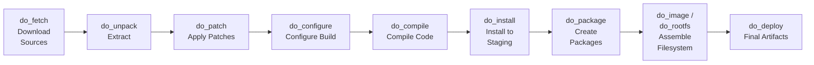

# Build Process Under the Hood

<span class="phase-label">Phase 1 · Page 9 of 10</span>

!!! info "Why Learn This Now?"
    You've already kicked off the build (Page 9) — it'll run for hours. Use that time to understand what's happening behind the scenes. This **parallel learning** approach means you're productive while waiting, and when the build finishes (or fails), you'll know exactly what happened.

!!! abstract "Page Goal"
    Understand the BitBake task pipeline, how recipes are parsed, what the shared state cache does, and how to navigate the build directory to debug issues.

---

## Page Process Overview



---

## The BitBake Task Pipeline

<!-- CONTENT:
Every recipe (`.bb` file) goes through a sequence of tasks. Each task is a function defined in the recipe or inherited from a class.

### Task-by-Task Breakdown

| Task | What It Does | Example |
|------|-------------|---------|
| `do_fetch` | Downloads source code from `SRC_URI` (git, http, local files) | Clones the Linux kernel from NVIDIA's git repo |
| `do_unpack` | Extracts downloaded archives into a working directory | Unpacks a `.tar.gz` into `tmp/work/.../<recipe>/` |
| `do_patch` | Applies patch files listed in `SRC_URI` | Applies PREEMPT_RT patch to the kernel |
| `do_configure` | Runs configuration (autoconf, cmake, kernel menuconfig) | `./configure --host=aarch64-...` |
| `do_compile` | Compiles the source code (cross-compilation) | `make -j8` with cross-compiler |
| `do_install` | Installs compiled files to a staging directory (`${D}`) | `make install DESTDIR=${D}` |
| `do_package` | Splits installed files into packages (deb/rpm/ipk) | Creates `linux-tegra_5.10.deb` |
| `do_package_write_deb` | Writes the actual `.deb` files to the deploy directory | Writes to `tmp/deploy/deb/` |
| `do_rootfs` | Assembles selected packages into a root filesystem | Creates the ext4 image |
| `do_image` | Converts rootfs to final image format(s) | Generates `.ext4`, `.wic`, etc. |
| `do_deploy` | Copies final artifacts to `tmp/deploy/images/<MACHINE>/` | Kernel, DTB, rootfs, flash tools |
-->

---

## Recipe Parsing

<!-- CONTENT:
### How BitBake Finds Recipes
1. BitBake reads `bblayers.conf` → finds all layers
2. Each layer's `layer.conf` declares recipe paths via `BBFILES`
3. BitBake parses all `.bb` and `.bbappend` files it finds
4. It builds a dependency graph of all recipes and tasks

### `.bb` vs `.bbappend`
- `.bb` files are the original recipe — they define everything from scratch
- `.bbappend` files modify an existing recipe — you use these to add patches, change config, etc.
- `.bbappend` files are matched by recipe name — `linux-tegra_%.bbappend` appends to `linux-tegra_<version>.bb`

### Variables and Overrides
- Variables can be set, appended, prepended, and overridden
- Kirkstone uses `:` syntax for overrides: `SRC_URI:append`, `DEPENDS:remove`, `RDEPENDS:${PN}`
- Machine-specific overrides: `SRC_URI:append:jetson-tx2i = "file://my-patch.patch"`
-->

---

## Shared State Cache (`sstate`)

<!-- CONTENT:
The sstate cache is what makes Yocto tolerable for daily use.

### How It Works
1. After each task completes, BitBake computes a hash of all inputs (source, config, dependencies)
2. The task output is stored in `SSTATE_DIR` keyed by this hash
3. On subsequent builds, if the hash matches, the cached result is used — the task is **skipped**
4. This is why rebuild #2 takes 10 minutes instead of 4 hours

### Sharing sstate
- Multiple developers can share an sstate cache via NFS or a shared directory
- CI/CD pipelines can pre-populate sstate to speed up builds
- `DL_DIR` (download directory) can also be shared to avoid re-downloading sources

### Invalidation
- If you change a recipe, its hash changes, and all dependent tasks are rebuilt
- Changing `local.conf` (e.g., adding a package) invalidates the image task but not individual package builds
-->

---

## Build Directory Anatomy

<!-- CONTENT:
After a build, the `build/` directory looks like this:

```
build/
├── conf/
│   ├── local.conf          ← Your build configuration
│   └── bblayers.conf       ← Your layer configuration
├── tmp/
│   ├── deploy/
│   │   ├── images/         ← ⭐ Final images (ext4, kernel, DTB) — Page 11
│   │   ├── deb/            ← Built .deb packages
│   │   └── licenses/       ← License files for all packages
│   ├── work/
│   │   └── <ARCH>/         ← Per-recipe working directories
│   │       └── <recipe>/
│   │           └── <version>/
│   │               ├── temp/
│   │               │   ├── log.do_compile     ← Build log
│   │               │   ├── log.do_configure   ← Config log
│   │               │   └── run.do_compile     ← Actual script that ran
│   │               ├── image/                 ← do_install output
│   │               └── packages-split/        ← Package contents
│   ├── sysroots/           ← Cross-compilation sysroots
│   └── buildstats/         ← Timing data per task
└── cache/                  ← BitBake parser cache
```

Key directories:
- `tmp/deploy/images/<MACHINE>/` — your final build artifacts (next page)
- `tmp/work/<ARCH>/<recipe>/<version>/temp/` — logs for debugging failed tasks
-->

---

## Debugging a Failed Task

<!-- CONTENT:
### Finding the Error
1. BitBake prints the failed recipe and task: `ERROR: Task (...) failed`
2. It tells you the log file: `ERROR: Logfile of failure stored in: /path/to/log.do_compile`
3. Read the log: `cat <log-path> | tail -50`

### Re-Running a Single Task
```bash
bitbake -c compile <recipe-name>     # Re-run do_compile for one recipe
bitbake -c cleansstate <recipe-name> # Wipe sstate for one recipe and rebuild
```

### Common Build Errors

| Error | Likely Cause | Fix |
|-------|-------------|-----|
| `do_fetch: Fetcher failure` | Network issue or bad `SRC_URI` | Check internet; check recipe URL |
| `do_compile: ld returned 1 exit status` | Link error — missing dependency | Check `DEPENDS` in recipe |
| `do_rootfs: Unable to install ...` | Package not found | Check `IMAGE_INSTALL` spelling, check layer provides the package |
| `Nothing PROVIDES 'virtual/kernel'` | MACHINE not set or wrong | Check `local.conf` MACHINE value |
-->

---

[← Kick Off the Build](08-kickoff-build.md){ .md-button }
[Next: Navigating Output & Flashing →](10-navigating-output-and-flashing.md){ .md-button .md-button--primary }
