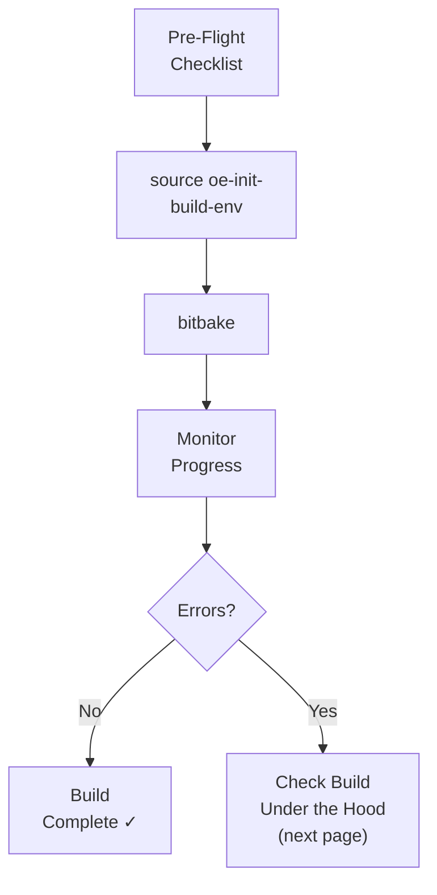

# Kicking Off the Build

<span class="phase-label">Phase 1 · Page 9 of 11</span>

!!! abstract "Page Goal"
    Run the actual build. This is the "press the button" page — short, action-oriented, no theory.

---

## Page Process Overview



---

## Pre-Flight Checklist

!!! tip "Before You Build"
    Run through this checklist. Every item should be ✓ before you type `bitbake`.

<!-- CONTENT:
- [ ] Host dependencies installed (Page 3)
- [ ] All repos cloned and on `kirkstone` branch (Page 5)
- [ ] All layers added and verified with `bitbake-layers show-layers` (Page 6–7)
- [ ] `MACHINE` set correctly in `local.conf` (Page 8)
- [ ] `IMAGE_INSTALL` has your desired packages (Page 8)
- [ ] Sufficient disk space: `df -h ~` (need 100 GB+ free)
- [ ] You're in the build directory after sourcing the environment
-->

---

## Source the Environment

<!-- CONTENT:
If you're in a new terminal (or have rebooted), you must re-source:

```bash
cd ~/yocto/poky
source oe-init-build-env
```

This puts you in `~/yocto/poky/build/` and adds `bitbake` to your PATH.
-->

---

## The BitBake Command

<!-- CONTENT:
```bash
bitbake <your-target-image>
```

Replace `<your-target-image>` with the image recipe name, for example:
- `core-image-minimal` — absolute minimum bootable image
- `demo-image-full-cmdline` — more complete image with utilities
- Your custom image recipe name

Example:
```bash
bitbake demo-image-full-cmdline
```
-->

---

## What to Expect

<!-- CONTENT:
### Build Time (First Build)
| Hardware | Approximate Time |
|----------|-----------------|
| 4-core, 16 GB RAM, HDD | 6–8 hours |
| 8-core, 32 GB RAM, SSD | 2–4 hours |
| 16-core, 64 GB RAM, NVMe | 1–2 hours |

### Disk Usage
- Downloads (`DL_DIR`): ~5-10 GB
- Build output (`TMPDIR`): ~50-100 GB
- sstate cache: ~20-30 GB

### Terminal Output
You'll see lines like:
```
NOTE: Preparing RunQueue
NOTE: Executing Tasks
Currently 3 running tasks (245 of 4521)  5% |##                    |
0: linux-tegra-5.10.104+gitAUTOINC+...-r0 do_fetch (from OE4T/...)
1: glibc-2.35-r0 do_compile
2: busybox-1.35.0-r0 do_configure
```

### Rebuilds
Subsequent builds are **much faster** thanks to the sstate cache. Only changed recipes are rebuilt.
-->

---

## Monitoring the Build

<!-- CONTENT:
- BitBake shows real-time task progress in the terminal
- You can open another terminal and check disk usage: `du -sh ~/yocto/poky/build/tmp`
- To see what's currently building: the terminal output shows running tasks
- Logs for each recipe are in `tmp/work/<ARCH>/<RECIPE>/<VERSION>/temp/log.do_<task>`
-->

---

## Build Complete — What Success Looks Like

<!-- CONTENT:
A successful build ends with:
```
NOTE: Tasks Summary: Attempted X tasks of which Y didn't need to be rerun and all succeeded.
```

No `ERROR:` lines. You're done!

Now, while you wait (or after it's done):
- **Next page** (Page 10) explains what just happened under the hood
- **Page 11** shows you where to find the output and how to flash it
-->

!!! info "Parallel Learning Approach"
    The build takes hours. While it runs, read the next page to understand what BitBake is doing behind the scenes. This is intentional — build and learn in parallel.

---

[← local.conf](08-local-conf.md){ .md-button }
[Next: Build Under the Hood →](10-build-under-the-hood.md){ .md-button .md-button--primary }
