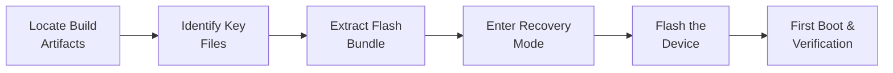

# Navigating Build Output & Flashing

<span class="phase-label">Phase 1 · Page 9 of 9</span>

!!! abstract "Page Goal"
    Navigate the build output directory, identify key artifacts, prepare the flash workspace, and flash the Jetson TX2i on the DevKit carrier board.

---

## Page Process Overview



---

## Build Output Directory

After a successful build, all artifacts are placed in the machine-specific deploy directory:

```
build/tmp/deploy/images/<MACHINE>/
```

For the Jetson TX2i on the NVIDIA DevKit carrier board, the path is:

```
build/tmp/deploy/images/jetson-tx2-devkit-tx2i/
```

---

### Artifacts for `core-image-sato`

```text
jetson-tx2-devkit-tx2i/
├── Image                                                      ← Linux kernel image
├── tegra210-jetson-tx2i-*.dtb                                 ← Device tree blob(s)
├── core-image-sato-jetson-tx2-devkit-tx2i.ext4                ← Root filesystem image
├── core-image-sato-jetson-tx2-devkit-tx2i.manifest            ← Package manifest
├── core-image-sato-jetson-tx2-devkit-tx2i.tegraflash.tar.gz   ← Flash bundle
├── bootfiles/                                                 ← Bootloader binaries
│   ├── cboot.bin
│   ├── tos-mon-only.img
│   └── ...
└── ...
```

### Artifacts for `core-image-full-cmdline`

!!! note "Difference from `core-image-sato`"
    `core-image-sato` includes the X11 graphics compositor by default. With `core-image-full-cmdline`, you can bake in a compositor of your choice, but the GUI service must be explicitly started on boot.

```text
jetson-tx2-devkit-tx2i/
├── Image                                                              ← Linux kernel image
├── tegra210-jetson-tx2i-*.dtb                                         ← Device tree blob(s)
├── core-image-full-cmdline-jetson-tx2-devkit-tx2i.ext4                ← Root filesystem image
├── core-image-full-cmdline-jetson-tx2-devkit-tx2i.manifest            ← Package manifest
├── core-image-full-cmdline-jetson-tx2-devkit-tx2i.tegraflash.tar.gz   ← Flash bundle
├── bootfiles/                                                         ← Bootloader binaries
│   ├── cboot.bin
│   ├── tos-mon-only.img
│   └── ...
└── ...
```

---

## Key Artifacts

| File | Description | Purpose |
|------|-------------|---------|
| `*.ext4` | Root filesystem image | Contains the entire OS — written to the eMMC during flash |
| `Image` | Linux kernel (uncompressed ARM64) | Loaded by the bootloader at boot |
| `*.dtb` | Device Tree Binary | Hardware description — tells the kernel about peripherals |
| `*.tegraflash.tar.gz` | Flash bundle generated by `meta-tegra` | Self-contained archive with everything needed to flash the device |
| `*.manifest` | Package list | Human-readable list of every package included in the image |
| `bootfiles/` | Bootloader binaries (cboot, TOS, etc.) | Written to boot partitions during the flash process |

---

## The tegraflash Bundle

`meta-tegra` generates a self-contained flash bundle: `*.tegraflash.tar.gz`

This archive contains everything required to flash the built Yocto image onto the target hardware:

- Root filesystem image (`.ext4`)
- Kernel and device tree binaries
- All bootloader binaries
- Partition layout configuration
- `doflash.sh` — a wrapper script that calls NVIDIA's `tegraflash.py`

---

## Preparing the Flash Workspace

!!! warning "Always Use the Command Line"
    Copying Yocto build artifacts using a graphical file manager can corrupt binary files. Always use command-line utilities (`cp`, `tar`) to copy and extract flash bundles.

```bash
# Create a dedicated flash workspace
mkdir -p ~/yocto/flash && cd ~/yocto/flash

# Copy the tegraflash bundle from the build output
cp ~/yocto/poky/build/tmp/deploy/images/jetson-tx2-devkit-tx2i/*.tegraflash.tar.gz .

# Extract the bundle
tar -xvf *.tegraflash.tar.gz
```

After extraction, verify that the `doflash.sh` script and the supporting binaries are present in the directory.

!!! tip "Placeholder — Directory Screenshot"
    A screenshot of the extracted flash directory contents will be added here for reference.

---

## Putting the DevKit in Recovery Mode

### Prerequisites

- A USB cable connected from the host machine to the DevKit's **recovery USB port**
- The DevKit connected to a power supply

### Recovery Mode Procedure (TX2 DevKit)

1. Power **off** the DevKit.
2. Hold the **RECOVERY** button (sometimes labelled `REC` or `FORCE RECOVERY`).
3. While holding RECOVERY, press and release the **POWER** button.
4. Wait approximately 2 seconds, then release the RECOVERY button.
5. Verify recovery mode on the host:

```bash
lsusb | grep -i nvidia
# Expected output: Bus XXX Device XXX: ID 0955:XXXX NVIDIA Corp.
```

!!! warning "Verification Required"
    If `lsusb` does not show an NVIDIA device, the board is **not** in recovery mode. Repeat the procedure above before attempting to flash.

---

## Flashing the Device

From the flash workspace, run the flash script with root privileges:

```bash
cd ~/yocto/flash
sudo ./doflash.sh
```

### What to Expect

- The script communicates with the device over USB.
- It writes the bootloader, kernel, DTB, and root filesystem to the on-board eMMC.
- Progress is displayed in the terminal.
- Typical flash time: **5–15 minutes**.
- A successful flash ends with a message similar to:

```
Flashing completed successfully, cold booting the device
```

---

## First Boot & Verification

### Serial Console Connection

Connect to the DevKit's serial console to observe boot output and log in:

```bash
# Identify the serial device
ls /dev/ttyUSB* /dev/ttyACM* 2>/dev/null

# Connect using minicom (115200 baud, 8N1)
sudo minicom -D /dev/ttyUSB0 -b 115200

# Alternatively, use screen
sudo screen /dev/ttyUSB0 115200
```

### First Boot Checklist

After the device reboots following a successful flash, verify the system:

1. **Login** — Username: `root` (no password if `debug-tweaks` is enabled in `local.conf`)

2. **Check the kernel version**:
    ```bash
    uname -a
    ```

3. **Check image size and storage usage**:
    ```bash
    df -h /
    ```

4. **Verify networking**:
    ```bash
    checking ip a and configuring ethernet - use the baked in network manager applet - in the top right corner of the GUI.
    ```

5. **Verify ROS** (if installed):
    ```bash
    source /opt/ros/<version>/setup.bash
    rosversion -d        # ROS 1
    ros2 --version       # ROS 2
    optionally run roscore to test ros1 functionality
    ```

6. **Verify GUI** (if installed):
    Check whether the display manager or desktop environment (e.g., Xfce, Weston) is running:
    ```bash
    systemctl status display-manager
    ```

---

## Troubleshooting Flash Failures

| Problem | Likely Cause | Fix |
|---------|-------------|-----|
| `lsusb` does not show NVIDIA | Device is not in recovery mode | Re-do the recovery mode procedure |
| `Error: USB communication failed` | Faulty cable or USB port | Try a different USB cable or port |
| `Error: Timeout waiting for device` | Device dropped out of recovery mode | Re-enter recovery mode and retry promptly |
| Flash succeeds but device does not boot | Wrong DTB or partition layout | Verify the `MACHINE` setting in `local.conf` and ensure the DTB matches your hardware |
| Kernel panic on boot | Missing modules or incorrect rootfs | Check `IMAGE_INSTALL` entries and rebuild with the required packages |

---

!!! success "Phase 1 Complete!"
    You now have a working Yocto-built Linux image running on the Jetson TX2i DevKit. In Phase 2, we will adapt this build for the Connect Tech Elroy carrier board.

---

[← The Build Process Explained](08-build-process.md){ .md-button }
[Next: Phase 2 Overview →](../phase2/index.md){ .md-button .md-button--primary }
