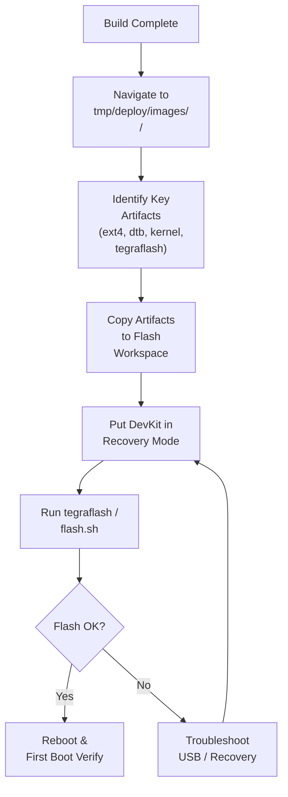

# Navigating Build Output & Flashing

<span class="phase-label">Phase 1 · Page 11 of 11</span>

!!! abstract "Page Goal"
    Navigate the build output directory, identify key artifacts, prepare the flash workspace, and flash the Jetson TX2i on the DevKit carrier board.

---

## Page Process Overview



---

## Build Output Directory

<!-- CONTENT:
After a successful build, your artifacts are in:

```
tmp/deploy/images/<MACHINE>/
```

For example:
```
tmp/deploy/images/jetson-tx2i/
```

### Directory Listing (Typical)
```
jetson-tx2i/
├── Image                                 ← Linux kernel image
├── tegra210-jetson-tx2i-*.dtb           ← Device tree blob(s)
├── demo-image-full-cmdline-jetson-tx2i.ext4  ← Root filesystem image
├── demo-image-full-cmdline-jetson-tx2i.manifest ← Package manifest
├── demo-image-full-cmdline-jetson-tx2i.tegraflash.tar.gz ← ⭐ Flash bundle
├── bootfiles/                            ← Bootloader files
│   ├── cboot.bin
│   ├── tos-mon-only.img
│   └── ...
└── ...
```
-->

---

## Key Artifacts

<!-- CONTENT:
| File | What It Is | Used For |
|------|-----------|----------|
| `*.ext4` | Root filesystem image | Contains the entire OS — gets written to eMMC |
| `Image` | Linux kernel (uncompressed ARM64) | Loaded by bootloader at boot |
| `*.dtb` | Device Tree Blob | Hardware description — tells the kernel about peripherals |
| `*.tegraflash.tar.gz` | ⭐ Flash bundle generated by meta-tegra | Everything needed to flash the device — bundled and ready |
| `*.manifest` | Package list | Human-readable list of all packages in the image |
| `bootfiles/` | Bootloader binaries (cboot, TOS, etc.) | Written to boot partitions during flash |
-->

---

## The tegraflash Bundle

<!-- CONTENT:
meta-tegra generates a self-contained flash bundle: `*.tegraflash.tar.gz`

This bundle contains:
- The root filesystem image (ext4)
- Kernel and DTB
- All bootloader binaries
- Partition layout configuration
- The `doflash.sh` script — a wrapper that calls NVIDIA's tegraflash.py

### Why This Matters
You don't need to manually assemble flash files — meta-tegra does it for you. Just extract and run.
-->

---

## Preparing the Flash Workspace

<!-- CONTENT:
```bash
# Create a flash workspace
mkdir -p ~/yocto/flash && cd ~/yocto/flash

# Copy the tegraflash bundle
cp ~/yocto/poky/build/tmp/deploy/images/jetson-tx2i/*.tegraflash.tar.gz .

# Extract
tar xzf *.tegraflash.tar.gz
```

After extraction you should see:
```
flash/
├── doflash.sh              ← The flash script
├── partition_table.xml     ← Partition layout
├── system.img              ← Root filesystem
├── boot.img                ← Kernel
├── tegra194-*.dtb          ← Device tree
└── ...
```
-->

---

## Putting the DevKit in Recovery Mode

<!-- CONTENT:
### Prerequisites
- USB-C cable connected from host to the DevKit's recovery USB port
- DevKit powered on (or connected to power supply)

### Recovery Mode Procedure (TX2 DevKit)
1. Power off the DevKit
2. Hold the **RECOVERY** button (sometimes labeled REC or FORCE RECOVERY)
3. While holding RECOVERY, press and release the **POWER** button
4. Wait 2 seconds, then release the RECOVERY button
5. Verify on the host:
```bash
lsusb | grep -i nvidia
# Should show: NVIDIA Corp. (recovery mode)
```

If `lsusb` doesn't show NVIDIA, the device is not in recovery mode. Try again.
-->

---

## Flashing

<!-- CONTENT:
```bash
cd ~/yocto/flash
sudo ./doflash.sh
```

### What to Expect
- The script communicates with the device over USB
- It writes bootloader, kernel, DTB, and rootfs to the eMMC
- Progress is shown in the terminal
- Typical flash time: 5–15 minutes
- A successful flash ends with a message like: `Flashing completed successfully`

### Alternative: Using flash.sh Directly
If not using the tegraflash bundle, you can use NVIDIA's `flash.sh`:
```bash
sudo ./flash.sh <board-config> mmcblk0p1
```
-->

---

## First Boot & Verification

<!-- CONTENT:
### Serial Console Connection
```bash
# Find the serial device
ls /dev/ttyUSB*
# or
ls /dev/ttyACM*

# Connect via minicom or screen
sudo screen /dev/ttyUSB0 115200
```

### First Boot Checklist
After the device reboots from flash:

1. **Login** — `root` (password: depends on `debug-tweaks` in local.conf — likely no password)
2. **Check kernel**:
```bash
uname -a
```
3. **Check image size**:
```bash
df -h /
```
4. **Check installed packages** (if deb):
```bash
dpkg -l | wc -l
```
5. **Verify networking**:
```bash
ip addr
ping -c 3 8.8.8.8
```
6. **Verify ROS** (if installed):
```bash
rosversion -d
```
7. **Verify GUI** (if installed):
Check if Xfce or display manager is running.
-->

---

## Troubleshooting Flash Failures

<!-- CONTENT:
| Problem | Likely Cause | Fix |
|---------|-------------|-----|
| `lsusb` doesn't show NVIDIA | Not in recovery mode | Re-do recovery mode procedure |
| `Error: USB communication failed` | Bad cable or USB port | Try a different USB-C cable or port |
| `Error: Timeout waiting for device` | Device lost recovery mode | Re-enter recovery mode, try again quickly |
| Flash succeeds but device doesn't boot | Wrong DTB or partition layout | Check MACHINE setting, verify DTB matches hardware |
| Kernel panic on boot | Missing modules or wrong rootfs | Check `IMAGE_INSTALL`, rebuild with more packages |
-->

---

!!! success "Phase 1 Complete!"
    You now have a working Yocto-built Linux image running on the Jetson TX2i DevKit. In Phase 2, we'll adapt this build for the Connect Tech Elroy carrier board.

---

[← Build Under the Hood](10-build-under-the-hood.md){ .md-button }
[Next: Phase 2 Overview →](../phase2/index.md){ .md-button .md-button--primary }
