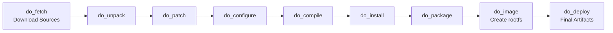

# Build Process

Phase 1 · Stage 5

!!! info "Outline Page"
    This page is an outline only.

---

## Outline

### Initializing the Build

- <!-- TODO: source oe-init-build-env -->
- <!-- TODO: Build directory structure -->

### Running bitbake

- <!-- TODO: bitbake command for target image -->
- <!-- TODO: Expected build duration -->
- <!-- TODO: Monitoring build progress -->

### Build Stages Breakdown

- <!-- TODO: Fetching (do_fetch) -->
- <!-- TODO: Unpacking (do_unpack) -->
- <!-- TODO: Patching (do_patch) -->
- <!-- TODO: Configuring (do_configure) -->
- <!-- TODO: Compiling (do_compile) -->
- <!-- TODO: Installing (do_install) -->
- <!-- TODO: Packaging (do_package) -->
- <!-- TODO: Image creation (do_image) -->

### Build Artifacts

- <!-- TODO: Location: tmp/deploy/images/<MACHINE>/ -->
- <!-- TODO: Key files: ext4, dtb, kernel image, modules -->
- <!-- TODO: System image size validation (< 5 GB target) -->

---

## bitbake Build Pipeline

---

[← Machine & Local Config](machine-local-conf.md){ .md-button }
[Flashing the DevKit →](flashing-devkit.md){ .md-button .md-button--primary }
