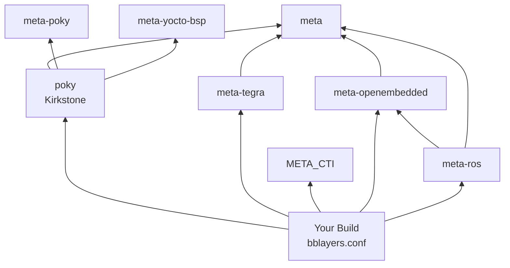

# Custom Layers & BSP Configuration

Phase 1 · Stage 3

!!! info "Outline Page"
    This page is an outline only.

---

## Outline

### Understanding Yocto Layers

- <!-- TODO: What are layers and why they matter -->
- <!-- TODO: Layer priority and dependency -->

### Required Layers for This Project

- <!-- TODO: meta-tegra — NVIDIA Tegra BSP -->
- <!-- TODO: meta-openembedded — additional recipes -->
- <!-- TODO: meta-ros — ROS Melodic/Noetic recipes -->

### Cloning & Adding Layers

- <!-- TODO: Git clone commands for each layer (Kirkstone branches) -->
- <!-- TODO: Verifying branch compatibility -->

### Updating bblayers.conf

- <!-- TODO: Adding layer paths -->
- <!-- TODO: Layer dependency resolution -->
- <!-- TODO: Example bblayers.conf snippet -->

---

## Layer Dependency Diagram

---

[← Yocto Quick Build](yocto-quick-build.md){ .md-button }
[Machine & Local Config →](machine-local-conf.md){ .md-button .md-button--primary }
