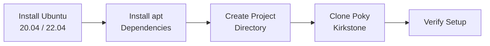

# Environment Setup

Phase 1 · Stage 1

!!! info "Outline Page"
    This page is an outline only.

---

## Outline

### Host System Requirements

- <!-- TODO: Supported Ubuntu versions -->
- <!-- TODO: Disk space, RAM, CPU recommendations -->

### Installing Dependencies

- <!-- TODO: apt packages required -->
- <!-- TODO: Python/pip requirements -->

### Directory Structure

- <!-- TODO: Recommended project directory layout -->

### Cloning Poky (Kirkstone)

- <!-- TODO: git clone command -->
- <!-- TODO: Branch checkout -->

---

---

[← Phase 1 Overview](index.md){ .md-button }
[Yocto Quick Build →](yocto-quick-build.md){ .md-button .md-button--primary }
