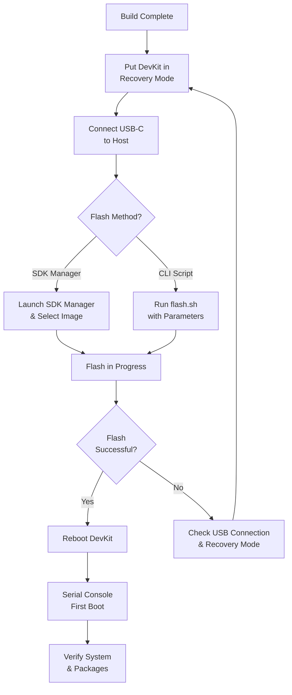

# Flashing the DevKit

Phase 1 · Stage 6

!!! info "Outline Page"
    This page is an outline only.

---

## Outline

### Prerequisites

- <!-- TODO: USB-C cable, recovery mode jumper -->
- <!-- TODO: Host machine requirements -->

### Entering Recovery Mode

- <!-- TODO: DevKit recovery mode procedure -->

### Flash Process

- <!-- TODO: Step-by-step flash instructions -->
- <!-- TODO: Using NVIDIA flash script vs SDK Manager -->

### First Boot Verification

- <!-- TODO: Serial console connection -->
- <!-- TODO: Login and basic system check -->
- <!-- TODO: Verifying ROS packages -->
- <!-- TODO: Verifying GUI -->

### Screenshots & Expected Output

- <!-- TODO: Add terminal screenshots -->
- <!-- TODO: Add boot log examples -->

---

## Flash Workflow

---

[← Build Process](build-process.md){ .md-button }
[Naming & Gotchas →](naming-gotchas.md){ .md-button .md-button--primary }
