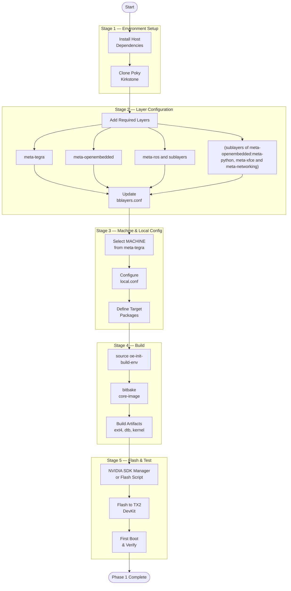

# Phase 1 — Minimal Yocto Build

Development · Week 2–3

!!! abstract "Goal"
    Build a minimal system image (< 5 GB) using the Yocto Project (Kirkstone branch) for the Jetson TX2i on the TX2 Development Kit board. The image includes a minimal GUI, ROS core packages, and essential networking and system utilities.

---

## Phase Process Overview

---

## Important Links & Repos

!!! tip "Key References"
    These are the primary resources you will need throughout this phase.

| Resource | Link |
|---|---|
| Yocto Project | <!-- TODO: Add link --> |
| Yocto Project Quick Build Guide | <!-- TODO: Add link --> |
| Yocto Project Documentation (Kirkstone) | <!-- TODO: Add link --> |
| Open Embedded for Tegra (IMPORTANT) | <!-- TODO: Add link --> |
| Poky Repository (Kirkstone branch) | <!-- TODO: Add link --> |
| meta-tegra Layer | <!-- TODO: Add link --> |
| meta-openembedded | <!-- TODO: Add link --> |
| meta-ros (Melodic / Noetic) | <!-- TODO: Add link --> |
| Flashing Process| <!-- TODO: Add link --> |
| Yocto — Adding Layers Guide | <!-- TODO: Add link --> |
| Yocto — Adapting to Custom Hardware | <!-- TODO: Add link --> |

---

## Subpages

| Page | Description |
|---|---|
| [Environment Setup](environment-setup.md) | Host dependencies, directory structure, initial clone |
| [Yocto Quick Build](yocto-quick-build.md) | Running a reference build to validate the toolchain |
| [Custom Layers & BSP](custom-layers-bsp.md) | Adding meta-tegra, meta-ros, meta-cti and configuring bblayers.conf |
| [Machine & Local Configuration](machine-local-conf.md) | Choosing machine, setting packages, local.conf tweaks |
| [Build Process](build-process.md) | Running bitbake, build stages, expected outputs |
| [Flashing the DevKit](flashing-devkit.md) | Flash workflow, SDK Manager, first boot verification |
| [Naming Conventions & Gotchas](naming-gotchas.md) | Common errors, naming pitfalls, tips and screenshots |

---

[← Phase 0](../phase0/index.md){ .md-button }
[Next: Phase 2 →](../phase2/index.md){ .md-button .md-button--primary }
