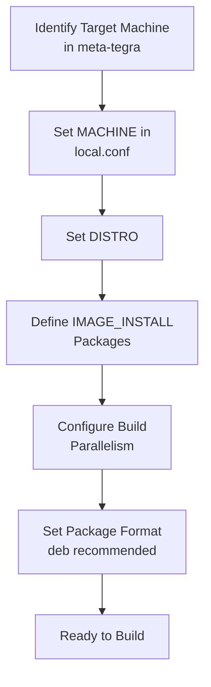

# Machine & Local Configuration

Phase 1 · Stage 4

!!! info "Outline Page"
    This page is an outline only.

---

## Outline

### Choosing the MACHINE Variable

- <!-- TODO: Available machines in meta-tegra -->
- <!-- TODO: jetson-tx2i vs jetson-tx2 differences -->
- <!-- TODO: Machine conf file location and contents -->

### Configuring local.conf

- <!-- TODO: MACHINE assignment -->
- <!-- TODO: IMAGE_INSTALL additions -->
- <!-- TODO: Package format (deb/rpm/ipk) -->
- <!-- TODO: Download and sstate cache directories -->
- <!-- TODO: Parallel build settings (BB_NUMBER_THREADS, PARALLEL_MAKE) -->

### Package Selection for Minimal ROS Image

- <!-- TODO: Core ROS packages -->
- <!-- TODO: Minimal GUI packages -->
- <!-- TODO: Networking utilities -->
- <!-- TODO: System tools -->

---

---

[← Custom Layers & BSP](custom-layers-bsp.md){ .md-button }
[Build Process →](build-process.md){ .md-button .md-button--primary }
