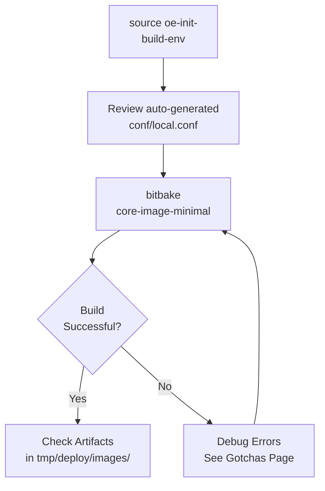

# Yocto Quick Build

Phase 1 · Stage 2

!!! info "Outline Page"
    This page is an outline only.

---

## Outline

### What is a Quick Build?

- <!-- TODO: Purpose of running a reference build first -->
- <!-- TODO: Adapting the Yocto Project Quick Build guide -->

### Sourcing the Build Environment

- <!-- TODO: source oe-init-build-env -->
- <!-- TODO: Understanding the build directory structure -->

### Running a Reference Build

- <!-- TODO: bitbake core-image-minimal -->
- <!-- TODO: Expected build time and output -->

### Verifying Build Output

- <!-- TODO: Checking tmp/deploy/images/ -->
- <!-- TODO: Expected artifacts list -->

---

---

[← Environment Setup](environment-setup.md){ .md-button }
[Custom Layers & BSP →](custom-layers-bsp.md){ .md-button .md-button--primary }
