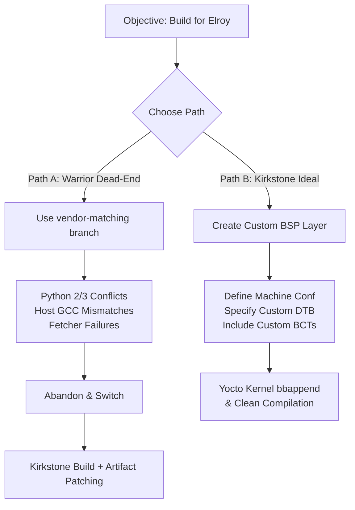

# Warrior Branch Dead-End & Custom Machine Setup

<span class="phase-label">Phase 2 · Page 2 of 6</span>

!!! abstract "Page Goal"
    Document the technical process, failures, and build issues encountered when attempting a build on the Yocto Warrior branch, contrasted with the ideal architectural process of setting up a custom machine target in Yocto.

---

## Page Process Overview



---

## Part 1: The Warrior Branch Dead-End

When adapting our Yocto build for the Connect Tech Elroy (ASG002) carrier board, the initial plan was to align the Yocto build branch with the vendor’s officially supported Board Support Package (BSP). 

Connect Tech's native BSP targeted NVIDIA L4T R28.2 / R28.3, which corresponds to the Yocto **Warrior** release (Yocto 3.0, released in late 2019). The decision was made to use the Warrior branch, assuming it would offer the path of least resistance.

### The Process Taken on Warrior
1. **Repository Setup**: Cloned Poky (Warrior branch) and the matching `meta-tegra` Warrior BSP layer.
2. **BSP Integration**: Downloaded and unpacked the Connect Tech CTI-L4T BSP package for the TX2/TX2i.
3. **Configuration**: Configured `bblayers.conf` to include `meta-tegra` and `meta-openembedded` sub-layers (all pinned to Warrior). Set `MACHINE = "jetson-tx2-devkit-tx2i"` in `local.conf`.
4. **Build Attempt**: Executed the bitbake command to generate a minimal image:
   ```bash
   bitbake core-image-minimal
   ```

### Technical Issues & Failures Encountered
The build failed early and repeatedly due to the age of the Warrior branch (released in 2019, EOL in 2020) and mismatches with modern build hosts.

#### 1. Python 2 vs Python 3 Mismatches
Yocto Warrior was built during the industry-wide transition from Python 2 to Python 3. Many host tools, parsing utilities, and recipes inside Poky and older `meta-openembedded` layers still hardcoded Python 2 commands. 
- **The Issue**: Modern host operating systems (like Ubuntu 22.04 LTS or newer) no longer package or easily support Python 2. This resulted in host-side parsing crashes during the execution of metadata scripts (`python-native` recipes failed to compile).

#### 2. Host Tooling & Compiler Conflicts (GCC)
Modern Linux hosts ship with newer compiler versions (GCC 11/12/13). Compiling the 4.9 kernel and GLIBC recipes pinned in Warrior triggered numerous compilation failures.
- **The Issue**: The old source code was not compatible with newer GCC compiler optimizations, triggering warnings (like `-Werror=format-security` or `-Werror=array-bounds`) that halted the compilation of the kernel, glibc, and early boot stages.

#### 3. Broken Fetcher Links
Because the Warrior branch is old, many upstream mirrors and package download URLs used in the recipes are dead or have changed locations.
- **The Issue**: Essential tools failed to build because BitBake could no longer fetch the source archives, requiring manual sourcing and placing of tarballs in the `downloads/` directory.

#### 4. Security & Maintenance Vulnerabilities
Being long End-of-Life, the Warrior branch lacks hundreds of critical CVE security updates, making it unsuitable for secure flight or space-based operating systems.

!!! danger "Dead-End Summary"
    Attempting to patch old vendor BSP recipes to compile on a modern host is a recipe for endless frustration. The Warrior branch path was abandoned. The project returned to the modern **Kirkstone** branch (released in 2022, LTS support), choosing to build a clean Kirkstone image and customize the boot configuration post-build rather than force-compiling a deprecated release.

---

## Part 2: Building a Custom Machine (The Ideal Way)

If we were to integrate custom carrier board support directly within the Yocto build system (rather than modifying artifacts post-build), we must follow Yocto's official hardware adaptation guide. This section details how a custom machine target is designed.

### 1. Create a Custom BSP Layer
Avoid editing vendor-provided layers (like `meta-tegra` or `meta-openembedded`) directly. Instead, create a dedicated custom hardware layer:
```bash
# Create the custom layer directory structure
bitbake-layers create-layer meta-custom-elroy

# Add the new layer to your build environment
bitbake-layers add-layer meta-custom-elroy
```

### 2. Define the Machine Configuration
Inside your custom layer, create a machine configuration file at `conf/machine/cti-tx2i-elroy.conf`. This configuration represents the target hardware combo:

```text
# conf/machine/cti-tx2i-elroy.conf
# @TYPE: Machine
# @NAME: CTI Elroy TX2i Carrier Board
# @DESCRIPTION: Machine configuration for Jetson TX2i SoM on Connect Tech Elroy

# Require the base SoC configurations from meta-tegra
require conf/machine/include/tegra186.inc

# Specify the custom Device Tree Blob (DTB) to use
KERNEL_DEVICETREE = "tegra186-tx2i-cti-ASG002-revF+.dtb"

# Hardware parameters (Sourced from jetson-tx2i configuration)
NVIDIA_BOARD = "t186ref"
NVIDIA_CHIP = "0x18"

# Boot loader BCT and CFG files (described in Page 1)
EMMC_BCT = "P3489_A00_8GB_Samsung_8GB_lpddr4_204Mhz_P134_A02_ECC_en_l4t.cfg"
PINMUX_CONFIG = "tegra186-mb1-bct-pinmux-quill-p3489-1000-a00.cfg"
PMIC_CONFIG = "tegra186-mb1-bct-pmic-quill-p3489-1000-a00.cfg"
PMC_CONFIG = "tegra186-mb1-bct-pad-quill-p3489-1000-a00.cfg"
PROD_CONFIG = "tegra186-mb1-bct-prod-storm-p3489-1000-a00.cfg"
BOOTROM_CONFIG = "tegra186-mb1-bct-bootrom-quill-p3489-1000-a00.cfg"
```

### 3. Add Custom Device Trees
To compile the custom device tree for the Elroy carrier board, the DTS source files must be made available to the kernel build system.
Create a recipe append file at `recipes-kernel/linux/linux-tegra_%.bbappend`:

```text
# recipes-kernel/linux/linux-tegra_%.bbappend
FILESEXTRAPATHS:prepend := "${THISDIR}/${PN}:"

# Add the custom DTS file to the build
SRC_URI += "file://tegra186-tx2i-cti-ASG002-revF+.dts"

do_configure:append() {
    # Copy the custom device tree source into the kernel source tree before compiling
    cp ${WORKDIR}/tegra186-tx2i-cti-ASG002-revF+.dts ${S}/arch/arm64/boot/dts/nvidia/
}
```

### 4. Partition and Image Configuration
Specify partition parameters to match the storage profile of the custom board:
- `EMMC_SIZE` (defines the total partition size of the eMMC).
- `ROOTFSSIZE` (defines the size of the root filesystem partition).
- `extlinux.conf` template (configures the bootloader command line to pass appropriate arguments to the custom board).

---

[← Device Trees & Configuration](01-device-trees-and-configuration.md){ .md-button }
[Next: Build Artifact Modification →](03-build-artifact-modification.md){ .md-button .md-button--primary }
