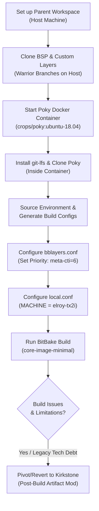

# Executing the Build 

<span class="phase-label">Phase 2 · Page 3 of 5</span>

!!! abstract "Page Goal"
    - Establish a step-by-step guide for setting up and executing the custom ConnectTech Elroy TX2i BSP build using the Yocto **Warrior** branch.
    - Explain the necessity of using a Docker container (`crops/poky:ubuntu-18.04`) to handle the obsolete host requirements of Yocto Warrior (Python 2.7, legacy GCC toolchains).
    - Walk through cloning the required layers on the correct branches, running the container, installing `git-lfs`, configuring `bblayers.conf` and `local.conf`, and executing the BitBake build.
    - Document the execution errors encountered and justify the architectural decision to pivot back to the stable **Kirkstone** branch.
---

!!! danger "Dead End - Difficult to Build"
    This page also documents a dead-end approach using the older Warrior branch due to several errors, which was abandoned in favor of continuing on Kirkstone.

## Page Process Overview

This flowchart illustrates the step-by-step execution path for setting up and attempting the Warrior build before pivoting:



---

## 1. Preparing the Warrior Workspace & Repositories

Because the custom `meta-cti` layer was originally written and tested against the older Yocto **Warrior** release, we must align our entire build environment with it to build the custom machine directly. 

### Branch Alignment Strategy
- All standard layer repositories (like `meta-openembedded`, `meta-ros`, and `meta-qt5`) must be checked out to the **`warrior`** branch.
- The `meta-tegra` BSP layer must be checked out to the specialized **`warrior-l4t-r32.2`** branch. This branch is locked to L4T R32.2 (JetPack 4.2.1) which matches the low-level firmware dependencies of the custom carrier BSP.
- The `meta-cti` layer must be checked out to the specific **`l4t-r32.2-cti-v126`** branch, which contains Damien LeFevre's ConnectTech BSP adjustments for this L4T release.

### Step 1: Create the Workspace on the Host
Create a dedicated workspace directory on your host machine to store all layer repositories:

```bash
mkdir -p ~/yocto-warrior && cd ~/yocto-warrior
```

### Step 2: Clone the BSP and Companion Layers
Run the following commands sequentially on your host terminal to clone the required repositories on their respective Warrior branches:

```bash
# 1. Clone the NVIDIA Tegra BSP Layer
git clone -b warrior-l4t-r32.2 https://github.com/OE4T/meta-tegra.git

# 2. Clone the custom ConnectTech carrier layer
git clone -b l4t-r32.2-cti-v126 https://github.com/lfdmn/meta-cti.git

# 3. Clone the OpenEmbedded multi-utility repository
git clone -b warrior https://github.com/openembedded/meta-openembedded.git

# 4. Clone the Robot Operating System layer
git clone -b warrior https://github.com/ros/meta-ros.git

# 5. Clone the Qt5 graphics framework layer
git clone -b warrior https://github.com/meta-qt5/meta-qt5.git
```

!!! warning "Do Not Clone Poky on the Host"
    Do not clone the main `poky` repository on your host machine. Modern Git checkouts and initialization scripts in Poky Warrior depend on Python 2.7. Sourcing it on a modern host will trigger python version errors. We will clone `poky` from *inside* the Docker container instead.

---

## 2. Cross-Platform Host Setup (The Poky Container)

Yocto Warrior was released in 2019 and requires legacy host dependencies (specifically **Python 2.7** and **GCC 8 or older**). Modern host operating systems (like Ubuntu 20.04 or 22.04 LTS) no longer ship these older packages, and their modern compiler toolchains will cause build-time host validation failures.

To bypass these host-level incompatibilities, we use the Yocto Project's official **Crops Poky** container, specifically the **Ubuntu 18.04** image.

### Step 3: Run the Yocto Crops Container
Execute the following command on your host terminal from the `~/yocto-warrior` folder:

```bash
docker run --rm -it --privileged -u root -v $(pwd):/workdir -w /workdir crops/poky:ubuntu-18.04
```

#### Understanding the Docker Flags:
- `--rm`: Automatically destroys the container instance upon exit, keeping the host system clean.
- `-it`: Runs the container interactively, forwarding standard input and output to your shell terminal.
- `--privileged`: Grants the container access to host loopback devices. This is **strictly required** for Yocto's root filesystem packaging and partition image layout generation (`tegraflash`).
- `-u root`: Launches the shell session as the root user. This is necessary because we must install additional packages inside the container.
- `-v $(pwd):/workdir`: Mounts our host workspace directory (`~/yocto-warrior`) into the `/workdir` folder inside the container, ensuring all built files persist on the host.
- `-w /workdir`: Sets the default active terminal path inside the container to `/workdir`.

---

## 3. Resolving Container Dependencies & Cloning Poky

Once inside the interactive Docker shell (`root@<container_id>:/workdir#`), you must configure git-lfs and clone the Poky framework.

### Step 4: Install and Register Git LFS
NVIDIA's BSP binary blobs require Git Large File Storage (LFS). If Git LFS is missing, files will be downloaded as tiny pointer text files, leading to immediate compilation failures.

To install Git LFS, open a secondary host terminal, find the container ID, and enter it:
```bash
# On your host machine
docker ps
docker exec -it -u root <container_id> bash
```

Once inside the secondary terminal, execute:
```bash
# Inside the container as root
apt-get update && apt-get install -y git-lfs
git lfs install --system
```

### Step 5: Clone Poky inside the Container
Now, clone the Yocto core Poky repository using the Python 2.7-compatible environment inside the container, back inside the workdir terminal:

```bash
git clone -b warrior https://git.yoctoproject.org/git/poky
```

### Step 6: Source the Build Environment
Source the environment script to create the build folder and generate default configuration templates:

```bash
source poky/oe-init-build-env build
```
This command changes your active directory inside the container to `/workdir/build/`.

---

## 4. Modifying Build Configuration Files

With the workspace established, we must configure `bblayers.conf` and `local.conf`.

### Step 7: Configure `bblayers.conf` (Layer Priority Overrides)
To register the custom layers and assign correct priority overrides, modify `/workdir/build/conf/bblayers.conf`. 

Because both `meta-tegra` and `meta-cti` define device trees and boot configurations, we must ensure our custom layer takes precedence. The base `meta-tegra` layer has a priority of **5**. By adding `meta-cti` with a priority of **6**, Yocto's parser knows to override any conflicting recipes or configurations in favor of our custom layer.

Replace `/workdir/build/conf/bblayers.conf` with the following:

```bash
# POKY_BBLAYERS_CONF_VERSION is increased each time build/conf/bblayers.conf
# changes incompatibly
POKY_BBLAYERS_CONF_VERSION = "2"

BBPATH = "${TOPDIR}"
BBFILES ?= ""

BBLAYERS ?= " \
  /workdir/poky/meta \
  /workdir/poky/meta-poky \
  /workdir/poky/meta-yocto-bsp \
  /workdir/meta-openembedded/meta-oe \
  /workdir/meta-openembedded/meta-python \
  /workdir/meta-openembedded/meta-networking \
  /workdir/meta-openembedded/meta-multimedia \
  /workdir/meta-openembedded/meta-gnome \
  /workdir/meta-openembedded/meta-xfce \
  /workdir/meta-ros/meta-ros-common \
  /workdir/meta-ros/meta-ros1 \
  /workdir/meta-ros/meta-ros1-melodic \
  /workdir/meta-qt5 \
  /workdir/meta-tegra \
  /workdir/meta-cti \
  "
```

### Step 8: Validate the Layer Stack Configuration
Verify that the layers are correctly registered with absolute paths inside the container, and check the priority values:

```bash
bitbake-layers show-layers
```

#### Expected Output
```text
layer                 path                                                 priority
====================================================================================
meta                  /workdir/poky/meta                                   5
meta-poky             /workdir/poky/meta-poky                              5
meta-yocto-bsp        /workdir/poky/meta-yocto-bsp                         5
meta-oe               /workdir/meta-openembedded/meta-oe                   6
meta-python           /workdir/meta-openembedded/meta-python               7
meta-networking       /workdir/meta-openembedded/meta-networking           5
meta-multimedia       /workdir/meta-openembedded/meta-multimedia           5
meta-gnome            /workdir/meta-openembedded/meta-gnome                5
meta-xfce             /workdir/meta-openembedded/meta-xfce                 7
meta-ros-common       /workdir/meta-ros/meta-ros-common                    10
meta-ros              /workdir/meta-ros/meta-ros1                          11
meta-ros-melodic      /workdir/meta-ros/meta-ros-melodic                   12
meta-qt5              /workdir/meta-qt5                                    7
meta-tegra            /workdir/meta-tegra                                  5
meta-cti              /workdir/meta-cti                                    6
```

### Step 9: Configure `local.conf` (Case-Sensitive Machine Selection)
Open `/workdir/build/conf/local.conf` and set the target machine. The machine string must match the configuration filename in `meta-cti/conf/machine/` exactly (case-sensitive):

```bash
# Target the custom ConnectTech Elroy Jetson TX2i configuration
MACHINE ?= "elroy-tx2i"

# Base configuration settings
DISTRO ?= "poky"
PACKAGE_CLASSES ?= "package_deb"
EXTRA_IMAGE_FEATURES ?= "debug-tweaks"
```

---

## 5. Executing the Build

Run the compilation process using BitBake from the `/workdir/build/` directory inside the Docker container:

```bash
bitbake core-image-sato
```

### Behind the Scenes: What BitBake is Doing:
1. **Parsing Metadata**: Parses all `.bb` and `.bbappend` files in your configured layers.
2. **Generating Dependency Graphs**: Resolves the recipes required for `core-image-sato`.
3. **Downloading Sources**: Downloads source tarballs and Git repositories into the `downloads/` directory.
4. **Compiling Toolchain**: Builds a cross-compiler (GCC) targeting the Tegra arm64 architecture.
5. **Kernel & Device Tree Compilation**: Compiles the patched kernel from Damien Lefevre's repository, applying the ConnectTech `tegra186_cti_defconfig` and building the `tegra186-tx2i-cti-ASG002-revF+.dtb` device tree binary.
6. **Packaging**: Creates Debian packages (`.deb`) and generates the final root filesystem and `tegraflash` package.

---

## 6. Issues and Problems with the build

- While the Docker container resolves the problem of building on a legacy host environment and 
provides a full fledged environment for Yocto to run, modern features also pose counter intuitive problems:
- Several Packages are out of support, especially python3-packages (like python-crypto for example) and need heavy custom bbappend and missing dependency resolution during the do:fetch() task of the build process itself.
- Missing packages are due to the old github references and links provided to the SRC_URI (Source URI) variables in the recipes themselves. The build process, being a automated task, cannot resolve these missing references and fails (or halts) the build process. This happens for several packages and manual resolution is a challenging and time consuming task in itself, including the need to create a folder structure, custom layer and adding in updated SRC_URIs.
- This still can raise issues during the compile phase and dorootfs phase due to missing recursive dependencies and further de-stablises the build.
- The issues were resolved and QA (Quality Assurance) warnings thrown by Yocto were heavily supressed and complete the build.
- This posed further issues during the flashing process, with several build artifacts missing and a usb flashing error was generated due to the above issue, caused by a missing detect tegra-usb script. 

[← Custom Machine Setup](02-custom-machine-setup.md){ .md-button }
[Next: Build Artifact Modification →](04-build-artifact-modification.md){ .md-button .md-button--primary }

