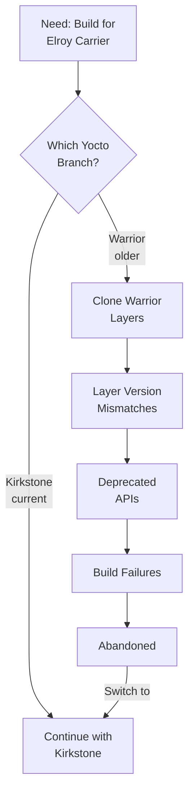

# Warrior Branch — A Dead End

Phase 2 · Page 3 of 7

!!! danger "Dead End — Do Not Repeat"
    The approach documented on this page was abandoned due to fundamental incompatibilities. It is included here to prevent future developers from repeating this path.

---

## Outline

### Why Warrior Was Attempted

- <!-- TODO: Initial reasoning for choosing Warrior -->
- <!-- TODO: ConnectTech BSP availability on Warrior -->

### What Went Wrong

- <!-- TODO: Layer compatibility issues -->
- <!-- TODO: Deprecated APIs and recipes -->
- <!-- TODO: meta-tegra version mismatches -->

### Specific Errors Encountered

- <!-- TODO: Error logs and descriptions -->

### Lessons Learned

- <!-- TODO: Always verify layer branch compatibility first -->
- <!-- TODO: Kirkstone is the better supported target for this project -->

---

## Decision Flow

---

[← Device Trees & Configuration](02-device-trees-and-configuration.md){ .md-button }
[Next: Build Artifact Modification →](04-build-artifact-modification.md){ .md-button .md-button--primary }
