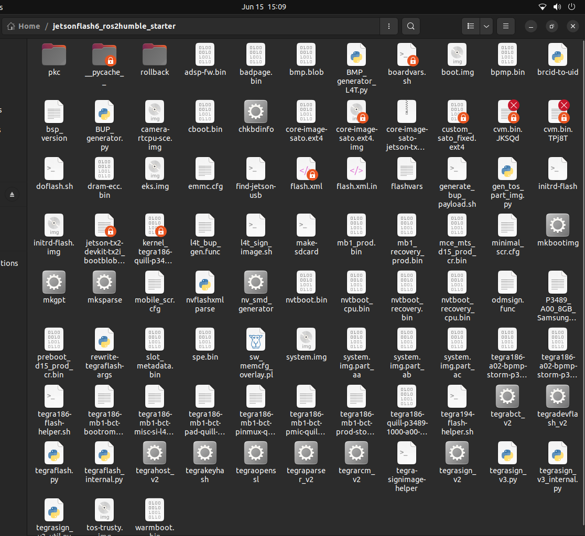

# Modifying Build Artifacts

<span class="phase-label">Phase 2 · Page 4 of 5</span>

!!! abstract "Page Goal"
    - Introduce the hybrid approach for carrier board customization: building a standard image, then modifying and repackaging the output artifacts for a standard NVIDIA based flashing utility/ Vendor provided packages applied to the NVIDIA Directory.
    - Present the visual build artifacts generated in a standard build.
    - Walk through mounting the Yocto-generated `.ext4` filesystem, editing `extlinux.conf` to allow bootloaders to set arguments automatically, and unmounting safely.
    - Explain the concept of sparse filesystem images and how to use the NVIDIA `mksparse` tool to compile the final flashable `system.img`.

---

## 1. Combining Yocto Images with NVIDIA's flash.sh utility

- Yocto allows us to produces several types of files, on completion of the build process. These include System Image files which contain the entire software and packages,i.e the Root File System. 
- This is usually generated in a .ext4 format which is a raw system image:

```text
+-------------------+      +-----------------------+         +--------------------------+
|  Standard Yocto   | ---> | Mount & Modify Rootfs, |  --->  |  NVIDIA Flashing Tool    |
|   Kirkstone Build |      |   mount the image.ext4 |        | (Flash Sparse system.img |
| (Compile Packages)|      | and edit extlinux.conf |        | to ConnectTech Board)    |
+-------------------+      +-----------------------+         +--------------------------+
```

This strategy separates the **Operating System compilation** (which compiles generic packages and configurations) from the **Hardware adaptation phase** (which configures the system for the specific carrier board). We use a standard, working build from Phase 1, extract its artifacts, inject our carrier-specific modifications, and repackage it for flashing.

---

## 2. Locating and Understanding Build Artifacts

When a Yocto build finishes successfully, the output artifacts are deployed to the following path on your host system:

```text
~/yocto/poky/build/tmp/deploy/images/<MACHINE_NAME>
```

### Visualizing the Deploy Directory
The folder contains bootloaders, kernel images, flashing scripts, partition configs, and device tree binaries:


*Figure 1: Deploy directory containing the compiled kernel, device trees, root filesystem, and Tegra flash configurations.*

### Key Artifact for Flashing
For using the a fully generated image for the flashing process, the artifact to access is the raw .ext4 file which is generated during the build :
1. **`core-image-sato-jetson-tx2-devkit-tx2i.ext4`**: The raw, uncompressed root filesystem (rootfs) partition image.

---

## 3. Mounting the ext4 Filesystem (Step-by-Step)

The Yocto-generated `.ext4` file is a sector-by-sector image of the root partition. To modify files inside it, we must mount it using a loop device on the host system.

### Step 1: Create a Mount Point Directory
On your host terminal, create a directory where the filesystem will be attached:

```bash
mkdir -p ~/mount_rootfs
```

### Step 2: Loop Mount the ext4 Image
Mount the raw image file with read-write permissions using `sudo`:

```bash
sudo mount -o loop ~/yocto/poky/build/tmp/deploy/images/jetson-tx2i/core-image-sato-jetson-tx2i.ext4 ~/mount_rootfs
```

### Step 3: Verify the Mounted Filesystem
Check the contents of the mounted folder to verify the root directory structure is visible:

```bash
ls -la ~/mount_rootfs
```

#### Expected Terminal Output:
```text
drwxr-xr-x  22 root root  4096 Jun 17 22:30 .
drwxr-xr-x  34 user user  4096 Jun 17 22:45 ..
drwxr-xr-x   2 root root  4096 Jun 17 22:30 bin
drwxr-xr-x   3 root root  4096 Jun 17 22:30 boot
drwxr-xr-x   2 root root  4096 Jun 17 22:30 dev
drwxr-xr-x  34 root root  4096 Jun 17 22:30 etc
drwxr-xr-x   3 root root  4096 Jun 17 22:30 home
drwxr-xr-x   8 root root  4096 Jun 17 22:30 lib
...
```

---

## 4. Modifying `extlinux.conf` to set the Mount Partitions Correctly

The bootloader (CBoot/U-Boot) reads `/boot/extlinux/extlinux.conf` from the root file system during early boot to locate the kernel and define boot-time arguments. Hence we need to specify the correct partition on our permanent storage - EMMC, which is /dev/mmcblk0p1.

### Step 4: Open `extlinux.conf` for Editing
Open the configuration file in a terminal editor:

```bash
sudo nano or sudo gedit ~/mount_rootfs/boot/extlinux/extlinux.conf
```

### Step 5: Configure Boot Parameters and Paths
We need to modify the Boot Parameters to either allow the bootloader to automatically detect and mount the root partition or to explicitly define it. First we will outline the initial structure which breaks in NVIDIA's flashing directory or setup (Yocto based arguments and script) and list both the hardcoded and non hardcoded parameters.

The Intial extlinux.conf located in side the mounted rootfs looks like this:

```text
TIMEOUT 30
DEFAULT primary

MENU TITLE L4T boot options

LABEL primary
      MENU LABEL primary kernel
      LINUX ../Image
      INITRD ../initrd
    
      APPEND ${cbootargs} root=/dev/mmcblk0{argument} ${bootargs}

---

Modifying this in a hardcoded way to directly specify the partitions and boot arguments :

navigate to /boot/extlinux/extlinux.conf inside the root file system that you have mounted and sudo gedit extlinux.conf, editing the rootfs parameter to point to /dev/mmcblk0p1.

```text
TIMEOUT 30
DEFAULT primary

MENU TITLE L4T boot options

LABEL primary
      MENU LABEL primary kernel
      LINUX ../Image
      INITRD ../initrd
    
      APPEND ${cbootargs} root=/dev/mmcblk0p1 ${bootargs}

---


Modifying the extlinux.conf in a hardcoded way so that cboot can specify arguments :

navigate to /boot/extlinux/extlinux.conf inside the root file system that you have mounted and sudo gedit extlinux.conf, to look like this.

```text
TIMEOUT 30
DEFAULT primary

MENU TITLE L4T boot options

LABEL primary
      MENU LABEL primary kernel
      LINUX ../Image
      INITRD ../initrd
    
      APPEND ${cbootargs} ${bootargs}

---

Explanation:
 - The Boot Up phase has 2 bootloaders, CBoot - Proprietary to NVIDIA and U-Boot, Open Source.
 - CBoot is responsible for selecting and determining which partition to look and load the file system.
 -  The main bootloader is UBoot and UBoot finds the Kernel and loads it. The ../Image is the reference of the kernel with respect to the extlinux.conf file, which comes from the minimal filesystem (initramfs)
 which the bootloader looks at to mount the required partition for full user space handover from the kernel space during booting.
 - Similary initrd is a script/binary loaded to initialise major systems.
 - ${cbootargs} and ${bootargs} are the boot arguments which are passed to the kernel. The aguments generated by earlier was pointing to a non existent partition so the bootloader failed to mount the filesystem.
 - We need to clean up this file and correct it to one of the options (either hardcoded to mmcblk0p1 or cboot generated arguments). This enables us to correctly integrate the system.img into the NVIDIA Directory for flashing which will be explained in detail in the next page.

## 5. Unmounting the Filesystem

To prevent filesystem corruption, the directory must be unmounted cleanly. This action flushes all cached writes from host memory to the physical `.ext4` file.

### Step 6: Unmount the Target Directory
Run the unmount command:

```bash
sudo umount ~/mount_rootfs
```

!!! caution "Do Not Unmount with Active Terminals"
    Ensure no terminal is open inside `~/mount_rootfs` (or any sub-folders) when executing the unmount command, as it will trigger a `target is busy` error.

---

## 6. Creating the Sparse Image (`system.img`)

Raw `.ext4` image files represent the complete partition footprint (e.g., 30 GB), regardless of whether the filesystem is full. Flashing a raw image takes a long time because the flashing tools copy gigabytes of empty sectors.

A **Sparse Image** replaces blocks of empty space (zeros) with small metadata flags, reducing the actual image file size significantly to the size of the ROOTFS partition.

### Step 7: Convert raw ext4 to Sparse Image

- Assuming the steps above are followed correctly, we will have a corrected and unmounted core-image-sato,ext4 inside the rootfs directory.

- Now we need to create a sparse image using one of the utilities - mksparse which is also generated inside the Yocto Build Artifacts.

- The underlying similarity between Yocto's approach to a flashing directory and setting up a Flashing Directory for an NVIDIA device is nearly the same. NVIDIA's scripts look for a sample root file system which is a dedicated folder in the directory, this is mounted and then converted to a sparse image during the traditional flashing process. Yocto likely does something similar and mounts the ext4 and converts it into a system.img file for flashing, using the underlying utility mksparse, which is common to both setups. NVIDIA's flash.sh script also allows us to reuse a system.img which we have created using a -r command line argument as explained fully in the next page. Hence, we create the sparse system.img inside the Yocto directory to transfer our minimal image and reuse it, avoiding rebuilding from NVIDIA's heavy and bloated sample rootfs.

``` bash

    cd /home/user/extracted_yocto_build_artifacts_directory
    Run the following command:
   ./mksparse -v --fillpattern=0 core-image-sato.ext4 system.img 

```

Now we have a successfully modified system.img which we can use in the next page, and move to the flashing directory setup for NVIDIA.

---

[← Executing the Build](03-executing-the-build.md){ .md-button }
[Next: Flashing Setup & Execution →](05-connecttech-flash-scripts.md){ .md-button .md-button--primary }

