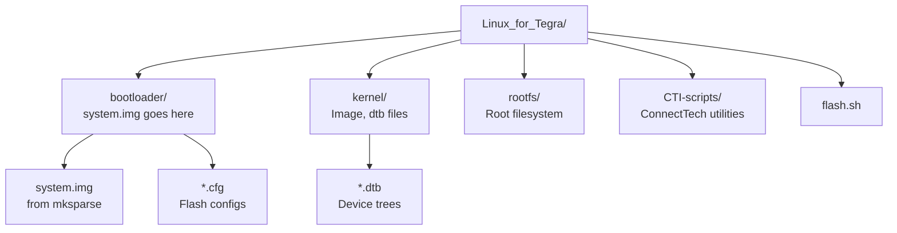

# ConnectTech Flash Scripts

Phase 2 · Page 4 of 6

!!! info "Outline Page"
    This page is an outline only.

---

## Outline

### ConnectTech BSP Overview

- <!-- TODO: What the CTI BSP provides -->
- <!-- TODO: Supported carrier boards -->
- <!-- TODO: Repository / download location -->

### Directory Structure for Flashing

- <!-- TODO: Linux_for_Tegra directory layout -->
- <!-- TODO: bootloader/ directory contents -->
- <!-- TODO: Where system.img goes -->

### CTI Flash Script Configuration

- <!-- TODO: Script name and parameters -->
- <!-- TODO: Board identification flags -->
- <!-- TODO: Carrier board selection -->

### Modifying Scripts for Custom Image

- <!-- TODO: Replacing default system.img -->
- <!-- TODO: DTB and CFG file placement -->
- <!-- TODO: Any script modifications needed -->

---

## Flash Directory Structure

---

[← Modifying Build Artifacts](03-build-artifact-modification.md){ .md-button }
[Next: Machine Configuration →](05-machine-configuration.md){ .md-button .md-button--primary }
