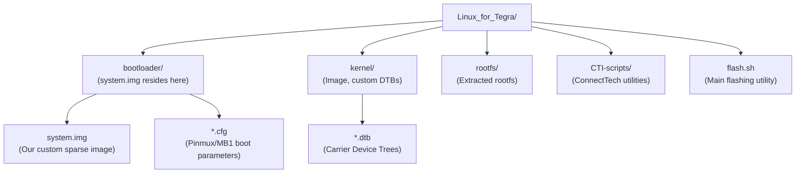

# Setting up the Flashing Environment & Flashing

<span class="phase-label">Phase 2 · Page 5 of 5</span>

!!! abstract "Page Goal"
    - Set up the official NVIDIA flashing directory structure (`Linux_for_Tegra`) on the host system.
    - Extract and overlay the ConnectTech BSP additions and flashing scripts (CTI Utilities) to add carrier board support.
    - Select the correct machine configuration files and parameters for the Jetson TX2i module on the Elroy carrier board.
    - Connect the hardware, place it in USB Recovery Mode, execute the flashing script, and verify the booted Linux system via serial console.

---

## 1. Setting up the NVIDIA Flashing Directory

NVIDIA provides a flashing tool called `flash.sh` that writes images to Jetson devices over USB. It comes inside a package called "Linux for Tegra" (L4T). We need to download this package and set it up on our host computer.

!!! note "Verified Testing Environment"
    This flashing process and NVIDIA's `flash.sh` script were tested and verified on a **native Ubuntu 18.04 LTS** host system. While Yocto compilation is run inside a Docker container (`crops/poky:ubuntu-18.04`) to handle compiler dependencies, flashing the physical hardware via USB Recovery Mode is most reliable when executed from a native Ubuntu installation. Loopback device mounts and USB events can be difficult to bridge stably through container layers.

### Step 1: Download and Extract the L4T Driver Package
1. Go to the [NVIDIA Jetson Linux Archive](https://developer.nvidia.com/embedded/jetson-linux-archive){:target="_blank"} and select the page for your target release (e.g., [Jetson Linux 32.7.6 (JetPack 4.6.6)](https://developer.nvidia.com/embedded/linux-tegra-r3276){:target="_blank"}).
2. Download the following packages:
    - [L4T Driver Package (BSP)](https://developer.nvidia.com/downloads/embedded/l4t/r32_release_v7.6/t186/jetson_linux_r32.7.6_aarch64.tbz2){:target="_blank"} (e.g., `Jetson_Linux_R32.7.6_aarch64.tbz2`)
    
    - [Sample Root Filesystem](https://developer.nvidia.com/downloads/embedded/l4t/r32_release_v7.6/t186/tegra_linux_sample-root-filesystem_r32.7.6_aarch64.tbz2){:target="_blank"} (required by `flash.sh` to initialize, though bypassed during our custom Yocto restore)
3. Extract the driver package on your host system:

```bash
# Extract the driver package
tar -xjf Jetson_Linux_R32.7.6_aarch64.tbz2
```
This extraction creates the main flashing directory root: `Linux_for_Tegra/`.

### Directory Structure Overview
Understanding the structure of `Linux_for_Tegra/` is essential. The primary subdirectories and their roles are detailed below:



| Subdirectory | Purpose / Description |
| :--- | :--- |
| **`bootloader/`** | Contains low-level boot configs (`.cfg`), partition layouts (`.xml`), and the sparse target filesystem image. **We copy our modified `system.img` here.** |
| **`kernel/`** | Stores the precompiled kernel binary (`Image`) and hardware device tree binaries (`.dtb`). |
| **`rootfs/`** | Standard Ubuntu root filesystem used for default flashing. We bypass this folder during Yocto flashing by telling the tool to reuse our pre-built sparse image. |
| **`flash.sh`** | NVIDIA's command-line script that signs the bootloaders, processes partition maps, and transmits images over USB. |

---

## 2. Adding ConnectTech Board Support

The NVIDIA package only knows about NVIDIA's own development boards. To flash onto a ConnectTech Elroy, we need to install ConnectTech's add-on files, which include the correct device tree and pin configuration for the Elroy.

### Step 2: Download and Extract CTI BSP
1. Visit the [ConnectTech L4T Board Support Packages Page](https://connecttech.com/resource-center/l4t-board-support-packages/){:target="_blank"}.
2. Under the **NVIDIA Jetson TX2/TX1** section, find the download matching your target L4T version (e.g. **CTI-L4T-TX2-KIRKSTONE-V001.tbz2** or similar for Kirkstone-L4T R32.7.x support).
3. Copy the downloaded archive to your flashing directory and extract:

```bash
# Copy and navigate
cp CTI-L4T-TX2-KIRKSTONE-V001.tbz2 ~/nvidia/nvidia_sdk/JetPack_4.6.6_Linux_JETSON_TX2I/Linux_for_Tegra/
cd ~/nvidia/nvidia_sdk/JetPack_4.6.6_Linux_JETSON_TX2I/Linux_for_Tegra/

# Extract the CTI package
tar -xjf CTI-L4T-TX2-KIRKSTONE-V001.tbz2
```

### Step 3: Run the CTI Overlay Installer
Execute the installation script with root privileges to copy custom machine configs, overlay board-specific device trees, and set script utilities:

```bash
sudo ./install.sh
```

#### What the CTI Installer Accomplishes:
- **DTB Overlays**: Places custom device trees (such as `tegra186-tx2i-cti-ASG002-revF+.dtb`) inside the `kernel/dtb/` directory.
- **Machine Configurations**: Adds carrier board target configuration profiles (like `revF+.conf`) to the flashing configurations.
- **Bootloader Configuration**: Installs custom pinmux configurations and power files into `bootloader/t186ref/cfg/`.

---
## 3. Choosing the Right Board Configuration

When flashing, you tell the script which board you are targeting. The ConnectTech installer adds new board profiles that the script can use to automatically select the right device tree and settings.

By default, the `machine.conf` files generated by NVIDIA inside the `Linux_for_Tegra/` directory support the Jetson Xavier and TX2i DevKits. 

### The Baseline Machine Config: `jetson-tx2i.conf`
Below is the content of the baseline configuration file `jetson-tx2i.conf` used by NVIDIA to configure the flashing environment for the TX2i developer kit:

```shell
# p2771-3489-ucm1.conf: configuration for T186-A02 ta795sa Silicon ucm1 profile 

BPFDTB_FILE=tegra186-a02-bpmp-storm-p3489-a00-00-ta795sa-ucm1.dtb;
source "${LDK_DIR}/p2771-0000.conf.common";
EMMC_BCT=P3489_A00_8GB_Samsung_8GB_lpddr4_204Mhz_P134_A02_ECC_en_l4t.cfg
DTB_FILE=tegra186-quill-p3489-1000-a00-00-ucm1.dtb;
TBCDTB_FILE=tegra186-quill-p3489-1000-a00-00-ucm1.dtb;

PROD_CONFIG="tegra186-mb1-bct-prod-storm-p3489-1000-a00.cfg";
PINMUX_CONFIG="tegra186-mb1-bct-pinmux-quill-p3489-1000-a00.cfg";
PMIC_CONFIG="tegra186-mb1-bct-pmic-quill-p3489-1000-a00.cfg";
PMC_CONFIG="tegra186-mb1-bct-pad-quill-p3489-1000-a00.cfg";
BOOTROM_CONFIG="tegra186-mb1-bct-bootrom-quill-p3489-1000-a00.cfg";
MISC_CONFIG="tegra186-mb1-bct-misc-si-l4t-storm.cfg";
DRAMECCFILE="bootloader/dram-ecc.bin";
BADPAGEFILE="bootloader/badpage.bin";
```

- **`BPFDTB_FILE`**: Specifies the Boot and Power Management Processor (BPMP) device tree binary for the `storm` (NVIDIA's industrial-grade TX2i) silicon profile. It controls early-stage clocks and voltage domains.
- **`source ... p2771-0000.conf.common`**: Imports the base settings shared by all Jetson TX2 modules (built on the P2771 board specification).
- **`EMMC_BCT`**: Sets the eMMC Boot Configuration Table (BCT). This initializes the module's Samsung eMMC storage, targets the LPDDR4 DRAM controller at 204 MHz, and activates the industrial TX2i's hardware-level **ECC (Error Correcting Code) memory** diagnostics.
- **`DTB_FILE` & `TBCDTB_FILE`**: Defines the Device Tree Binary loaded by the Linux kernel and the early bootloader stages. For the developer kit, this is the standard `quill-p3489` DTB.
- **`PROD_CONFIG` / `PINMUX_CONFIG` / `PMIC_CONFIG` / `PMC_CONFIG` / `BOOTROM_CONFIG` / `MISC_CONFIG`**: Selects low-level hardware configuration tables. The `storm` and `p3489` flags target the industrial SoM specifically, setting pins, power levels, pad voltages, and boot ROM options.
- **`DRAMECCFILE` & `BADPAGEFILE`**: Links to binary configs handling dynamic RAM error corrections and mapping out damaged sectors, which are vital for reliability in space environments.

---

## 4. ConnectTech Board Configurations & Flashing Utilities

When you execute ConnectTech's installer script (`install.sh` or `do_install.sh`), it creates a `cti/` subdirectory inside the L4T `bootloader/` directory (`Linux_for_Tegra/bootloader/cti/`). It then populates this directory with carrier-specific configuration profiles and flashing wrappers.

### A. The Common ConnectTech Configuration: `cti-tx2i.conf.common`
This configuration file defines target hardware parameters and early boot options shared by all ConnectTech boards utilizing the Jetson TX2i module. It overrides standard NVIDIA settings (such as disabling references to the developer kit's onboard EEPROM).

??? info "Click to view `cti-tx2i.conf.common` configuration"
    ```shell
    # Copyright (c) 2015-2017, NVIDIA CORPORATION. All rights reserved.
    #
    # Redistribution and use in source and binary forms, with or without
    # modification, are permitted provided that the following conditions
    # are met:
    #  * Redistributions of source code must retain the above copyright
    #    notice, this list of conditions and the following disclaimer.
    #  * Redistributions in binary form must reproduce the above copyright
    #    notice, this list of conditions and the following disclaimer in the
    #    documentation and/or other materials provided with the distribution.
    #  * Neither the name of NVIDIA CORPORATION nor the names of its
    #    contributors may be used to endorse or promote products derived
    #    from this software without specific prior written permission.
    #
    # THIS SOFTWARE IS PROVIDED BY THE COPYRIGHT HOLDERS ``AS IS'' AND ANY
    # EXPRESS OR IMPLIED WARRANTIES, INCLUDING, BUT NOT LIMITED TO, THE
    # IMPLIED WARRANTIES OF MERCHANTABILITY AND FITNESS FOR A PARTICULAR
    # PURPOSE ARE DISCLAIMED.  IN NO EVENT SHALL THE COPYRIGHT OWNER OR
    # CONTRIBUTORS BE LIABLE FOR ANY DIRECT, INDIRECT, INCIDENTAL, SPECIAL,
    # EXEMPLARY, OR CONSEQUENTIAL DAMAGES (INCLUDING, BUT NOT LIMITED TO,
    # PROCUREMENT OF SUBSTITUTE GOODS OR SERVICES; LOSS OF USE, DATA, OR
    # PROFITS; OR BUSINESS INTERRUPTION) HOWEVER CAUSED AND ON ANY THEORY
    # OF LIABILITY, WHETHER IN CONTRACT, STRICT LIABILITY, OR TORT
    # (INCLUDING NEGLIGENCE OR OTHERWISE) ARISING IN ANY WAY OUT OF THE USE
    # OF THIS SOFTWARE, EVEN IF ADVISED OF THE POSSIBILITY OF SUCH DAMAGE.

    sub_var_token()
    {
    	local var="$1";
    	local from="$2";
    	local to="$3";
    	if [ "${var}" != "" -a "${!var}" != "" ]; then
    		if [[ "${!var}" =~ "${from}" ]]; then
    			local val=`echo "${!var}" | sed -e s/${from}/${to}/`;
    			eval "${var}=${val}";
    		fi;
    	fi;
    }

    # Process fuse version:
    # Production Fused BD vs non-fused BD:
    # preboot_d15_dev_cr.bin vs. preboot_d15_prod_cr.bin
    # mce_mts_d15_dev_cr.bin vs. mce_mts_d15_prod_cr.bin
    # mb1_dev.bin            vs. mb1_prod.bin
    # mb1_recovery_dev.bin   vs. mb1_recovery_prod.bin
    process_fuse_level()
    {
    	local fuselevel="${1}";
    	local srctoken="_dev";
    	local trgtoken="_prod";

    	if [ "${fuselevel}" = "fuselevel_unknown" ]; then
    		return;
    	fi;
    	if [ "${fuselevel}" = "fuselevel_nofuse" ]; then
    		srctoken="_prod";
    		trgtoken="_dev";
    		sub_var_token "WB0BOOT" "warmboot.bin" "warmboot_dev.bin";
    	else
    		sub_var_token "WB0BOOT" "warmboot_dev.bin" "warmboot.bin";
    	fi;
    	sub_var_token "MTSPREBOOT" "${srctoken}" "${trgtoken}";
    	sub_var_token "MTS"        "${srctoken}" "${trgtoken}";
    	sub_var_token "MB1FILE"    "${srctoken}" "${trgtoken}";
    	sub_var_token "SOSFILE"    "${srctoken}" "${trgtoken}";
    }

    process_board_version()
    {
        # Not used for CTI boards: bypasses reference EEPROM checking
        echo " "
    }

    # Common values and/or defaults across p2771-0000*.conf:
    DFLT_KERNEL_IMAGE="bootloader/t186ref/p2771-0000/500/u-boot.bin";
    CHIPID=0x18;
    EMMC_CFG=flash_l4t_t186.xml;
    BOOTPARTSIZE=8388608;
    EMMCSIZE=31276924928;
    ITS_FILE=;
    EMMC_BCT=P3489_A00_8GB_Samsung_8GB_lpddr4_204Mhz_P134_A02_ECC_en_l4t.cfg
    TBCDTB_FILE=tegra186-quill-p3489-1000-a00-00-ucm1.dtb;

    # USE_UBOOT environment checks:
    if [ -z "${USE_UBOOT}" ]; then
    	USE_UBOOT=1;
    fi;
    ROOTFSSIZE=28GiB;
    CMDLINE_ADD="console=ttyS0,115200n8 console=tty0 OS=l4t fbcon=map:0 net.ifnames=0";
    target_board="t186ref";
    ROOT_DEV="mmcblk0p12 ------------ internal eMMC.
            sda1 ----------------- external USB devices. (USB memory stick, HDD)
            eth0 ----------------- nfsroot via RJ45 Ethernet port.
            eth1 ----------------- nfsroot via USB Ethernet interface.";
    TEGRABOOT="bootloader/t186ref/nvtboot.bin";
    WB0BOOT="bootloader/t186ref/warmboot.bin";
    FLASHAPP="bootloader/tegraflash.py";
    FLASHER="bootloader/nvtboot_recovery_cpu.bin";
    BOOTLOADER="bootloader/nvtboot_cpu.bin";
    INITRD="bootloader/l4t_initrd.img";
    TBCFILE="bootloader/cboot.bin";
    BPFFILE="bootloader/bpmp.bin";
    TOSFILE="bootloader/tos.img";
    EKSFILE="bootloader/eks.img";
    MTSPREBOOT="bootloader/preboot_d15_prod_cr.bin";
    MTS="bootloader/mce_mts_d15_prod_cr.bin";
    MB1FILE="bootloader/mb1_prod.bin";
    SOSFILE="bootloader/mb1_recovery_prod.bin";
    MB2BLFILE="bootloader/nvtboot_recovery.bin";

    # BCT args:
    BCT="--sdram_config";
    BINSARGS="--bins \"";
    DEV_PARAMS="emmc.cfg";
    SCR_CONFIG="minimal_scr.cfg";
    SCR_COLD_BOOT_CONFIG="mobile_scr.cfg";
    MISC_CONFIG="tegra186-mb1-bct-misc-si-l4t.cfg";
    PINMUX_CONFIG="tegra186-mb1-bct-pinmux-quill-p3489-1000-a00.cfg";
    PMIC_CONFIG="tegra186-mb1-bct-pmic-quill-p3489-1000-a00.cfg";
    PMC_CONFIG="tegra186-mb1-bct-pad-quill-p3489-1000-a00.cfg";
    PROD_CONFIG="tegra186-mb1-bct-prod-storm-p3489-1000-a00.cfg";
    BOOTROM_CONFIG="tegra186-mb1-bct-bootrom-quill-p3489-1000-a00.cfg";

    BPFDTB_FILE=tegra186-a02-bpmp-storm-p3489-a00-00-ta795sa-ucm1.dtb;

    # Default FAB (Force Quill boards without properly programmed EEPROM):
    DEFAULT_FAB="B01";
    ext_target_board=`echo "${ext_target_board}" | sed "s|/|-|g"`;
    VERFILENAME="emmc_bootblob_ver.txt";
    SMDFILE="slot_metadata.bin";

    rootfs_ab=0;
    disk_enc_enable=0;

    # Rootfs A/B Check:
    if [[ "${ROOTFS_AB}" == 1 && "${ROOTFS_ENC}" == "" ]]; then
    	rootfs_ab=1;
    	EMMC_CFG=flash_l4t_t186_rootfs_ab.xml;
    	ROOTFSSIZE=14GiB;
    	SMDFILE="slot_metadata.bin.rootfsAB";
    # Disk encryption support:
    elif [[ "${ROOTFS_AB}" == "" && "${ROOTFS_ENC}" == 1 ]]; then
    	disk_enc_enable=1;
    	EMMC_CFG=flash_l4t_t186_enc_rfs.xml;
    # Rootfs A/B + Disk encryption support:
    elif [[ "${ROOTFS_AB}" == 1 && "${ROOTFS_ENC}" == 1 ]]; then
    	rootfs_ab=1;
    	disk_enc_enable=1;
    	EMMC_CFG=flash_l4t_t186_enc_rootfs_ab.xml;
    	ROOTFSSIZE=14GiB;
    	SMDFILE="slot_metadata.bin.rootfsAB";
    fi;
    ```

#### Key Elements of `cti-tx2i.conf.common`
- **`process_board_version()` Override**: This function is explicitly mapped as a no-op (`echo " "`). Standard NVIDIA developer kits read hardware model info from an onboard EEPROM over I2C. ConnectTech boards do not contain this specific EEPROM. Without this override, the flashing script would fail to read the board version and abort.
- **`CHIPID=0x18`**: Targets the Tegra 186 SoC configuration (representing the TX2 family).
- **`EMMC_BCT`**: Standardizes the ECC-enabled Samsung LPDDR4 memory configuration profile.

---

### B. The Elroy Board Configuration: `revF+.conf`
This configuration file targets the revision F+ (and newer) versions of the ConnectTech Elroy carrier board. It is located at `bootloader/cti/tx2i/elroy/revF+.conf`:

```shell
#!/bin/bash
ODMDATA=0x6090000
SYSBOOTFILE=p2771-0000/extlinux.conf;
DTB_FILE=tegra186-tx2i-cti-ASG002-revF+.dtb;
TBCDTB_FILE=$DTB_FILE;
ext_target_board=cti-tx2i-asg002-00;

source "${LDK_DIR}/cti-tx2i.conf.common";
```

#### Detailed Explanation:
- **`ODMDATA=0x6090000`**: Overrides low-level hardware multiplexing parameters, configuring the custom PCIe lanes and USB ports for the Elroy carrier board.
- **`DTB_FILE` & `TBCDTB_FILE`**: Forces the flashing script to load and flash the Elroy-specific device tree binary `tegra186-tx2i-cti-ASG002-revF+.dtb`.
- ** Sourcing `cti-tx2i.conf.common`**: Integrates the common settings defined in the step above.

---

### C. The ConnectTech Flashing Wrapper: `cti-flash.sh`
ConnectTech includes an interactive, menu-driven script called `cti-flash.sh` to simplify flashing configurations for various modules and carrier boards.

??? info "Click to view the menu-driven `cti-flash.sh` script"
    ```bash
    #!/bin/bash

    NOCOLOR='\033[0m'
    GREEN='\033[0;32m'
    RED='\033[0;41m'
    STD='\033[0;0;39m'

    flash(){
        ./flash.sh cti/$2/$BOARD_TYPE/$1 mmcblk0p1
        exit 0
    }

    menu() {
        clear
        echo "~~~~~~~~~~~~~~~~~~~~~~~~~~~"  
        echo "         CTI FLASH         "
        echo "~~~~~~~~~~~~~~~~~~~~~~~~~~~"
        echo "1. Astro"
        echo "2. Elroy"
        echo "3. Orbitty"
        echo "4. Spacely (ASG006)"
        echo "5. Spacely (ASG026)"
        echo "6. Sprocket"
        echo "7. Rudi"
        echo "8. Cogswell"
        echo "9. Rosie"
        echo "10. Graphite VPX"
        echo "11. Quasar"
        echo "x. Exit"
    }

    astroMenu() {
        clear
        echo "~~~~~~~~~~~~~~~~~~~~~~~~~~~" 
        echo "           Astro           "
        echo "~~~~~~~~~~~~~~~~~~~~~~~~~~~"
        echo "1. Revison J+"
        echo "2. Revison G to Revision I"
        echo "3. USB3.0 (Rev F prior)"
        echo "4. mPCIe (Rev F prior)"
        echo "5. Cancel (back to main menu)"
    }

    elroyMenu() {
        clear
        echo "~~~~~~~~~~~~~~~~~~~~~~~~~~~"  
        echo "           Elroy           "
        echo "~~~~~~~~~~~~~~~~~~~~~~~~~~~"
        echo "1. Revison F+"
        echo "2. USB3.0 (Rev E prior)"
        echo "3. mPCIe (Rev E prior )"
        echo "4. Cancel (back to main menu)"
    }

    spacelyMenu() {
        clear
        echo "~~~~~~~~~~~~~~~~~~~~~~~~~~~"  
        echo "    Spacely (ASG006)       "
        echo "~~~~~~~~~~~~~~~~~~~~~~~~~~~"
        echo "1. Base"
        echo "2. IMX274 3 Cameras"
        echo "3. IMX274 6 Cameras"
        echo "4. Cancel (back to main menu)"
    }

    spacelyRevjMenu() {
        clear
        echo "~~~~~~~~~~~~~~~~~~~~~~~~~~~"  
        echo "    Spacely (ASG026)       "
        echo "~~~~~~~~~~~~~~~~~~~~~~~~~~~"
        echo "1. Base"
        echo "2. IMX274 3 Cameras"
        echo "3. IMX274 6 Cameras"
        echo "4. Cancel (back to main menu)"
    }

    rudiMenu() {
        clear
        echo "~~~~~~~~~~~~~~~~~~~~~~~~~~~"  
        echo "           Rudi            "
        echo "~~~~~~~~~~~~~~~~~~~~~~~~~~~"
        echo "1. Revison C+"
        echo "2. USB3.0 (Rev B prior)"
        echo "3. mPCIe (Rev B prior )"
        echo "4. Cancel (back to main menu)"
    }

    sprocketMenu() {
        clear
        echo "~~~~~~~~~~~~~~~~~~~~~~~~~~~"  
        echo "          Sprocket          "
        echo "~~~~~~~~~~~~~~~~~~~~~~~~~~~"
        echo "1. Base"    
        echo "2. IMX274"
        echo "3. Cancel (back to main menu)"
    }

    quasarMenu() {
        clear
        echo "~~~~~~~~~~~~~~~~~~~~~~~~~~~"  
        echo "          Quasar           "
        echo "~~~~~~~~~~~~~~~~~~~~~~~~~~~"
        echo "1. Base"    
        echo "2. IMX274"
        echo "3. Cancel (back to main menu)"
    }

    vpxMenu() {
        clear
        echo "~~~~~~~~~~~~~~~~~~~~~~~~~~~"  
        echo "            VPX            "
        echo "~~~~~~~~~~~~~~~~~~~~~~~~~~~"
        echo "1. Base"
        echo "2. IMX274-2CAM"
        echo "3. Cancel (back to main menu)"
    }

    tx2Menu() {
        clear
        echo "~~~~~~~~~~~~~~~~~~~~~~~~~~~"  
        echo "        TX2 Version        "
        echo "~~~~~~~~~~~~~~~~~~~~~~~~~~~"
        echo "1. TX2"
        echo "2. TX2i"
        echo "3. TX2-4G"
        echo "4. Cancel (back to main menu)"
    }

    tx2Options(){
        tx2Menu
        local choice
        read -p "Enter choice:  " choice
        case $choice in
            1) flash $1 tx2;;    
            2) flash $1 tx2i;;
            3) flash $1 tx2-4G;;
            4) ;;
            *) echo -e "${RED}Invalid Choice...${STD}" && sleep 1
        esac
    }

    astroOptions(){
        astroMenu
        local choice
        read -p "Enter choice:  " choice
        case $choice in
            1) tx2Options revJ+;;
            2) tx2Options revG+;;    
            3) tx2Options usb3;;
            4) tx2Options mpcie;;
            5) ;;
            *) echo -e "${RED}Invalid Choice...${STD}" && sleep 1
        esac
    }

    elroyOptions(){
        elroyMenu
        local choice
        read -p "Enter choice:  " choice
        case $choice in
            1) tx2Options revF+;;    
            2) tx2Options usb3;;
            3) tx2Options mpcie;;
            4) ;;
            *) echo -e "${RED}Invalid Choice...${STD}" && sleep 1
        esac
    }

    spacelyOptions(){
        spacelyMenu
        local choice
        read -p "Enter choice:  " choice
        case $choice in
            1) tx2Options base;;    
            2) tx2Options li-imx274-3cam;;
            3) tx2Options li-imx274-6cam;;
            4) ;;
            *) echo -e "${RED}Invalid Choice...${STD}" && sleep 1
        esac
    }

    spacelyRevjOptions(){
        spacelyRevjMenu
        local choice
        read -p "Enter choice:  " choice
        case $choice in
            1) tx2Options base-revj+;;    
            2) tx2Options li-imx274-3cam-revj+;;
            3) tx2Options li-imx274-6cam-revj+;;
            4) ;;
            *) echo -e "${RED}Invalid Choice...${STD}" && sleep 1
        esac
    }
    quasarOptions(){
        quasarMenu
        local choice
        read -p "Enter choice:  " choice
        case $choice in
            1) tx2Options base;;    
            2) tx2Options li-imx274;;
            3) ;;
            *) echo -e "${RED}Invalid Choice...${STD}" && sleep 1
        esac
    }
    sprocketOptions(){
        sprocketMenu
        local choice
        read -p "Enter choice:  " choice
        case $choice in  
            1) tx2Options base;;
            2) tx2Options li-imx274;;
            3) ;;
            *) echo -e "${RED}Invalid Choice...${STD}" && sleep 1
        esac
    }

    rudiOptions(){
        rudiMenu
        local choice
        read -p "Enter choice:  " choice
        case $choice in
            1) tx2Options base;;    
            2) tx2Options usb3;;
            3) tx2Options mpcie;;
            4) ;;
            *) echo -e "${RED}Invalid Choice...${STD}" && sleep 1
        esac
    }

    vpxOptions(){
        vpxMenu
        local choice
        read -p "Enter choice:  " choice
        case $choice in  
            1) tx2Options base;;
            2) tx2Options li-imx274-2cam;;
            3) ;;
            *) echo -e "${RED}Invalid Choice...${STD}" && sleep 1
        esac
    }

    boardOptions(){
        local choice
        read -p "Enter choice:  " choice
        case $choice in
            1) BOARD_TYPE="astro"; astroOptions;;    
            2) BOARD_TYPE="elroy"; elroyOptions;;
            3) BOARD_TYPE="orbitty"; tx2Options base;;
            4) BOARD_TYPE="spacely"; spacelyOptions;;
            5) BOARD_TYPE="spacely"; spacelyRevjOptions;;
            6) BOARD_TYPE="sprocket"; sprocketOptions;;
            7) BOARD_TYPE="rudi"; rudiOptions;;
            8) BOARD_TYPE="cogswell"; tx2Options base;;
            9) BOARD_TYPE="rosie"; tx2Options base;;
            10) BOARD_TYPE="vpg003"; vpxOptions;; 
            11) BOARD_TYPE="quasar"; quasarOptions;;
            x) exit 0;;
            *) echo -e "${RED}Invalid Choice...${STD}" && sleep 1
        esac
    }

    trap ''
    dmesg -D

    while true
    do
        menu
        boardOptions
    done
    ```

####  Script Working:
When you execute `cti-flash.sh`, you interact with a CLI menu interface. Selecting **`2`** (Elroy) -> **`1`** (Revision F+) -> **`2`** (TX2i) triggers:
```bash
# Executed internally by the CTI script
./flash.sh cti/tx2i/elroy/revF+ mmcblk0p1
```
This maps to `bootloader/cti/tx2i/elroy/revF+.conf` inside the flashing directory.

!!! warning "Interactive Flash vs. Custom Yocto Restore"
    The interactive script `cti-flash.sh` executes `flash.sh` **without** the `-r` (reuse) flag. It will build a root filesystem from the default `rootfs/` directory, which will overwrite your custom Yocto packages. 
    
    To flash your custom Yocto `system.img`, you must run the direct command passing the target configuration path and the `-r` option, as shown in Section 5 below.

---


## 5. Flashing with Our Custom Image

- The ConnectTech `cti-flash.sh` script calls NVIDIA's `flash.sh` under the hood, but it does **not** include the `-r` (reuse) flag by default. Without `-r`, the script would rebuild the root filesystem from scratch using NVIDIA's default files, overwriting our custom Yocto image.

- To keep our image, we copy the script and add the `-r` flag:
 
```shell
flash(){
        ./flash.sh -r cti/$2/$BOARD_TYPE/$1 mmcblk0p1
        exit 0
    }
```

 - Added -r to the ./flash.sh command.

 - Also notice that the ConnectTech script calls the underlying NVIDIA flash.sh script, with the following and supplies the required machine.conf. This ensures we pull in the correct DTB file for the Elroy and our Peripherals will work out of the box when flashed.

 - As given in step 4 run the script sudo ./<name>.sh

 - It will prompt you to enter the Carrier -  Press 2 for Elroy

 - It will prompt you to enter the Revision - Press 1 for Rev F+.

 - It will ask for the TX2 or SOC version - Press 2 for TX2i.

 - It will flash the board with our custom system.img. 


#### Putting the Elroy Board in Recovery Mode

- The Elroy is a small board without physical buttons (Power, Reset, Recovery). To enter recovery mode, you need to **short pins 6 and 20** on the outer edge of the board using a jumper wire.

!!! warning "Do this step carefully"

    - Short the pins after discharging your body from static. You may do so by holding a grounded surface for a few seconds.
    - Power on the board and connect it to the host machine via a USB 2 Cable. The TX2i being an older device may not be recognised on USB 3.0 ports and you can use a USB 2.0 adapter/hub for the same.

- Check if the board is detected using the lsusb utility - you should see something similar to the following output:

```shell
 Bus 001 Device 005: ID 0955:7018 NVIDIA Corp.
```

- If you see the above output, the board is in recovery mode and ready to be flashed. If not, repeat the steps above.

- Run the modified Connectech script, which now has the -r flag and finish flashing the board. Monitor the flash logs carefully and check if the ASG002-revF+ file is loaded in the logs. If the flashes completes successfully, remove the short on the board and reboot the board.

- The board should boot up with the Yocto-built OS. This completes Phase 2 — adapting the build for the ConnectTech Elroy carrier board.

!!! note "Extension of the Ideas for similar CLI based Jetson Flashing "

    - An additional page will be added soon regarding this, as underlying dtb, machine.conf and flashing follow similar approaches for most Jetson Devices. The only change with newer devices is modernized architecture like UEFI and Secure Boot, which needs to be analyzed in detail and modifications to be added for the same.

---

[← Build Artifact Modification](04-build-artifact-modification.md){ .md-button }
[Phase 3 — PREEMPT_RT →](../phase3/index.md){ .md-button .md-button--primary }
