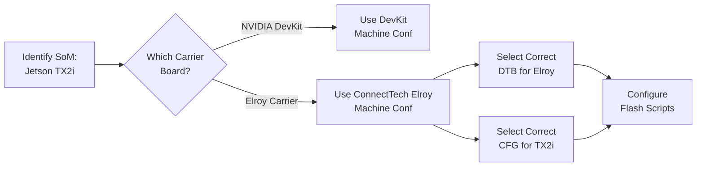

# Machine Configuration & Flags

Phase 2 · Page 5 of 6

!!! info "Outline Page"
    This page is an outline only.

---

## Outline

### Machine Configuration Files

- <!-- TODO: Where machine confs live in meta-tegra / NVIDIA -->
 <!-- TODO: Contents of a machine conf file -->

### jetson-tx2i Flag vs Elroy Board

- <!-- TODO: Difference between the two targets -->
- <!-- TODO: When to use which flag -->
- <!-- TODO: CFG file selection based on flag -->

### Getting the Correct CFG Files

- <!-- TODO: Sources for CFG files -->
- <!-- TODO: Which CFGs match the Elroy + TX2i combo -->

### Configuration Checklist

- [ ] <!-- TODO: Checklist item 1 -->
- [ ] <!-- TODO: Checklist item 2 -->
- [ ] <!-- TODO: Checklist item 3 -->

---

---

[← ConnectTech Scripts](04-connecttech-flash-scripts.md){ .md-button }
[Flashing & Testing →](06-flashing-and-verification.md){ .md-button .md-button--primary }
