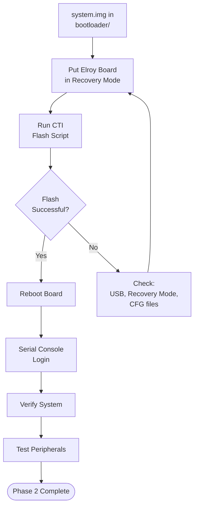

# Flashing & Testing on Elroy

Phase 2 · Stage 5

!!! info "Outline Page"
    This page is an outline only.

---

## Outline

### Pre-Flash Checklist

- [ ] system.img copied to bootloader/
- [ ] Correct DTB in place
- [ ] Correct CFG files configured
- [ ] CTI scripts configured
- [ ] USB connection established
- [ ] Board in recovery mode

### Flash Procedure

- <!-- TODO: Step-by-step flash commands -->
- <!-- TODO: Expected console output -->
- <!-- TODO: Flash duration -->

### Post-Flash Verification

- <!-- TODO: Serial console first boot -->
- <!-- TODO: System verification commands -->
- <!-- TODO: Peripheral testing (USB, Ethernet, GPIO) -->

### Screenshots & Expected Output

- <!-- TODO: Add terminal screenshots -->

---

## Flash & Verify Pipeline

---

[← Machine Conf & Flags](06-machine-configuration.md){ .md-button }
[Phase 3 — PREEMPT_RT →](../phase3/index.md){ .md-button .md-button--primary }
