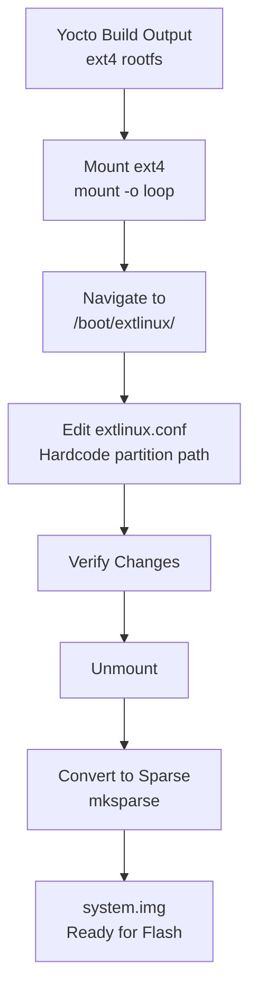

# Build Artifact Modification

Phase 2 · Stage 3

!!! info "Outline Page"
    This page is an outline only.

---

## Outline

### Locating Build Artifacts

- <!-- TODO: Path to ext4 rootfs from Yocto build -->
- <!-- TODO: Key files to identify -->

### Mounting the ext4 Filesystem

- <!-- TODO: Mount command -->
- <!-- TODO: Verifying mount contents -->

### Editing extlinux.conf

- <!-- TODO: Location: /boot/extlinux/extlinux.conf -->
- <!-- TODO: What needs to be hardcoded (partition UUID/path) -->
- <!-- TODO: Why this is necessary for Elroy -->

### Unmounting

- <!-- TODO: Clean unmount procedure -->

### Creating the Sparse Image

- <!-- TODO: What is a sparse image and why it's needed -->
- <!-- TODO: mksparse utility usage -->
- <!-- TODO: Output file: system.img -->

---

## Artifact Modification Pipeline

---

[← Warrior Dead End](warrior-dead-end.md){ .md-button }
[ConnectTech Scripts →](connecttech-scripts.md){ .md-button .md-button--primary }
