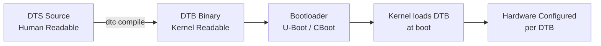

# Device Tree Binaries & CFG Files

Phase 2 · Concepts

!!! info "Outline Page"
    This page is an outline only.

---

## Outline

### What is a Device Tree?

- <!-- TODO: Concept explanation -->
- <!-- TODO: DTS vs DTB vs DTSI -->

### Why DTBs Matter for Custom Hardware

- <!-- TODO: Hardware description for the kernel -->
- <!-- TODO: Pin multiplexing, peripheral configuration -->

### CFG Files in the NVIDIA Flash Process

- <!-- TODO: What CFG files control -->
- <!-- TODO: Partition layout definitions -->
- <!-- TODO: Memory and bootloader configuration -->

### Finding the Right DTB for Elroy

- <!-- TODO: CTI-provided DTBs -->
- <!-- TODO: Decompiling and inspecting DTBs -->
- <!-- TODO: dtc tool usage -->

---

## DTB Flow in Boot Process

---

[← Elroy vs DevKit](elroy-vs-devkit.md){ .md-button }
[Warrior Dead End →](warrior-dead-end.md){ .md-button .md-button--primary }
