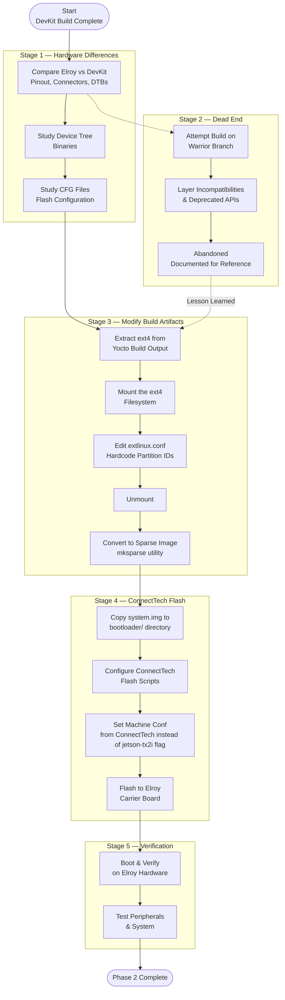

# Phase 2 — Custom Hardware Adaptation

Hardware · Week 3–4

!!! abstract "Goal"
    Transition the working Yocto build from the NVIDIA TX2 Development Kit to the Connect Tech Elroy carrier board — a minimal form-factor carrier designed for embedded and space applications.

!!! danger "Dead End Documented"
    This phase also documents a dead-end approach using the older Warrior branch, which was abandoned in favor of continuing on Kirkstone. This is included to save future developers from repeating the same mistake.

---

## Why a custom carrier board?

- 

---

## Adapting from the Yocto Perspective

## Phase Process Overview

---

## Subpages

| Page | Description |
|---|---|
| [Elroy vs DevKit](01-hardware-comparison.md) | Hardware comparison, form factor, connector differences |
| [DTBs & CFG Files](02-device-trees-and-configuration.md) | Device tree binaries and flash configuration concepts |
| [Dead End — Warrior Branch](03-warrior-branch-dead-end.md) | Why the Warrior branch failed and lessons learned |
| [Build Artifact Modification](04-build-artifact-modification.md) | Mounting ext4, editing extlinux.conf, creating sparse image |
| [ConnectTech Flash Scripts](05-connecttech-flash-scripts.md) | CTI BSP scripts, directory setup, flash configuration |
| [Machine Conf & Flags](06-machine-configuration.md) | jetson-tx2i flag, Elroy board cfg, machine configuration |
| [Flashing & Testing](07-flashing-and-verification.md) | Flash procedure and verification on Elroy hardware |

---

[← Phase 1](../phase1/index.md){ .md-button }
[Next: Phase 3 →](../phase3/index.md){ .md-button .md-button--primary }
