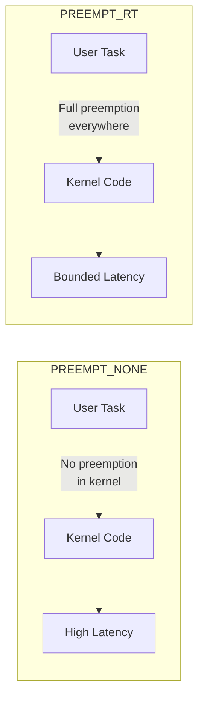

# Understanding PREEMPT_RT

Phase 3 · Concepts

!!! info "Outline Page"
    This page is an outline only.

---

## Outline

### What is PREEMPT_RT?

- <!-- TODO: Definition and purpose -->
- <!-- TODO: Difference between PREEMPT_NONE, PREEMPT_VOLUNTARY, PREEMPT, and PREEMPT_RT -->

### Why Real-Time Matters for Space

- <!-- TODO: Deterministic scheduling for payload control -->
- <!-- TODO: Bounded worst-case latency -->
- <!-- TODO: Interaction with ROS real-time requirements -->

### How PREEMPT_RT Works

- <!-- TODO: Making most kernel code preemptible -->
- <!-- TODO: Converting spinlocks to mutexes -->
- <!-- TODO: Threaded interrupt handlers -->
- <!-- TODO: Priority inheritance -->

### Limitations & Tradeoffs

- <!-- TODO: Throughput vs latency tradeoff -->
- <!-- TODO: Not all drivers are RT-safe -->

---

## Preemption Model Comparison

---

[← Phase 3 Overview](index.md){ .md-button }
[Applying the Patch →](02-applying-the-patch.md){ .md-button .md-button--primary }
