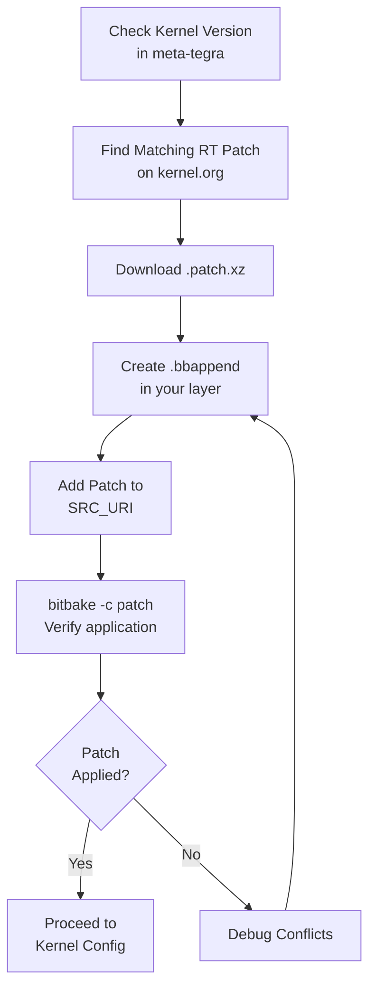

# Applying the PREEMPT_RT Patch via Yocto

Phase 3 · Stage 2

!!! info "Outline Page"
    This page is an outline only.

---

## Outline

### Identifying the Kernel Version

- <!-- TODO: How to find current kernel version in your build -->
- <!-- TODO: Matching patch version to kernel version -->

### Downloading the RT Patch

- <!-- TODO: Source: kernel.org/pub/linux/kernel/projects/rt/ -->
- <!-- TODO: Patch naming convention -->

### Creating a Kernel bbappend

- <!-- TODO: File location and naming -->
- <!-- TODO: Adding patch to SRC_URI -->
- <!-- TODO: Recipe structure -->

### Verifying Patch Application

- <!-- TODO: bitbake -c patch verification -->
- <!-- TODO: Checking patch logs -->

---

---

[← Understanding PREEMPT_RT](01-understanding-preempt-rt.md){ .md-button }
[Kernel Configuration →](03-kernel-configuration.md){ .md-button .md-button--primary }
