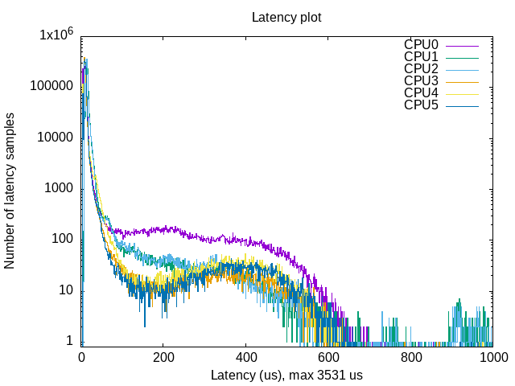
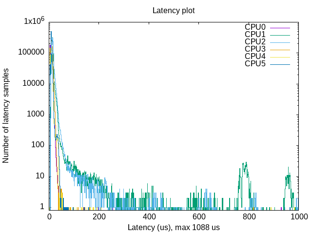
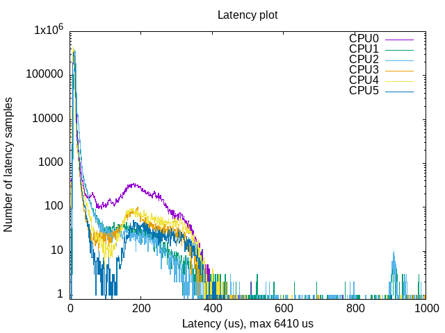
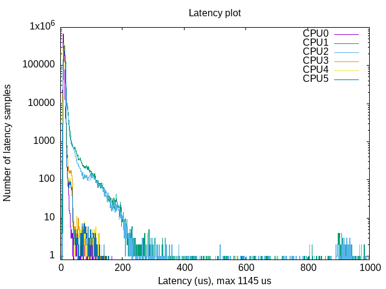

# OSADL Latency Validation

<span class="phase-label">Phase 3 · Page 4 of 5</span>

!!! abstract "Page Goal"
    - Introduce the Open Source Automation Development Lab (OSADL) real-time benchmarking standards.
    - Walk through executing `cyclictest` and `stress-ng` on the Yocto image to measure worst-case latency under extreme load.
    - Detail the process of parsing histogram outputs and creating a graphical latency plot using `gnuplot` after getting the results back on the host machine.
    - Compare latency metrics between the standard and real-time kernels.

---


!!! info "References & Further Reading"
    - **Cyclictest Overview**: Read more about [Cyclictest](https://wiki.linuxfoundation.org/realtime/documentation/howto/tools/cyclictest/start){:target="_blank"}.
    - **stress-ng Reference**: Ubuntu Kernel reference for [stress-ng](https://wiki.ubuntu.com/Kernel/Reference/stress-ng){:target="_blank"}.
    - **OSADL Latency Script Guide**: Refer to the official OSADL guide on [Creating a latency plot from cyclictest histogram data](https://www.osadl.org/Create-a-latency-plot-from-cyclictest-hi.bash-script-for-latency-plot.0.html){:target="_blank"} for detailed configuration options.
    - **Performance Testing Guide**: Review the Industrial Monitor Direct [RT-Preempt Linux Real-Time Performance Testing Guide](https://industrialmonitordirect.com/blogs/knowledgebase/rt-preempt-linux-real-time-performance-testing-guide){:target="_blank"} for insights on testing methods under heavy loads.

---


## 1. The OSADL Benchmarking Standard

The **Open Source Automation Development Lab (OSADL)** is the leading industry cooperative promoting real-time Linux in industrial automation and safety systems. OSADL maintains strict benchmarks to qualify real-time kernels.

A valid real-time test cannot measure latency on an idle system. Events like CPU spikes, flash write cycles, and telemetry processing occur concurrently. Therefore, the OSADL benchmark standard requires running latency checks (**`cyclictest`**) for a long duration while simulating severe system stress (**`stress-ng`**).

---

## 2. Setting Up the Testing Tools

### Option A: Running on the Yocto Image (This was Tested in this project)
Since we appended the real-time test suite (`rt-tests`, `stress-ng`, `trace-cmd`, `numactl`) directly to `IMAGE_INSTALL:append` in `local.conf` (detailed in [Yocto PREEMPT_RT Integration](02-yocto-rt-integration.md)), the target Yocto image has all benchmarking binaries pre-compiled. 
- **Benefit**: No internet connection, package installation, or external feeds are required on the board. You can immediately run benchmarks offline.

### Option B: Running on the Native L4T Image
If you are validating the native host compilation on a standard Ubuntu based Jetson Linux, install the utilities manually:
```bash
sudo apt-get update
sudo apt-get install -y rt-tests stress-ng gnuplot
```

---

## 3. Simulating Load with `stress-ng`

[stress-ng](https://wiki.ubuntu.com/Kernel/Reference/stress-ng) is a versatile tool used to stress test a computer system in various selectable ways. In a parallel terminal, we simulate severe background system stress to evaluate real-time scheduler determinism, while the other terminal runs the latency test. 
```bash
# Run heavy parallel stress test on all 6 cores for 10 minutes
stress-ng --cpu 6 --vm 4 --vm-bytes 256M --hdd 1 --sock 1 --switch 2 --timeout 10m
```

#### What the Flags Mean:
- `--cpu 6`: Spawns 6 CPU stressor processes (matching the Jetson TX2i's total core count) executing math operations.
- `--vm 4 --vm-bytes 256M`: Spawns 4 virtual memory stressors, each allocating and releasing 256MB of RAM.
- `--hdd 1`: Spawns 1 HDD worker performing sequential writes/reads to test disk memory and I/O.
- `--sock 1`: Spawns 1 socket stressor executing loopback communication.
- `--switch 2`: Spawns 2 workers forcing frequent context switching.
- `--timeout 10m`: Bounds the test run duration to 10 minutes.

---

## 4. Running the Latency Benchmark (`cyclictest`)

[Cyclictest](https://wiki.linuxfoundation.org/realtime/documentation/howto/tools/cyclictest/start) accurately and repeatedly measures the difference between a thread's intended wake-up time and the time at which it actually wakes up from `clock_nanosleep` in order to provide statistics about the system's latencies. It can measure latencies in real-time systems caused by the hardware, the firmware, and the operating system.

The original test was written by Thomas Gleixner (tglx), but several people have subsequently contributed modifications. Cyclictest is currently maintained by Clark Williams and John Kacur and is part of the test suite `rt-tests`.

### How Cyclictest Measures Latency

Cyclictest measures the difference between the **actual execution time** and the **scheduled or interval time** (the expected wake-up time we set). 
The **Max Latency** metric captures the worst-case measure of this difference, proving the maximum possible delay a real-time task could experience before execution. 

When comparing a standard kernel (non-RT) against an RT kernel under severe stress:
- **Non-RT Kernel**: You will observe massive, unpredictable spikes in maximum latency, as standard scheduling cannot guarantee bounded execution delays.
- **RT Kernel (`PREEMPT_RT`)**: The maximum latency spikes are strictly bounded and significantly lower, demonstrating determinism regardless of system load.

While the target is under max stress, we run `cyclictest` to measure scheduling delays. To match the specific verification tests run on the Jetson TX2i, use the following configuration:

```bash
# Execute cyclictest specifically configured for the Jetson TX2i
sudo cyclictest -l 2000000 -m -Sp 90 -i 200 -h 1000 -q > output
```

#### Detailed Flag Explanations:
- **`-l 2000000`**: Loop count. Runs the real-time measurement loop 2,000,000 times (takes approximately 6.6 minutes at a 200us interval).
- **`-m`**: Memory locking. Calls `mlockall` to lock the test process's memory pages into RAM, preventing them from being swapped out to disk.
- **`-Sp 90`**: Real-time configuration. Sets threads in SMP mode (spawning one thread per core with strict CPU affinity) running under `SCHED_FIFO` real-time scheduling policy at priority `90`.
- **`-i 200`**: Interval. Sets the cycle wake-up interval to 200 microseconds (0.2 milliseconds) to simulate hard-bounded real-time task frequencies.
- **`-h 1000`**: Histogram. Captures and categorizes latency results into 1000 buckets (1us resolution per bucket up to 1ms total overflow).
- **`-q`**: Quiet mode. Suppresses standard output update lines during run-time, minimizing logging overhead and avoiding console print latency impacts.
- **`> output`**: Redirects the output statistics data and histogram table to a file named `output`.

---

## 5. Visualizing Latency: Creating an OSADL Latency Plot

To convert the raw text histogram data into a line graph showing the latency distribution of all 6 CPU cores under stress and their max latency spikes, we use the `mklatencyplot.bash` given by OSADL, and modify it slightly to suit the Jetson TX2i. 

!!! note "OSADL Script"
    The original script from OSADL can be downloaded [here](https://www.osadl.org/uploads/media/mklatencyplot.bash), and the accompanying OSADL documentation is available [here](https://www.osadl.org/Create-a-latency-plot-from-cyclictest-hi.bash-script-for-latency-plot.0.html).

### The Plotting Script (`mklatencyplot.bash`)
Create a file named `mklatencyplot.bash` on the target (or on your host workstation by copying the `output` file over):

```bash
#!/bin/bash
#stress via sudo stress-ng --cpu 6 --vm 4 --vm-bytes 256M --hdd 2 --sock 2 --switch 4 --timeout 10m 
# 1. Run cyclictest
cyclictest -l2000000 -m -Sp90 -i200 -h1000 -q >output 
#original was 100 million iterations, which was very heavy and would run for hours, a jetson may not be able to handle a stress test of that level. original script lists histogram upto 400 us only, extended to 1000 us to check if any major spikes 
# 2. Get maximum latency
max=`grep "Max Latencies" output | tr " " "\n" | sort -n | tail -1 | sed s/^0*//`

# 3. Grep data lines, remove empty lines and create a common field separator
grep -v -e "^#" -e "^$" output | tr " " "\t" >histogram 

# 4. Set the number of cores, TX2i has 6 cores, 4 ARM A57 Cortex Cores and 2 Denver Cores
cores=6

# 5. Create two-column data sets with latency classes and frequency values for each core, for example
for i in `seq 1 $cores`
do
  column=`expr $i + 1`
  cut -f1,$column histogram >histogram$i
done

# 6. Create plot command header
echo -n -e "set title \"Latency plot\"\n\
set terminal png\n\
set xlabel \"Latency (us), max $max us\"\n\
set logscale y\n\
set xrange [0:1000]\n\
set yrange [0.8:*]\n\
set ylabel \"Number of latency samples\"\n\
set output \"plot.png\"\n\
plot " >plotcmd

# 7. Append plot command data references
for i in `seq 1 $cores`
do
  if test $i != 1
  then
    echo -n ", " >>plotcmd
  fi
  cpuno=`expr $i - 1`
  if test $cpuno -lt 10
  then
    title=" CPU$cpuno"
   else
    title="CPU$cpuno"
  fi
  echo -n "\"histogram$i\" using 1:2 title \"$title\" with histeps" >>plotcmd
done

# 8. Execute plot command
#gnuplot -persist <plotcmd
```

### Script Execution & Workflow
1. The target device had the GUI turned off, and did not have gnuplot, the results were copied back to the host via USB and, gnuplot was run on the 22.04 LTS Yocto Build host. Hence the plotting is commented out.

2. Ensure the script is executable and run it on the target device, ensuring that stress-ng test is running in a parallel terminal just before running the script :
   ```bash
   chmod +x mklatencyplot.bash
   ./mklatencyplot.bash
   ```

### Results & Observations

#### Test 1: Native L4T — Normal (Non-RT) Kernel



| Metric | CPU0 (ARM) | CPU1 (Denver) | CPU2 (Denver) | CPU3 (ARM) | CPU4 (ARM) | CPU5 (ARM) |
|---|---|---|---|---|---|---|
| **Min Latency (µs)** | 4 | 6 | 7 | 4 | 4 | 4 |
| **Avg Latency (µs)** | 17 | 17 | 17 | 11 | 13 | 12 |
| **Max Latency (µs)** | 1,047 | **3,531** | 1,601 | 1,042 | 1,073 | 1,059 |
| **Histogram Overflows** | 3 | **112** | 82 | 1 | 1 | 5 |
| **Total Samples** | 1,964,252 | 1,997,306 | 1,997,088 | 1,999,999 | 1,995,294 | 1,997,214 |

**baseline** test — NVIDIA's stock L4T with no real-time kernel changes.

- The **Denver cores (CPU1, CPU2)** do not show acceptable performance levels. CPU1 reaches a maximum latency of **3,531 µs (3.5 ms)**, which is far too high for any real-time applications. CPU2 also reached 1,601 µs. Both Denver cores had many histogram overflows (112 and 82 events above 1000 µs).
- The **ARM cores (CPU0, CPU3–CPU5)** did better, with average latencies of 11–17 µs. CPU0 (ARM) had a higher average (17 µs) likely because of extra system tasks running on it, but the ARM cores generally had far fewer overflows (1–5 events).

#### Test 2: Native L4T — RT (PREEMPT_RT) Kernel



| Metric | CPU0 (ARM) | CPU1 (Denver) | CPU2 (Denver) | CPU3 (ARM) | CPU4 (ARM) | CPU5 (ARM) |
|---|---|---|---|---|---|---|
| **Min Latency (µs)** | 4 | 5 | 7 | 4 | 3 | 4 |
| **Avg Latency (µs)** | 9 | 15 | 16 | 10 | 9 | 10 |
| **Max Latency (µs)** | 931 | **1,088** | 1,067 | **819** | 983 | 966 |
| **Histogram Overflows** | 0 | **5** | 8 | 0 | 0 | 0 |
| **Total Samples** | 2,000,000 | 1,996,016 | 1,998,928 | 1,999,488 | 1,999,249 | 1,999,030 |

Adding the **PREEMPT_RT patch** to the L4T kernel made a big difference:

- Average latencies dropped across the board. The ARM cores now average **9–10 µs**, and even the Denver cores improved (CPU0 went from 17 µs to 9 µs).
- Maximum latencies came down significantly. CPU1 (Denver) dropped from 3,531 µs to **1,088 µs** — about a **3× improvement**. CPU3 (ARM) achieved the best max of **819 µs**.
- Histogram overflows(spikes exceeding 1000 µs) were almost gone: ARM cores had **zero** overflows, and the Denver cores had only **5 and 8**.
- The plot shows a **much tighter distribution** — most samples are below 20 µs with a steep drop-off.

#### Test 3: Yocto — Non-RT Kernel



| Metric | CPU0 (ARM) | CPU1 (Denver) | CPU2 (Denver) | CPU3 (ARM) | CPU4 (ARM) | CPU5 (ARM) |
|---|---|---|---|---|---|---|
| **Min Latency (µs)** | 5 | 7 | 7 | 5 | 5 | 5 |
| **Avg Latency (µs)** | 16 | 15 | 15 | 12 | 12 | 12 |
| **Max Latency (µs)** | **6,410** | 1,367 | 1,362 | 1,020 | 931 | 903 |
| **Histogram Overflows** | **5** | 50 | 45 | 1 | 0 | 0 |
| **Total Samples** | 1,984,341 | 1,999,737 | 1,999,955 | 1,997,897 | 1,995,238 | 1,998,754 |

This test used a custom Yocto-built Linux with a non-RT kernel. The results are mixed:

- **CPU0 (ARM)** recorded the worst single latency in the entire study: **6,410 µs (6.4 ms)**.
- The **Denver cores (CPU1, CPU2)** had max latencies around **1,365 µs** with many overflows (50 and 45 events). Their average latencies were 15 µs.
- The other **ARM cores (CPU3–CPU5)** performed the best in this test, with max latencies between **903–1,020 µs** and averages of 12 µs. CPU4 and CPU5 had **zero overflows**.

#### Test 4: Yocto — RT (PREEMPT_RT) Kernel



| Metric | CPU0 (ARM) | CPU1 (Denver) | CPU2 (Denver) | CPU3 (ARM) | CPU4 (ARM) | CPU5 (ARM) |
|---|---|---|---|---|---|---|
| **Min Latency (µs)** | 5 | 7 | 7 | 5 | 5 | 5 |
| **Avg Latency (µs)** | **9** | 14 | 13 | 11 | 11 | 12 |
| **Max Latency (µs)** | **544** | 1,108 | 1,145 | 986 | **568** | **587** |
| **Histogram Overflows** | 0 | **15** | 14 | 0 | 0 | 0 |
| **Total Samples** | 2,000,000 | 1,999,085 | 1,999,013 | 1,999,699 | 1,999,500 | 1,999,420 |

- **CPU0 (ARM)** now achieves **544 µs** max latency — a massive improvement from 6,410 µs on the non-RT Yocto kernel. 
- **CPU4 and CPU5 (ARM)** achieved max latencies of  **568 µs and 587 µs** — below the 1 ms mark.
- **CPU3 (ARM)** had a slightly higher max of **986 µs**.
- The **Denver cores (CPU1, CPU2)** still had the highest max latencies: **1,108 µs and 1,145 µs**, and were the only cores with histogram overflows (15 and 14).

!!! warning "Unexpected Denver Core Latency Spikes"
    While the ARM Cores performed as normal with consistently bounded real-time latencies, the Denver Cores exhibited unexpected latency spikes. More studying, understanding, and core isolation-based testing are needed to determine if the Denver cores are not suited for strict real-time (RT) tasks or if simulated load using stress-ng was much heavier by Jetson Device standards.

---

## Comparative Summary

### Maximum Latency Comparison (µs)

| Core | L4T Non-RT | L4T RT | Yocto Non-RT | Yocto RT |
|---|---|---|---|---|
| **CPU0 (ARM)** | 1,047 | 931 | **6,410** | **544** |
| **CPU1 (Denver)** | **3,531** | 1,088 | 1,367 | 1,108 |
| **CPU2 (Denver)** | 1,601 | 1,067 | 1,362 | 1,145 |
| **CPU3 (ARM)** | 1,042 | **819** | 1,020 | 986 |
| **CPU4 (ARM)** | 1,073 | 983 | 931 | **568** |
| **CPU5 (ARM)** | 1,059 | 966 | 903 | **587** |

### Average Latency Comparison (µs)

| Core | L4T Non-RT | L4T RT | Yocto Non-RT | Yocto RT |
|---|---|---|---|---|
| **CPU0 (ARM)** | 17 | **9** | 16 | **9** |
| **CPU1 (Denver)** | 17 | 15 | 15 | 14 |
| **CPU2 (Denver)** | 17 | 16 | 15 | 13 |
| **CPU3 (ARM)** | 11 | 10 | 12 | 11 |
| **CPU4 (ARM)** | 13 | **9** | 12 | 11 |
| **CPU5 (ARM)** | 12 | 10 | 12 | 12 |

### Histogram Overflow Comparison (events exceeding 1000 µs)

| Core | L4T Non-RT | L4T RT | Yocto Non-RT | Yocto RT |
|---|---|---|---|---|
| **CPU0 (ARM)** | 3 | **0** | 5 | **0** |
| **CPU1 (Denver)** | **112** | 5 | 50 | 15 |
| **CPU2 (Denver)** | 82 | 8 | 45 | 14 |
| **CPU3 (ARM)** | 1 | **0** | 1 | **0** |
| **CPU4 (ARM)** | 1 | **0** | **0** | **0** |
| **CPU5 (ARM)** | 5 | **0** | **0** | **0** |

---

## Analysis of ARM Cortex-A57 vs. Denver 2 Cores

One of the clearest findings from these tests is that the **ARM and Denver cores behave very differently** when it comes to real-time performance.

### ARM Cortex-A57 Cores (CPU0, CPU3–CPU5): Steady and Predictable

The ARM cores give **consistently low and predictable latencies** across all four tests:

- Average latencies stay between 9–17 µs — a narrow range.
- Maximum latencies are mostly below 1 ms on RT kernels (best: 544 µs on Yocto RT).
- Histogram overflows are rare (0–5 events) and **zero on both RT kernel configurations**.

### Denver 2 Cores (CPU1, CPU2):

The NVIDIA Denver cores (specifically Denver 2 on the Jetson TX2/TX2i) are poorly suited for real-time (RT) tasks because their underlying microarchitecture relies on Dynamic Code Optimization (DCO), a software-based dynamic binary translation mechanism. While DCO provides excellent average throughput and power efficiency, it introduces massive, unpredictable variations in execution time (jitter). 

In real-time systems, predictability and guaranteed worst-case execution times are far more important than raw peak performance. Here is a technical breakdown of why Denver cores conflict with real-time requirements:

1. **Dynamic Binary Translation Creates Jitter**: Under the hood, Denver is not a native ARM processor. It is a highly parallel Very Long Instruction Word (VLIW) processor. It runs a hidden software layer (firmware) that intercepts standard ARMv8 instructions and translates them on the fly into its internal VLIW format. 
    - **The First Run**: When a block of code is executed for the first time, it is interpreted slowly while the DCO routine analyzes and optimizes it.
    - **Subsequent Runs**: The optimized microcode is stored in a hidden 128 MB cache. If the code runs again, the processor hits this cache and executes it incredibly fast.
    - **The RT Problem**: This mechanism means the execution time of the exact same function can vary wildly depending on whether the optimized microcode is currently in the cache or if it was evicted and needs to be re-translated.  

2. **DCO Cache Pollution**: If a high-priority RT task preempts a running process, the Denver core's DCO cache might get polluted or flushed. When the RT task resumes, it may suffer a severe latency spike as the core stops to re-translate the instructions.

---

[← Real-Time Scheduling Concepts](03-real-time-scheduling.md){ .md-button }
[Next: Hardware Interfacing & Results →](05-hardware-robotics-interfacing.md){ .md-button .md-button--primary }
