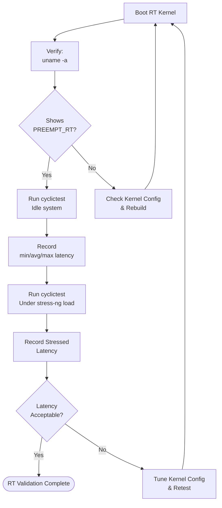

# Validation & Testing

Phase 3 · Stage 5

!!! info "Outline Page"
    This page is an outline only.

---

## Outline

### Verifying RT Kernel is Running

- <!-- TODO: uname -a output showing PREEMPT_RT -->
- <!-- TODO: /proc/version check -->

### cyclictest — Latency Benchmarking

- <!-- TODO: Installing cyclictest -->
- <!-- TODO: Running cyclictest with appropriate parameters -->
- <!-- TODO: Interpreting results (min/avg/max latency) -->
- <!-- TODO: Acceptable thresholds for space applications -->

### Stress Testing

- <!-- TODO: Running under load (stress-ng) -->
- <!-- TODO: Measuring latency degradation under stress -->

### Results & Screenshots

- <!-- TODO: Add cyclictest output -->
- <!-- TODO: Add latency histogram -->

---

## Validation Pipeline

---

[← Kernel Configuration](03-kernel-configuration.md){ .md-button }
[Current Work →](../roadmap.md){ .md-button .md-button--primary }
