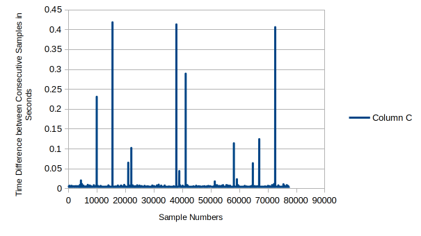
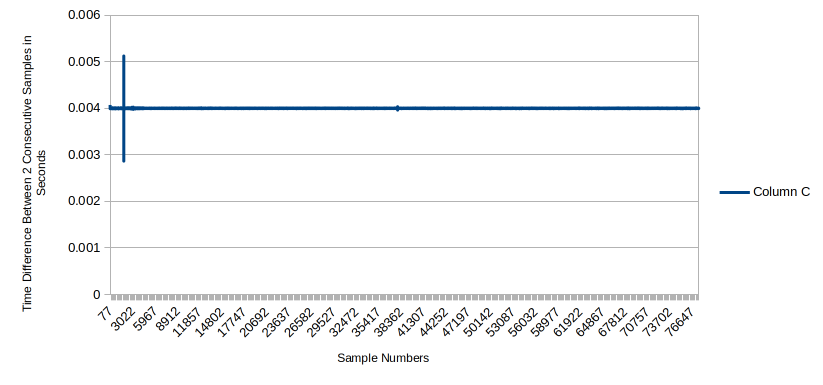
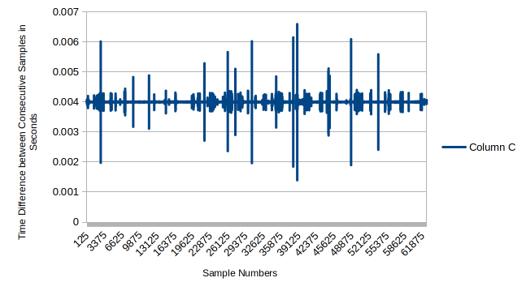
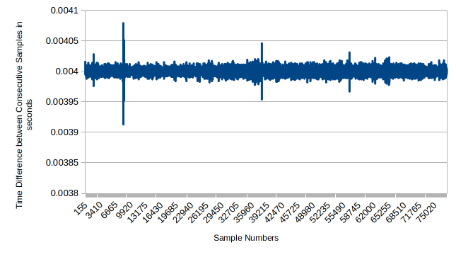

# Hardware Interfacing & Results

<span class="phase-label">Phase 3 · Page 5 of 5</span>

!!! abstract "Page Goal"
    - Implement a fully functional, high-performance C++ real-time control loop operating under a strict **4ms hard deadline**.
    - Configure real-time environment safety mechanisms: memory locking (`mlockall`), stack pre-faulting, CPU affinity, and avoid Priority Inversions & Priority Inheritance, simulating a full real-time code.

---

## Experiment Setup & Objectives

This experiment measures and validates the timing precision of a real-time controller interfacing with a high-precision robotic joint actuator over an Ethernet network. The test software establishes a high-frequency communication link to command the actuator's angular movements while continuously logging physical telemetry.

### What the Experiment Does
By analyzing the control logic, the experiment follows a structured, five-stage cycle to test the actuator's physical response and logging accuracy:

1. **Baseline Static Hold**: The actuator is commanded to stay at a 0.0° displacement for a brief period to collect idle calibration data.
2. **Clockwise Rotation**: The controller increments the target joint position by exactly 0.02° on each step, causing a smooth clockwise rotation.
3. **Transition Pause**: The actuator is commanded to hold its position static again for a short duration to let any inertial transients settle.
4. **Counter-Clockwise Rotation**: The controller decrements the target joint position by 0.02° per step, returning the actuator back to its starting coordinate.
5. **Final Static Hold**: The actuator is held in its home position for a final sensor recording period.

### Telemetry Collection
At every step of this cycle, the software queries the actuator at a target rate of 250 Hz (one command every **4 milliseconds**). The actuator responds by transmitting a telemetry payload containing:
- **Kinematic State**: Real-time position (degrees), velocity (degrees/second), and torque (Newton-meters).
- **Physical Dynamics**: Acceleration along the X, Y, and Z axes (g-force).
- **Health Indicators**: Electrical current (Amperes) and internal temperature (degrees Celsius).

The central engineering objective is to determine if the computer can maintain this strict 4ms communication loop under intense system workloads without experiencing timing spikes (jitter).

---

## 1. Real-Time Code Implementation

This page details the implementation of a C++ real-time control loop running at 250 Hz (4ms intervals) that interfaces with an actuator via Ethernet. To guarantee that a process will never exceed the 4ms deadline under heavy CPU or I/O stress, the C++ application configures several low-level Linux kernel interfaces.

The RT-Friendly code (`main_eth_rt.cpp`) implements the following critical mechanisms to ensure determinism:

### Memory Locking vs. Page Faults (`mlockall`)
- **RT Code**: Uses `mlockall(MCL_CURRENT | MCL_FUTURE)`. This forces the operating system to lock the entire program into physical RAM. It guarantees the CPU will never freeze mid-loop due to a page fault or memory swap to disk.
- **Non-RT Code**: Lacks memory locking. The OS can page out code to the swap space at any moment, creating random millisecond-level stalls.

### Clock Synchronization vs. Loose Sleeping
- **RT Code**: Uses `clock_nanosleep(CLOCK_MONOTONIC, TIMER_ABSTIME, ...)`. It tracks a mathematically absolute deadline anchor. If a loop iteration runs slightly late, the next sleep window is automatically compressed to catch back up.
- **Non-RT Code**: Uses sequential `usleep(2800)` and `usleep(200)`. These are relative sleep statements. Every microsecond of execution jitter drifts the clock forward permanently, destroying the exact sampling interval.

### RAM Logging Buffers vs. File I/O Choking
- **RT Code**: Pre-allocates memory using `global_log_buffer.reserve()` before the real-time loops start. During the fast cycles, it only pushes data to RAM (`.push_back()`). It saves the actual text file to disk only after all communication loops are completely finished.
- **Non-RT Code**: Directly calls `fprintf(fp_log, ...)` inside the active loop. Writing to a physical disk or console buffer involves heavy kernel context switches and wait states. This introduces massive, unpredictable timing jitter that easily blows past the loop deadline.

---

## 2. C++ Control Loop Source Code

The complete source code for `main_eth_rt.cpp` is provided below. It sends position trajectories and reads telemetry (current, position, velocity, torque, acceleration, and temperature) sequentially over the network.

??? example "View Full `main_eth_rt.cpp` Source Code"
    ```cpp
    #include <iostream>
    #include <dlfcn.h>
    #include <stdlib.h>
    #include <stdio.h>
    #include <arpa/inet.h> 
    #include <string.h>
    #include <unistd.h>
    #include <ctime>
    #include <chrono>
    #include <vector>
    #include <sys/mman.h> // Required for mlockall
    
    // Kinova API Headers
    #include "Kinova.API.EthCommLayerUbuntu.h"
    #include "KinovaTypes.h"
    
    struct TelemetryData {
        int cmd_counter;
        double timestamp;
        float current;
        float position;
        float velocity;
        float torque;
        float accelX;
        float accelY;
        float accelZ;
        float temp;
    };
    
    // Global pre-allocated storage bucket
    std::vector<TelemetryData> global_log_buffer;
    
    using namespace std;
    
    #define LOOPCOUNT 18000 // For one full revolution with incremental angle of 0.02 deg.
    #define ACTUATOR_ID 20
    
    // Volatile variable shared with the hardware layer
    volatile float Joint6Command;
    
    // Library handle
    void * commLayer_Handle;
    
    // Fixed Function Prototype Signature
    void ReadPosition(TelemetryData &current_sample);
    
    // Function pointers for API tracking
    int(*fptrInitCommunication)(EthernetCommConfig & config);
    int(*MyRS485_Activate)();     
    int(*MyRS485_Read)(RS485_Message* PackagesIn, int QuantityWanted, int &ReceivedQtyIn);
    int(*MyRS485_Write)(RS485_Message* PackagesOut, int QuantityWanted, int &ReceivedQtyIn);
    int(*fptrCloseCommunication)(); 
    
    FILE *fp_log;
    FILE *fp_count;
    int cnt;
    char log_file_name[100];
    int cmd_counter = 0; 
    float number_of_revolutions; 
    
    // High-precision clock utility function to track loop window target points
    void add_nanoseconds(struct timespec *ts, long ns) {
        ts->tv_nsec += ns;
        while (ts->tv_nsec >= 1000000000) {
            ts->tv_nsec -= 1000000000;
            ts->tv_sec++;
        }
    }
    
    int main(int argc, char* argv[])
    {   
        // Prevent the OS from hitting page faults or utilizing swap space
        if (mlockall(MCL_CURRENT | MCL_FUTURE) == -1) {
            perror("mlockall failed! Did you run with sudo privileges?");
            exit(1);
        }
        
        
        int WriteCount = 0;
        int ReadCount = 0;
        bool Actuator6Initialized = false;
        
        int ThreadArgument = 0;
    
        RS485_Message InitMessage;
        RS485_Message ReceiveInitMessage;
        RS485_Message TrajectoryMessage;
        EthernetCommConfig ComputerRobotEthConfig;
    
        ComputerRobotEthConfig.localIpAddress = inet_addr("192.168.100.10");
        ComputerRobotEthConfig.subnetMask = inet_addr("255.255.255.0");
        ComputerRobotEthConfig.robotIpAddress = inet_addr("192.168.100.11");
        ComputerRobotEthConfig.localCmdport = 25015;
        ComputerRobotEthConfig.robotPort = 55000;
        ComputerRobotEthConfig.localBcastPort = 25025;
        ComputerRobotEthConfig.rxTimeOutInMs = 1000;
    
        cout << "RS-485 communication Example." << endl;
    
        commLayer_Handle = dlopen("./Kinova.API.EthCommLayerUbuntu.so", RTLD_NOW | RTLD_GLOBAL);
    
        fptrInitCommunication = (int(*)(EthernetCommConfig & config)) dlsym(commLayer_Handle, "Ethernet_Communication_InitCommunicationEthernet");
        MyRS485_Activate = (int(*)()) dlsym(commLayer_Handle, "Ethernet_Communication_OpenRS485_Activate");
        MyRS485_Read = (int(*)(RS485_Message*, int, int &)) dlsym(commLayer_Handle, "Ethernet_Communication_OpenRS485_Read");
        MyRS485_Write = (int(*)(RS485_Message*, int, int &)) dlsym(commLayer_Handle, "Ethernet_Communication_OpenRS485_Write");
        fptrCloseCommunication = (int (*)()) dlsym(commLayer_Handle, "Ethernet_Communication_CloseCommunication");
    
        if((fp_count = fopen("log_count.txt", "r")) == NULL) {
            printf("%s\n", "\nCould not open file log_count.txt for reading\n");
            exit(1);
        } else {
            printf("%s\n", "\nOpened file log_count.txt successfully for reading\n");
        }
    
        if (fscanf(fp_count, "%d", &cnt) != 1) {
            cnt = 0; // Fallback parsing handle
        }
        printf("%s:%d\n", "log count read from file is", cnt);
        fclose(fp_count);
    
        if((fp_count = fopen("log_count.txt", "w")) == NULL) {
            printf("%s\n", "\nCould not open file log_count.txt for writing\n");
            exit(1);
        } else {
            printf("%s\n", "\nOpened file log_count.txt successfully for writing\n");
        }
    
        fprintf(fp_count, "%d", cnt + 1);
        fclose(fp_count);
    
        sprintf(log_file_name, "%s%d%s", "./logs/actuator_log", cnt, ".txt");
        printf("\n**********************************\nLogging data to %s\n**********************************\n", log_file_name);
    
        printf("\nEnter number of revolutions required for actuator (can be fractional also, min 0.02):");
        scanf("%f",&number_of_revolutions);
    
        if((fp_log = fopen(log_file_name, "w")) == NULL) {
            printf("%s\n", "\nCould not open log file\n");
            exit(1);
        } else {
            printf("%s\n", "\nOpened file log file successfully\n");
        }
    
        // Write file descriptor header instantly (done before entering real-time sequence)
        fprintf(fp_log, "Count Timestamp(s) Current(A) Position(deg) Velocity(deg/sec) Torque(Nm) Accel_X() Accel_Y() Accel_Z() Temp(degC)\n");
    
        if (fptrInitCommunication != NULL && MyRS485_Activate != NULL && MyRS485_Read != NULL && MyRS485_Write != NULL)
        {
            int result = fptrInitCommunication(ComputerRobotEthConfig);
    
            if (result == NO_ERROR_KINOVA)
            {
                cout << "E T H E R N E T   I N I T I A L I Z A T I O N   C O M P L E T E D" << endl << endl;
    
                int activation_result = MyRS485_Activate();
                cout << "RS485 activation result:" << activation_result << endl;
    
                InitMessage.Command = RS485_MSG_GET_ACTUALPOSITION; 
                InitMessage.SourceAddress = 0x00;                   
                InitMessage.DestinationAddress = ACTUATOR_ID;              
    
                InitMessage.DataLong[0] = 0x00000000;
                InitMessage.DataLong[1] = 0x00000000;
                InitMessage.DataLong[2] = 0x00000000;
                InitMessage.DataLong[3] = 0x00000000;
    
                while (ReadCount != 1 && !Actuator6Initialized)
                {
                    MyRS485_Write(&InitMessage, 1, WriteCount);
                    for (int i = 0; i < 5E6; i++);
                    MyRS485_Read(&ReceiveInitMessage, 1, ReadCount);
    
                    if (ReceiveInitMessage.SourceAddress == ACTUATOR_ID && ReceiveInitMessage.Command == RS485_MSG_SEND_ACTUALPOSITION)
                    {
                        Joint6Command = ReceiveInitMessage.DataFloat[1];
                        Actuator6Initialized = true;
                    }
                    cout << ReadCount << " | " << WriteCount << endl;
                }
    
    
    	    /*
    			* Creation of a message to send a position to the actuator 6(default address 0x15)
    			* If you check the RS 485 communication protocol document, you will see that the command
    			* RS485_MSG_GET_POSITION_COMMAND_ALL_VALUES(0x14) takes the command in argument 0 and 1.
    			* The argument 2 is a flag that indicates that you need the extended version of the answer.
    			* Basically, this command let you move the robot and the answer is the updated data.
    			*/
                TrajectoryMessage.Command = RS485_MSG_GET_POSITION_COMMAND_ALL_VALUES;
                TrajectoryMessage.SourceAddress = 0x00;
                TrajectoryMessage.DestinationAddress = ACTUATOR_ID;
                TrajectoryMessage.DataFloat[0] = Joint6Command;
                TrajectoryMessage.DataFloat[1] = Joint6Command;
                TrajectoryMessage.DataLong[2] = 0x1;
                TrajectoryMessage.DataLong[3] = 0x00000000;
    
                cout << " Press any key to commence initial data acquisition without actuator motion for a few sec";
                getchar();
    
                // CRITICAL RT STEP: Pre-allocate RAM buffer capacity upfront to guarantee no inner dynamic allocations
                size_t total_estimated_loops = (LOOPCOUNT * number_of_revolutions * 2) + ((LOOPCOUNT / 10) * 3) + 100;
                global_log_buffer.reserve(total_estimated_loops);
    
                // High-resolution clock anchor alignment
                struct timespec deadline_timer;
                clock_gettime(CLOCK_MONOTONIC, &deadline_timer);
                auto start_timestamp = std::chrono::system_clock::now();
    
                // ==================== LOOP 1: STATIC INITIAL ACQUISITION ====================
                for (int i = 0; i < LOOPCOUNT/10; i++) 
                {
                    cmd_counter++;
                    TelemetryData sample = { cmd_counter, 0.0, 0, 0, 0, 0, 0, 0, 0, 0 };
                    float joint_hold_cmd = 0.0;//As we cannot simply acquire sensor value, command 0 position increment and get values
    
                    TrajectoryMessage.DataFloat[0] = joint_hold_cmd;
                    TrajectoryMessage.DataFloat[1] = joint_hold_cmd;
    
                    auto now = std::chrono::system_clock::now();
                    sample.timestamp = std::chrono::duration<double>(now - start_timestamp).count();
    
                    MyRS485_Write(&TrajectoryMessage, 1, WriteCount);
                    
                    ReadPosition(sample);
                    global_log_buffer.push_back(sample); 
    
                    add_nanoseconds(&deadline_timer, 4000000); // 3.0 Milliseconds total loop budget
                    clock_nanosleep(CLOCK_MONOTONIC, TIMER_ABSTIME, &deadline_timer, NULL);
                }
    
                cout << "Beginning to rotate in clockwise direction" << "\n";
                  
                // ==================== LOOP 2: CLOCKWISE ROTATION ====================
                for (int i = 0; i < LOOPCOUNT*number_of_revolutions; i++)
                {
                    cmd_counter++;
                    TelemetryData sample = { cmd_counter, 0.0, 0, 0, 0, 0, 0, 0, 0, 0 };
                    Joint6Command += (float)(0.02);
    
                    TrajectoryMessage.DataFloat[0] = Joint6Command;
                    TrajectoryMessage.DataFloat[1] = Joint6Command;
    
                    auto now = std::chrono::system_clock::now();
                    sample.timestamp = std::chrono::duration<double>(now - start_timestamp).count();
    
                    MyRS485_Write(&TrajectoryMessage, 1, WriteCount);
                    
                    ReadPosition(sample);
                    global_log_buffer.push_back(sample);
    
                    add_nanoseconds(&deadline_timer, 4000000);
                    clock_nanosleep(CLOCK_MONOTONIC, TIMER_ABSTIME, &deadline_timer, NULL);
                }
    
                cout << "Beginning to rotate in anti-clockwise direction in a few sec" << "\n";
    
                // ==================== LOOP 3: TRANSITION PAUSE ====================
                for (int i = 0; i < LOOPCOUNT/10; i++) 
                {
                    cmd_counter++;
                    TelemetryData sample = { cmd_counter, 0.0, 0, 0, 0, 0, 0, 0, 0, 0 };
                    float joint_hold_cmd = 0.0; //As we cannot simply acquire sensor value, command 0 position increment and get values
    
                    TrajectoryMessage.DataFloat[0] = joint_hold_cmd;
                    TrajectoryMessage.DataFloat[1] = joint_hold_cmd;
    
                    auto now = std::chrono::system_clock::now();
                    sample.timestamp = std::chrono::duration<double>(now - start_timestamp).count();
    
                    MyRS485_Write(&TrajectoryMessage, 1, WriteCount);
                    
                    ReadPosition(sample);
                    global_log_buffer.push_back(sample);
    
                    add_nanoseconds(&deadline_timer, 4000000);
                    clock_nanosleep(CLOCK_MONOTONIC, TIMER_ABSTIME, &deadline_timer, NULL);
                }
    
                // ==================== LOOP 4: ANTI-CLOCKWISE ROTATION ====================
                for (int i = 0; i < LOOPCOUNT*number_of_revolutions; i++)
                {
                    cmd_counter++;
                    TelemetryData sample = { cmd_counter, 0.0, 0, 0, 0, 0, 0, 0, 0, 0 };
                    Joint6Command -= (float)(0.02);
    
                    TrajectoryMessage.DataFloat[0] = Joint6Command;
                    TrajectoryMessage.DataFloat[1] = Joint6Command;
    
                    auto now = std::chrono::system_clock::now();
                    sample.timestamp = std::chrono::duration<double>(now - start_timestamp).count();
    
                    MyRS485_Write(&TrajectoryMessage, 1, WriteCount);
                    
                    ReadPosition(sample);
                    global_log_buffer.push_back(sample);
    
                    add_nanoseconds(&deadline_timer, 4000000);
                    clock_nanosleep(CLOCK_MONOTONIC, TIMER_ABSTIME, &deadline_timer, NULL);
                }
    
                // ==================== LOOP 5: FINAL HOLD ACQUISITION ====================
                for (int i = 0; i < LOOPCOUNT/10; i++) 
                {
                    cmd_counter++;
                    TelemetryData sample = { cmd_counter, 0.0, 0, 0, 0, 0, 0, 0, 0, 0 };
                    float joint_hold_cmd = 0.0;
    
                    TrajectoryMessage.DataFloat[0] = joint_hold_cmd;
                    TrajectoryMessage.DataFloat[1] = joint_hold_cmd;
    
                    auto now = std::chrono::system_clock::now();
                    sample.timestamp = std::chrono::duration<double>(now - start_timestamp).count();
    
                    MyRS485_Write(&TrajectoryMessage, 1, WriteCount);
                    
                    ReadPosition(sample);
                    global_log_buffer.push_back(sample);
    
                    add_nanoseconds(&deadline_timer, 4000000);
                    clock_nanosleep(CLOCK_MONOTONIC, TIMER_ABSTIME, &deadline_timer, NULL);
                }    
            }
    
            result = fptrCloseCommunication();
        }
        else
        {
            cout << "Errors while loading API's function" << endl;
        }
    
        // POST-PROCESSING PHASE: Loops are safe, write memory blocks down to disk
        cout << "Real-time communication complete. Writing telemetry buffer to disk..." << endl;
        for (const auto& s : global_log_buffer) {
            fprintf(fp_log, "%d %lf %f %f %f %f %f %f %f %f\n", 
                    s.cmd_counter, s.timestamp, s.current, s.position, 
                    s.velocity, s.torque, s.accelX, s.accelY, s.accelZ, s.temp);
        }
    
        fclose(fp_log);
        cout << "Log file compiled and finalized successfully." << endl;
        return 0;
    }
    
    // Updated worker implementation acting entirely out of high-speed system memory references
    void ReadPosition(TelemetryData &current_sample)
    {
        RS485_Message MessageListIn[50];
        int MessageReadCount = 0;
    
        MyRS485_Read(MessageListIn, 3, MessageReadCount);
    
        for (int j = 0; j < MessageReadCount; j++)
        {
            if (MessageListIn[j].Command == RS485_MSG_SEND_ALL_VALUES_1)
            {
                current_sample.current  = MessageListIn[j].DataFloat[0];
                current_sample.position = MessageListIn[j].DataFloat[1];
                current_sample.velocity = MessageListIn[j].DataFloat[2];
                current_sample.torque   = MessageListIn[j].DataFloat[3];
            }
            if (MessageListIn[j].Command == RS485_MSG_SEND_ALL_VALUES_2)
            {
                short accelX = (short)(MessageListIn[j].DataLong[2] & 0x0000FFFF);
                short accelY = (short)((MessageListIn[j].DataLong[2] & 0xFFFF0000) >> 16);
                short accelZ = (short)(MessageListIn[j].DataLong[3] & 0x0000FFFF);
                short temperature = (short)((MessageListIn[j].DataLong[3] & 0xFFFF0000) >> 16);
    
                current_sample.accelX = (float)accelX * 0.001f;
                current_sample.accelY = (float)accelY * 0.001f;
                current_sample.accelZ = (float)accelZ * 0.001f;
                current_sample.temp   = (float)temperature * 0.01f;
            }
        }
    }
    ```

---

## 3. Compiling and Running on the Target

To compile the real-time control loop application directly on the Jetson TX2i, run the following compiler command:

```bash
# Compile with RT and dynamic linking libraries
g++ -o ethrt main_eth_rt.cpp -ldl -lrt -std=c++11
```

Before running, ensure the system is locked to maximum performance to prevent power-saving CPU throttling:
```bash
sudo jetson_clocks
```

### The Background Stress Test
To properly simulate an industrial environment, we run a background stress test using `stress-ng` in a parallel terminal:
```bash
stress-ng --cpu 2 --vm 2 --vm-bytes 128M --hdd 1 --sock 1 --switch 2 --timeout 10m
```
This spawns workers across CPUs, virtual memory, hard disk I/O, and networking sockets to aggressively compete with our RT process for resources.

### Running the Test Cases
Depending on the scheduler policy and priority, we observed different levels of determinism. We test these variations using `nice` (for `SCHED_OTHER` user space priorities) and `chrt` (for `SCHED_FIFO` real-time priorities):

#### Case 652: Non-RT Code, Normal Priority, Stress-NG Active
```bash
sudo nice -n -20 chrt -o 0 ./eth
```

#### Case 655: RT-Friendly Code, Normal Priority, No Stress
```bash
sudo nice -n -20 chrt -o 0 ./ethrt
```

#### Case 656: RT-Friendly Code, Normal Priority, Stress-NG Active
```bash
sudo nice -n -20 chrt -o 0 ./ethrt
```

#### Case 657: RT-Friendly Code, RT Priority (SCHED_FIFO), Stress-NG Active
```bash
sudo chrt -f 49 ./ethrt
```
*Note: We use a real-time priority of 49. Most hardware drivers and kernel tasks sit at priority 50, and watchdogs at 90-99. A priority of 49 ensures our user-space control loop preempts standard background tasks without freezing critical low-level hardware drivers.*

---

## 4. Hardware Actuator Testing Results (Graphs)

By analyzing the output logs generated by the Kinova actuator test cases, we plotted the time-difference between consecutive movements of the joints and calculated the spikes.

### Case 652: Non-RT Code, SCHED_OTHER, Stress Active


### Case 655: RT-Friendly Code, SCHED_OTHER, No Stress


### Case 656: RT-Friendly Code, SCHED_OTHER, Stress Active


### Case 657: RT-Friendly Code, SCHED_FIFO Priority 49, Stress Active


## 5. Experiment Log Registry & Analysis

To document all stages of our testing, the trial parameters were recorded in the log repository configuration file (`README.txt`). The section below lists the test configurations recorded, explains the testing conditions in plain terms, and explains why specific cases were selected for visual analysis.

### Repository Configuration File (`README.txt`)

All actuator testing runs were executed on a real-time patched kernel (`4.9.337-rt197`). The full log database is listed below:

```text
Data Logs Explained:All testing done on a RT patched Kernel 4.9.337-rt197


Logs 642-647 were not done properly - day1 to study the process (June 3 2026)

June 4 2026:

Logs		Code-Type	Scheduler	Flags			Stress
actuatorlog648	Non-RT (v2)	SCHED_OTHER	Default			None 
actuatorlog649	Non-RT (v2)	SCHED_OTHER	nice -n -20 chrt-o	None
actuatorlog650	Non-RT (v2)	SCHED_FIFO	chrt -f 49		None
actuatorlog652	Non-RT (v2)	SCHED_OTHER	nice -n -20 chrt -o	Active
actuatorlog653	Non-RT (v2)	SCHED_FIFO	chrt -f 49		Active
actuatorlog654	RT-Friendly	SCHED_FIFO	Limit: 3ms		(Failed due to tight 0.38ms window)
actuatorlog655	RT-Friendly	SCHED_OTHER	nice -n 20		None
actuatorlog656	RT-Friendly	SCHED_OTHER	nice -n -20 chrt -o	Active
actuatorlog657	RT-Friendly	SCHED_FIFO	chrt -f 49 		Active
```

### Breakdown of All Logged Trials

*   **Trial Logs 642 to 647**: Initial exploratory trials conducted to verify basic electrical connections and understand command API behavior. These tests were not fully completed or calibrated and serve only as preliminary study.
*   **Actuator Log 648**: The control loop is executed using standard, non-real-time code with default scheduling settings under normal operating conditions (no background processes loading the computer).
*   **Actuator Log 649**: The control loop is executed with standard code but configured with the maximum possible priority allowed for normal user processes (`nice -n -20`).
*   **Actuator Log 650 & 651**: The control loop runs standard code under the real-time scheduler (`SCHED_FIFO` priority level 49). No background tasks are running.
*   **Actuator Log 652**: The control loop runs standard code with high user priority, but the computer is subjected to severe background processing stress (competing tasks loading CPU, memory, hard drive, and network sockets).
*   **Actuator Log 653**: The control loop runs standard code using the real-time scheduler under the same heavy background stress.
*   **Actuator Log 654**: The optimized real-time code is tested with a highly restricted communication interval limit of 3 milliseconds. This test failed because physical Ethernet transmissions occupied approximately 2.62 milliseconds, leaving only a 0.38 millisecond window to process communication and telemetry logs, which is insufficient.
*   **Actuator Log 655**: The optimized real-time code (using memory locking and memory logging) is executed under default priority with no system stress.
*   **Actuator Log 656**: The optimized real-time code is executed under high user-space priority while the computer is under heavy background stress.
*   **Actuator Log 657**: The optimized real-time code is executed under the real-time scheduler (`SCHED_FIFO` priority level 49) while the computer is under heavy background stress.

### Why These Four Specific Trials Are Plotted

Out of the complete registry, **Case 652**, **Case 655**, **Case 656**, and **Case 657** are selected for graphical analysis because they systematically demonstrate the progression of timing stability as we apply software optimizations and operating system scheduling adjustments:

1.  **Case 652**: Demonstrates what happens to standard software on a standard operating system configuration under heavy industrial loads. With background tasks competing for CPU and disk resources, the loop suffers massive delay spikes (jitter) that easily breach the 4ms deadline.
2.  **Case 655**: Establishes a reference timing profile for the optimized code on an idle system, showing how the loop behaves under ideal conditions.
3.  **Case 656**: Shows that even when we optimize the software (locking memory to avoid page faults and saving logs to RAM instead of writing directly to disk), the operating system can still delay the process to let background tasks run if it is scheduled as a normal priority process. Jitter spikes still exceed the 4ms target.
4.  **Case 657**: Demonstrates the combined power of optimized software design and real-time scheduling priority. By running the RT-optimized code under the real-time scheduler (`SCHED_FIFO`), the critical control loop successfully preempts all background stress, maintaining a precise and flat 4ms timing interval with negligible jitter.

---

[← OSADL Latency Validation](04-osadl-latency-testing.md){ .md-button }
[Phase 4 — A/B Redundancy →](../phase4/index.md){ .md-button .md-button--primary }
