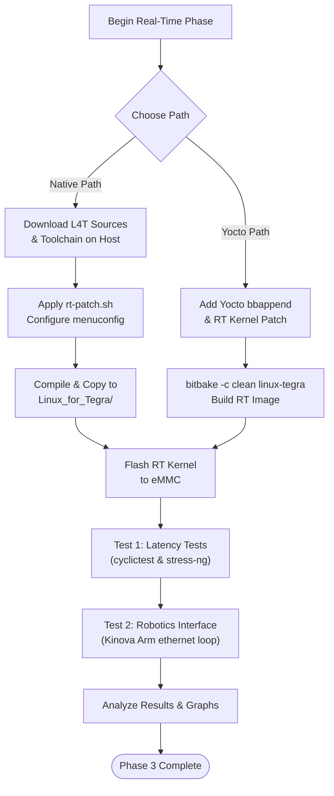

# Phase 3 — PREEMPT_RT Real-Time Integration

<span class="phase-label">Real-Time · Week   4-5</span>

!!! abstract "Goal"
    - Understand the core concepts of the `PREEMPT_RT` patch and why deterministic worst-case scheduling latency is critical for space systems.
    - Compare and implement two separate paths for real-time kernel integration: **Native host compilation** within NVIDIA's L4T flashing folder and **Yocto-based Kirkstone recipe integration**.
    - Explore real-time thread scheduling theory (`SCHED_FIFO` vs. `SCHED_OTHER`) and validate latency improvements using cyclictest under load.
    - Implement a hardware-level robotics testing loop (Ethernet-based Kinova arm control) to prove system stability under a strict 4ms hard deadline.

---

## 1. What is PREEMPT_RT & Why is it Critical for Space?

In a standard Linux kernel, when a thread is running inside kernel space (executing a system call or handling a hardware interrupt), it cannot be interrupted or preempted by a higher-priority user-space thread. This behavior introduces unpredictable delays (jitter) in scheduling, meaning a critical thread might miss its execution window.

The **`PREEMPT_RT`** patch modifies the kernel source to make almost all sections of kernel code fully preemptible. It achieves this by:
1. Converting spinlocks into sleeping mutexes (which can be preempted).
2. Forcing hardware interrupt handlers (ISRs) to run as preemptible kernel threads.
3. Implementing priority inheritance to prevent priority inversion bugs.

```text
Standard Kernel:
[ High-Pri User Thread ] ========> [ Wait... ] ==================> [ Run ]
[ Low-Pri System Call ]  ===========> [ Non-Preemptible Kernel Code ]

PREEMPT_RT Kernel:
[ High-Pri User Thread ] ========> [ Preempt! ] ===> [ Run ]
[ Low-Pri System Call ]  ===========> [ Preempted ] ... [ Resume ]
```

### Determinism in Space Payloads
For spacecraft control systems, sensor fusion engines (GNC - Guidance, Navigation, and Control), and robotic manipulators, timing is everything. Missing a control loop deadline by even a few milliseconds can lead to:
- Thruster firing misalignment during orbital maneuvers.
- Instability in high-rate control loops, causing mechanical damage.
- Lost frames or sync errors in sensor telemetry.

By applying `PREEMPT_RT`, we guarantee a **deterministic upper bound on the worst-case latency time**, ensuring critical code executes exactly when required.

---

## 2. Two Approaches to Real-Time Integration

This phase documents two separate implementation pathways to provide developers with flexibility during development and deployment:

### Approach A: Native L4T Flashing Directory Integration
This approach compiles the RT kernel natively on an Ubuntu 18.04 host system, applying NVIDIA's `rt-patch.sh` script to the L4T source package. The compiled kernel `Image` and modules are then copied directly into the `Linux_for_Tegra/` flashing folder.
- **Best for**: Rapid hardware verification, direct debugging, and developers matching standard NVIDIA-based development workflows.

### Approach B: Yocto-Based BSP Build Integration
This approach integrates the PREEMPT_RT patch directly into the Yocto Kirkstone build system. By adding a recipe append (`.bbappend`) to the kernel recipe, the build system automatically fetches, patches, and configures the RT kernel, outputting a reproducible real-time image.
- **Best for**: Production builds, continuous integration (CI/CD), and maintaining a clean, version-controlled repository.

---

## Phase Process Overview

This flowchart maps out the sequence of events across Phase 3:



---

## 3. Subpages

| Page | Suffix | Description |
| :--- | :--- | :--- |
| 1. [Native PREEMPT_RT Patching](01-native-rt-patching.md) | `01-native-rt-patching.md` | Applying the RT patch natively on an Ubuntu 18.04 host and copying images to `Linux_for_Tegra/`. |
| 2. [Yocto PREEMPT_RT Integration](02-yocto-rt-integration.md) | `02-yocto-rt-integration.md` | Integrating the RT patch into the Yocto Kirkstone build using recipe appends and clean compilation. |
| 3. [Real-Time Scheduling Concepts](03-real-time-scheduling.md) | `03-real-time-scheduling.md` | Real-time scheduling theory, process priorities, `SCHED_FIFO` vs. `SCHED_OTHER`, and priority inversion. |
| 4. [OSADL Latency Validation](04-osadl-latency-testing.md) | `04-osadl-latency-testing.md` | Standardized latency testing using `cyclictest` and `stress-ng` following OSADL benchmarks. |
| 5. [Hardware Robotics Interfacing](05-hardware-robotics-interfacing.md) | `05-hardware-robotics-interfacing.md` | Implementing a 4ms Ethernet loop to control a Kinova robotic arm, resolving priority inversion, and writing RT C++ code. |
| 6. [Results, Analysis & Timers](06-results-and-timers.md) | `06-results-and-timers.md` | Analysis of latency graphs and the role of high-resolution timers in the PREEMPT_RT kernel. |

---

[← Phase 2](../phase2/index.md){ .md-button }
[Next: Native PREEMPT_RT Patching →](01-native-rt-patching.md){ .md-button .md-button--primary }
