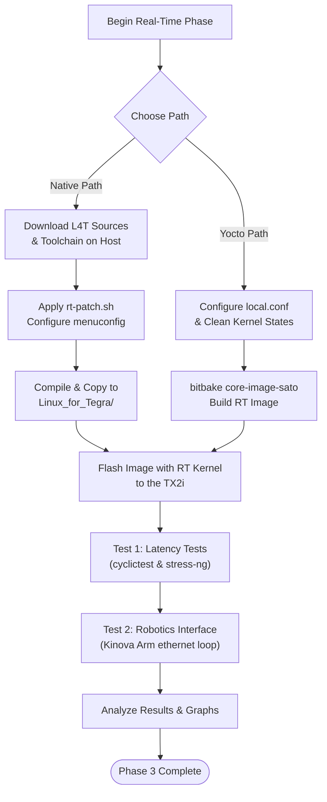

# Phase 3 — PREEMPT_RT Real-Time Integration

Real-Time · Week 4-5

!!! abstract "Goal"
    - Understand the core concepts of the `PREEMPT_RT` patch and why deterministic worst-case scheduling latency is much more important for space systems.
    - Compare and implement two separate paths for real-time kernel integration: **Native host compilation** within NVIDIA's L4T flashing folder and **Yocto-based Kirkstone recipe integration**.
    - Explore real-time thread scheduling (`SCHED_FIFO` vs. `SCHED_OTHER`) and validate latency improvements using industry standard tests under heavy CPU loads.
    - Implement a practical application level test - achieving hard-bounded latency for an actuator.

## 1. What is PREEMPT_RT & Why is it Critical for Space?

In a standard Linux kernel, when a thread is running inside kernel space (executing a system call or handling a hardware interrupt), it cannot be interrupted or preempted by a user-space thread or application level thread, even if scheduled with higher priority. This behavior introduces unpredictable delays (jitter) in scheduling cases where a thread has to complete its execution based on a deterministic deadline, regardless of background or competing processes.

By default Linux is not a real time operating system. The **`PREEMPT_RT`** patch modifies the kernel source to make almost all sections of kernel code fully preemptible,giving Linux a near RTOS (Real Time Operating System) Capability. It achieves this by:
1. Converting spinlocks into sleeping mutexes (which can be preempted).
2. Forcing hardware interrupt handlers (Interrupt Service Routines) to run as preemptible kernel threads.
3. Implementing priority inheritance to prevent priority inversion bugs.

### Why This Matters for Space

- By applying PREEMPT_RT, we guarantee a deterministic upper bound on the worst-case latency time, ensuring critical code executes exactly when required. 
- This can have several applications in space for example, a precise timed payload movement, internal parts or actuator movements, on-board robotics movements, collision detection, and timed telemetry and logging based on stringent requirements (at the millisecond level).    
---

## 2. Two Approaches to Real-Time Integration

This phase documents two separate implementation pathways to provide developers with flexibility to add a Real Time Kernel, both from native L4T and the Yocto perspective:

### Approach A: Native L4T Flashing Directory Integration
- This approach compiles the RT kernel natively on an Ubuntu 18.04 host system, applying NVIDIA's `rt-patch.sh` script to the L4T source package. The compiled kernel `Image` and modules are then copied directly into the `Linux_for_Tegra/` flashing folder.
- **Stable**: This approach is more stable, providing complete control over kernel compilation, feature selection, and settings. This allows you to manually configure power management options and adjust the Kernel Tick Frequency Timer (from 250 Hz / 4 ms up to a maximum of 1000 Hz / 1 ms).
- **Direct Flashing Integration**: The kernel is pulled from the `/Linux_for_Tegra/kernel` folder, and the RT-patch kernel modules are integrated directly during the flashing phase itself.
- **Clear References**: Offers a user-friendly implementation path with well-documented, guided examples available online, and clean integration with NVIDIA's official folder structure and sample ROOTFS.

### Approach B: Yocto-Based BSP Build Integration
This approach integrates the PREEMPT_RT patch directly into the Yocto Kirkstone build system. By adding a recipe append (`.bbappend`) to the kernel recipe, the build system automatically fetches, patches, and configures the RT kernel, outputting a reproducible image, with a realtime kernel.
- **Yocto Model Integration**: Ties directly into the Yocto framework, using a layer-based configuration. It extends the BSP Layers by adding a custom meta-layer, ensuring changes do not impact cloned layers.
- **File Structure & Naming Caveats**: Covers specific Yocto structure requirements and strict naming conventions for `.bbappend` files to successfully override and patch upstream recipes.
- **Full Build Customizability**: Establishes Yocto's capacity to customize every component of the build process, in this case the kernel and its real time modules.

---

## Phase Process Overview

This flowchart maps out the sequence of events across Phase 3:

---

## 3. Subpages

| Page | Suffix | Description |
| :--- | :--- | :--- |
| 1. [Native PREEMPT_RT Patching](01-native-rt-patching.md) | `01-native-rt-patching.md` | Applying the RT patch natively on an Ubuntu 18.04 host and copying images to `Linux_for_Tegra/`. |
| 2. [Yocto PREEMPT_RT Integration](02-yocto-rt-integration.md) | `02-yocto-rt-integration.md` | Integrating the RT patch into the Yocto Kirkstone build using recipe appends and clean compilation. |
| 3. [Real-Time Scheduling Concepts](03-real-time-scheduling.md) | `03-real-time-scheduling.md` | Real-time scheduling theory, process priorities, `SCHED_FIFO` vs. `SCHED_OTHER`, and priority inversion. |
| 4. [OSADL Latency Validation](04-osadl-latency-testing.md) | `04-osadl-latency-testing.md` | Standardized latency testing using `cyclictest` and `stress-ng` following OSADL benchmarks. |
| 5. [Hardware Robotics Interfacing](05-hardware-robotics-interfacing.md) | `05-hardware-robotics-interfacing.md` | Implementing a 4ms Ethernet loop to control a Kinova robotic arm, resolving priority inversion, and writing RT C++ code. |
---

[← Phase 2](../phase2/index.md){ .md-button }
[Next: Native PREEMPT_RT Patching →](01-native-rt-patching.md){ .md-button .md-button--primary }
