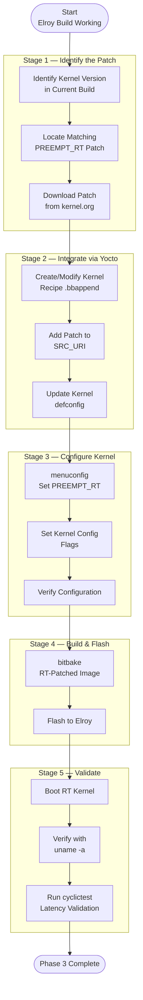

# Phase 3 — PREEMPT_RT Kernel Patch

Kernel · Week 4

!!! abstract "Goal"
    Apply the PREEMPT_RT patch to the Linux kernel through the Yocto build system, enabling fully preemptible (deterministic) real-time scheduling. This is critical for time-sensitive space payload operations where worst-case latency must be bounded.

---

## Phase Process Overview

---

## Important Links

| Resource | Link |
|---|---|
| PREEMPT_RT Patch Archive | <!-- TODO: https://wiki.linuxfoundation.org/realtime/ --> |
| Kernel.org RT Patches | <!-- TODO: Add link --> |
| Yocto Kernel Dev Manual | <!-- TODO: Add link --> |
| cyclictest Documentation | <!-- TODO: Add link --> |

---

## Subpages

| Page | Description |
|---|---|
| [Understanding PREEMPT_RT](01-understanding-preempt-rt.md) | What PREEMPT_RT is and why it matters for space |
| [Applying the Patch via Yocto](02-applying-the-patch.md) | Kernel recipe modification, SRC_URI, bbappend |
| [Kernel Configuration](03-kernel-configuration.md) | menuconfig, defconfig, RT-specific flags |
| [Validation & Testing](04-validation-and-testing.md) | cyclictest, latency profiling, verification |

---

[← Phase 2](../phase2/index.md){ .md-button }
[Current Work →](../roadmap.md){ .md-button .md-button--primary }
