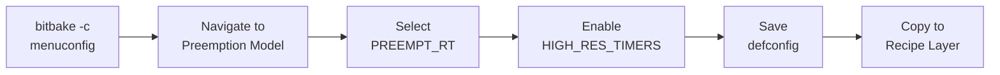

# Kernel Configuration

Phase 3 · Stage 3

!!! info "Outline Page"
    This page is an outline only.

---

## Outline

### Using menuconfig via Yocto

- <!-- TODO: bitbake -c menuconfig command -->
- <!-- TODO: Navigating to preemption settings -->

### Key Configuration Flags

- <!-- TODO: CONFIG_PREEMPT_RT=y -->
- <!-- TODO: CONFIG_HIGH_RES_TIMERS=y -->
- <!-- TODO: CONFIG_NO_HZ_FULL=y -->
- <!-- TODO: Other relevant RT flags -->

### Saving Configuration

- <!-- TODO: Saving defconfig -->
- <!-- TODO: Integrating back into Yocto recipe -->

### Verifying Configuration

- <!-- TODO: bitbake -c kernel_configcheck -->
- <!-- TODO: Checking .config in build directory -->

---

---

[← Applying the Patch](applying-patch.md){ .md-button }
[Validation & Testing →](validation-testing.md){ .md-button .md-button--primary }
